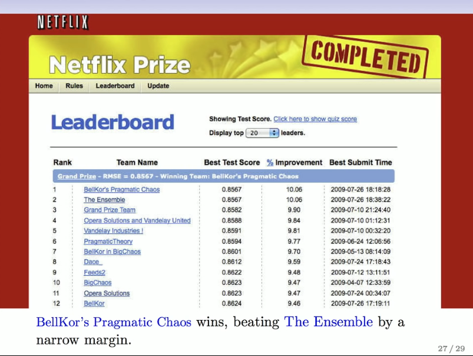

# Section 1 - Supervised and Unsupervised Learning
## The Supervised Learning Problem
_Starting point:_
* Outcome measurement $Y$ (also called dependent variable, response, target).
* Vector of $p$ predictor measurements $X$ (also called inputs, regressors, covariates, features, independent variables).
* In the _regression problem_, $Y$ is quantitative (e.g price, blood pressure).
* In the _classification problem_, $Y$ takes values in a finite, unordered set (survived/died, digit 0-9, cancer class of tissue sample).
* We have training data $(x_1,y_2),\dots(x_N,y_N).$ These are observations (examples, instances) of these measurements.
## Objectives
On the basis of the training data we would like to:
* Accurately predict unseen test cases.
* Understand which inputs affect the outcome, and how.
* Assess the quality of our predictors and inferences.
## Philosophy
* It is important to understand the ideas behind the various techniques, in order to know how and when to use them.
* One has to understand the simpler methods first, in order to grasp the more sophisticated ones.
* It is important ti accurately assess the performance of a method, to know how well or how badly it is working [simpler method often perform as well as fancier ones!]
* This is an exciting research area, having important applications in science, industry and finance.
* Statistical learning is a fundamental ingredient in the training of a modern _data scientist._
## Unsupervised learning
* No outcome variable, just a set of predictors (features) measured on a set of samples.
* objective is more fuzzy - find groups of samples that behave similarly, find features that behave similarly, find linear combinations of features with the most variation.
* difficult to know how well you are doing.
* different from supervised learning, but can be useful as a pre-processing step for supervised learning.
## The Netflix Prize
* competition started in October 2006. Training data is ratings for $18,000$ movies by $400,000$ Netflix customers, each rating between $1$ and $5.$
* training data is very sparse - about $98\%$ missing.
* objective is to predict the rating for a set of $1$ million customer-movie pairs that are missing in the training data.
* Netflix's original algorithm achieved a root MSE of $0.953.$ The first team to achieve a $10\%$ improvement wins one million dollars.
* is this a supervised or unsupervised problem?

## Statistical Learning versus Machine Learning
* Machine Learning arose as a subfield of Artificial Intelligence.
* Statistical Learning arose as a subfield of Statistics.
* _There is much overlap_ - both fields focus on supervised and unsupervised problems:
  * Machine learning has a greater emphasis on _large scale_ applications and _prediction accuracy._
  * Statistical learning emphasizes _models_ and their interpretability, and _precision_ and _uncertainty_.
* But the distinction has become more and more blurred, and there is a great deal of "cross-fertilization".
* Machine learning has the upper hand in _Marketing!_