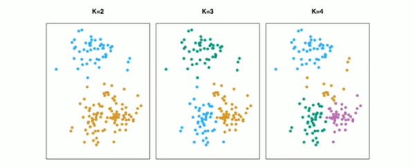
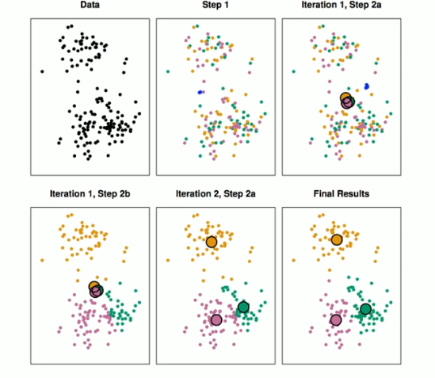
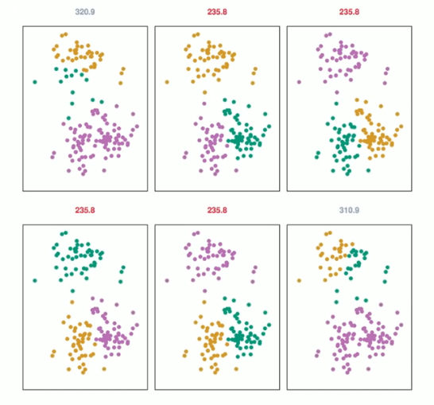

# Section 3 - K-means Clustering
## Clustering
* _Clustering_ refers to a very broad set of techniques for finding _subgroups_, or _clusters_, in a data set.
* We seek a partition of the data into distinct groups so that the observations within each group are quite similar to each other.
* To make this, we must define what it means for two or more observations to be _similar_ or _different_.
* Indeed, this is often a domain-specific consideration that must be made based on knowledge of data being studied.
## PCA vs Clustering
* PCA looks for a low-dimensional representation of the observations that explains a good fraction of the variance.
* Clustering looks for homogeneous subgroups among the observations.
## Clustering for Market Segmentation
* Suppose we have access to a large number of measurements (e.g. median household income, occupation, distance from nearest urban area, and so forth) for a large number of people.
* Our goal is to perform _market segmentation_ by identifying subgroups of people who might be more receptive to a particular form of advertising, or more likely to purchase a particular product.
* The task of performing market segmentation amounts to clustering the people in the data set.
## Two clustering methods
* In _$K$-means-clustering_, we seek to partition the observations into a pre-specified number of clusters.
* In _hierarchical clustering_, we do not know in advance how many clusters we want; in fact, we end up with a tree-like visual representation of the observations, called a _dendrogram,_ that allows us to view at once the clusterings obtained for each possible number of clusters, from $1$ to $n.$
## $K$-Means clustering

A simulated data set with $150$ observations in $2$-dimensional space. Panels show the results of applying $K$-means clustering with different values of $K,$ the number of clusters. The color of each observation indicates the cluster to which it was assigned using the $K$-means clustering algorithm. Note that there is no ordering of the clusters, so the cluster coloring is arbitrary. These cluster labels were not used in clustering; instead, they are the outputs of the clustering procedure.
## Details of $K$-means clustering
Let $C_1,\dots,C_K$ denote sets containing the indices of the observations in each cluster. These sets satisfy two properties:
1. $C_1\cup C_2\cup\dots\cup C_K=\{1,\dots,n\}.$ In other words, each observation belongs to at least one of the $K$ clusters.
2. $C_k\cap C_{k'}=\empty$ for all $k=k'.$ In other words, the clusters are non-overlapping: no observation belongs to more than one cluster.

For instance, if the $i$th observation is in the $k$th cluster, then $i\in C_k.$
* The idea behind $K$-means clustering is that a _good_ clusterig is one for which the _within-cluster variation_ is as small as possible.
* The within-cluster variation for cluster $C_k$ is a measure $\text{WCV}(C_k)$ of the amount by which the observations within a cluster differ from each other.
* Hence we want to solve the problem
$$\min_{C_1,\dots,C_K}\{\sum_{k=1}^K{\text{WCV}(C_k)}\}.\tag{2}$$
* In words, this formula says that we want to partition the observations into $K$ clusters such that the total within-cluster variation, summed over all $K$ clusters, is as small as possible.
## How to define within-cluster variation?
* Typically we use Euclidean distance
$$\text{WCV}(C_k)=\frac{1}{|C_k|}\sum_{i,i'\in C_k}{\sum_{j=1}^p{(x_{ij}-x_{i'j})^2}},\tag{3}$$
where $|C_k|$ denotes the number of observations in the $k$th cluster.
* Combining $(2)$ and $(3)$ gives the optimization problem that defines $K$-means clustering,
$$\min_{C_1,\dots,C_K}\{\sum_{k=1}^K{\frac{1}{|C_k|}\sum_{i,i'\in C_k}{\sum_{j=1}^p{(x_{ij}-x_{i'j})^2}}}\}.\tag{4}$$
## $K$-Means Clustering Algorithm
1. Randomly assign a number, from $1$ to $K,$ to each of the observations. These serve as initial cluster assignmnets for the observations.
2. Iterate until the cluster assignmnets stop changing:
   2.1 For each of the $K$ clusters, compute the cluster _centroid_. The $k$th cluster centroid is the vector of the $p$ feature means for the observation in the $k$th cluster.
   2.2 Assign each observation to the cluster whose centroid is closest (where _closest_ is defined using Euclidean distance).
## Properties of the Algorithm
* This algorithm is guaranteed to decrease the value of the objective $(4)$ at each step. _Why?_ Note that
$$\frac{1}{|C_k|}\sum_{i,i'\in C_k}{\sum_{j=1}^p{(x_{ij}-x_{i'j})^2}}=2\sum_{i\in C_k}{\sum_{j=1}^p{(x_{ij}-\bar{x}_{kj})^2}},$$
where
$$\bar{x}_{kj}=\frac{1}{|C_k|}\sum_{i\in C_k}{x_{ij}}$$
is the mean for feature $j$ in cluster $C_k.$
* However it is not guaranteed to give a global minimum. _Why not?_
## Example

## Details of Previous Figure
The progress of the $K$-means algorithm with $K=3.$
* _Top left:_ The observations are shown.
* _Top center:_ In Step $1$ of the algorithm, each observation is randomly assigned to a cluster.
* _Top right:_ In Step $2(a),$ the cluster centroids are computed. These are shown as large colored disks. Initially the centroids are almost completely overlapping because the initial cluster assignments were chosen at random.
* _Bottom left:_ In Step $2(b),$ each observatio is assigned to the nearest centroid.
* _Bottom center:_ Step $2(a)$ is once again performed, leading to new cluster centroids.
* _Bottom right:_ The results obtained after $10$ iterations.
## Example: different starting values

## Details of Previous Figure
$K$-means clustering performed six times on the data from previous figure with $K=3,$ each time with a different random assignment of the observations in Step $1$ of the 

$K$-means algorithm.

Above each plot is the value of the objective $(4).$

Three different local optima were obtained, one of which resulted in a smaller value of the objective and provides better separation between the clusters.

Those labeled in red all achieved the same best solution, with an objective value of $235.8$