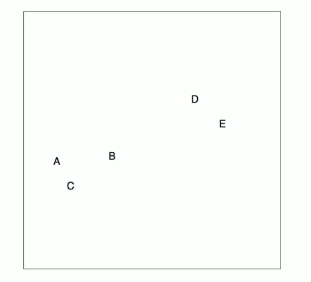
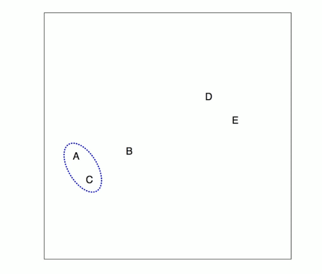
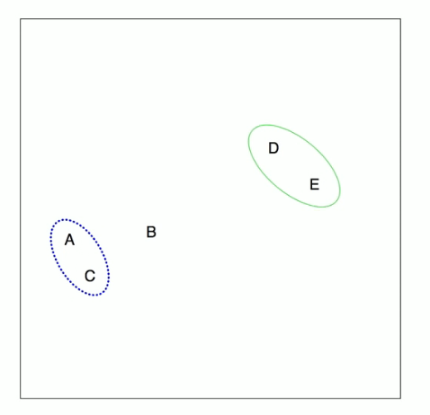
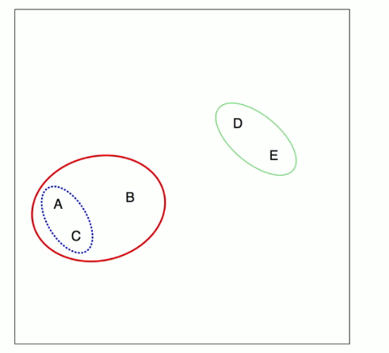
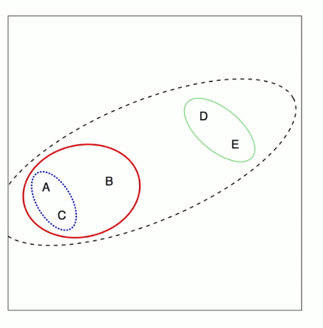
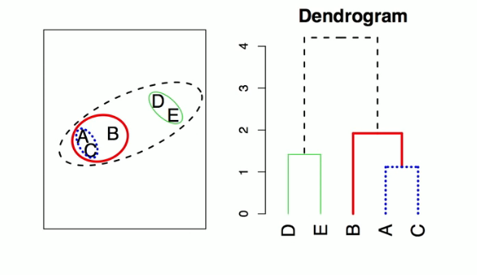
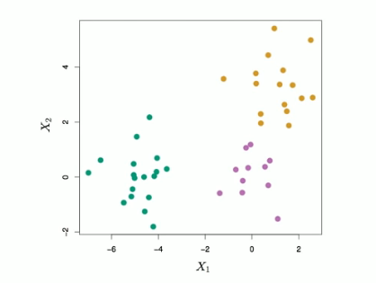
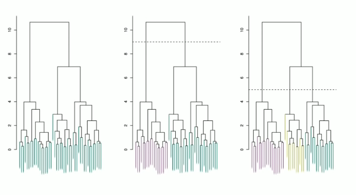
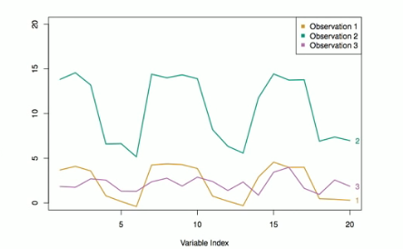

# Section 4 - Hierarchical Clustering
## Hierarchical Clustering
* $K$-means clustering requires us to pre-specify the number of clusters $K.$ This can be a disadvantage (later we discuss strategies for choosing $K$)
* _Hierarchical clustering_ is an alternative approach which does not require that we commit to a particular choice of $K.$
* In this section we describe _bottom-up_ or _agglomerative_ clustering. This is the most common type of hierarchical clustering, and refers to the fact that a dendrogram is built starting from the leaves and combining clusters up to the trunk.
## Hierarchical Clustering: the idea
Builds a hierarchy in a "bottom-up" fashion...

## Hierarchical Clustering Algorithm
The approach in words:
* Start with each point in its own cluster.
* Identify the **closest** two clusters and merge them.
* Repeat.
* Ends when all points are in a single cluster.

## An Example

$45$ observations generated in $2$-dimensional space. In reality there are three distinct classes, shown in separate colors. However, we will treat these class labels as unknown and will seek to cluster the observation in order to discover the classes from the data.
## Application of hierarchical clustering

## Details of previous figure
* _Left:_ Dendrogram obtained from hierarchically clustering the data from previous slide, with complete linkage and Euclidean distance.
* _Center:_ The dendrogram from the left-hand panel, cut at a height of $9$ (indicated by the dashed line). This cut results in two distinct clusters, shown in different colors.
* _Right:_ The dendrogram from the left-hand panel, now cut at a height of $5.$ This cut results in three distinct clusters, shown in different colors. Note that the colors were not used in clustering, but are simply used for display purposes in this figure.
## Types of Linkage
| _Linkage_ | _Description_ |
| --- | --- |
| Complete | Maximal inter-cluster dissimilarity. Compute all pairwise dissimimalrities between the observations in cluster $A$ and the observations in cluster $B$, and record the _largest_ of these dissimilarities. |
| Single | Minimal inter-cluster dissimilarity. Compute all pairwise dissimilarities between the observations in cluster $A$ and the observations in cluster $B,$ and record the _smallest_ of these dissimilarities. |
| Average | Mean inter-cluster dissimilarity. Compute all pairwise dissimilairities between the observations in cluster $A$ and the observations in cluster $B,$ and record the _average_ of these dissimilarities. |
| Centroid | Dissimilarity betwwen the centroid for cluster $A$ (a mean vector of length $p$) amd the centroid for cluster $B.$ Centroid linkage an result in undesirable _inversions._ |
## Choice of Dissimilarity: Measure
* So far have used Euclidean Distance.
* An alternative is _correlation-based distance_ which considers two observations to be similar if their features are highly correlated.
* This is an unusual use of correlation; which is normally computed betqeen variables; here it is computed between the observation profiles for each pair of observations.

## Practical issues
* _Scaling of the variables matters!_ Should the observations or features first be standardized in some way. For instance, maybe the variables should be centered to have mean zero and scaled to have standard deviation one.
* In the case of hierarchical clustering:
  * What dissimilarity measure should be used?
  * What type of linkage should be used?
* How many clusers to choose? (in both $K$-means or hierarchical clustering). Difficult problem. No agreed-upon method. See Elements of Statistical Learning, chapter $13$ for more details.
* Which features should we use to drive the clustering?
