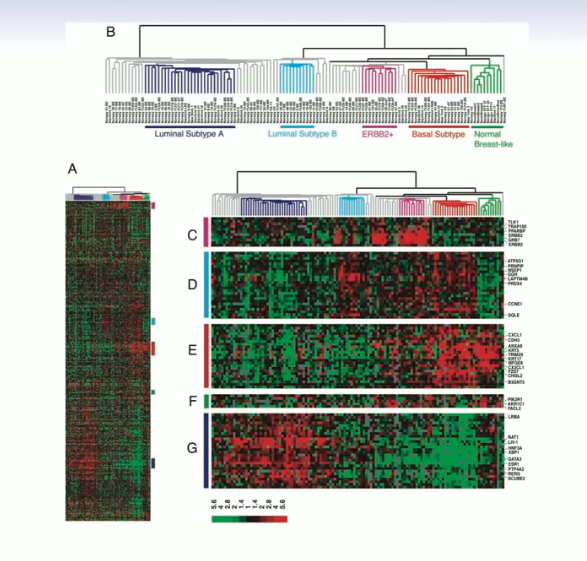
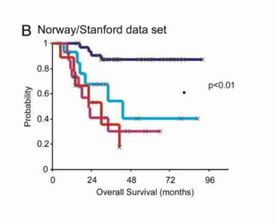

# Section 5 - Breast Cancer Example of Hierarchical Clustering
## Example: breast cancer microarray study
* "Repeated observation of breast tumor subtypes in independent gene expression data sets;" Sorlie et al, PNAS 2003
* Gene expression measurements for about $\sim8000$ genes, for each of $88$ breast cancer patients.
* Average linkage, correlation metric
* Clustered samples using $500$ _intrinsic genes:_ each woman was measured before and after chemoterarpy. Intrinsic genes have smallest within/between variation.

## Conclusions
* _Unsupervised learning_ is important for understanding the variation and grouping structure of a set of unlabeled data, and can be a useful pre-processor for supervised learning.
* It is intrinsically more difficult than _supervised learning_ because there is no gold standard (like an outcome variable) and no single objective (like test set accuracy).
* It is an active field of research, with many recently developed tools such as _self-organizing maps, independent components analysis_ and _spectral clustering._ See _The Elements of Statistical Learning_, chapter $14.$