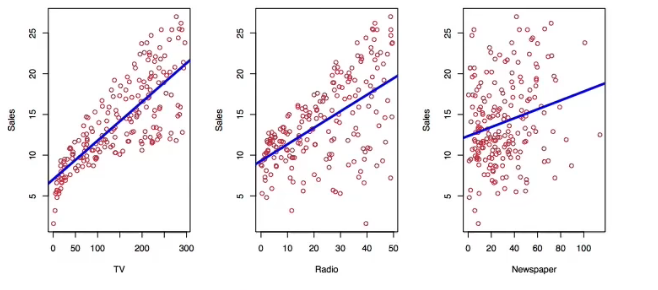
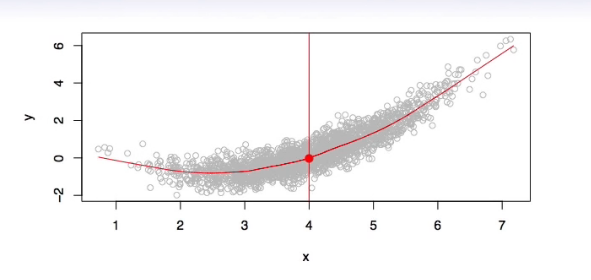
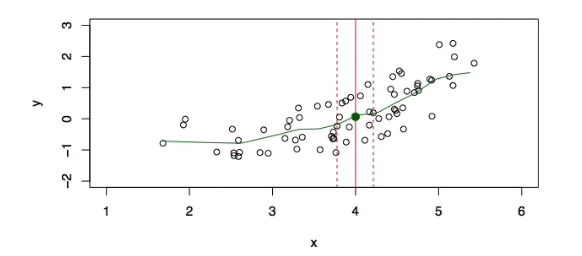

# Section 1 - Statistical Learning and Regression
## What is Statistical Learning

Shown are _Sales_ vs _TV, Radio_ and _Newspaper,_ with a blue linear-regression line fit separately to each.
Can we predict _Sales_ using these three?
Perhaps we can do better using a model
$$\textit{Sales}\approx f(\textit{TV, Radio, Newspaper})$$
## Notation
Here _Sales_ is a _response_ or _target_ that we wish to predict. We generally refer to the response as $Y.$
_TV_ is a _feature_, or _input_, or _predictor_, we name it $X_1.$
Likewise name _Radio_ as $X_2,$ and so on.
We can refer to the _input vector_ collectively as
$$X=\left(\begin{array}{c}
X_1\\
X_2\\
X_3
\end{array}\right)$$
Now we write our model as
$$Y=f(X)+\epsilon$$
where $\epsilon$ captures measurement errors and other discrepancies.
## What is $f(X)$ good for?
* With a good $f$ we can make predictions of $Y$ at new points $X=x.$
* We can understand which components of $X=(X_1,X_2,\dots,X_p)$ are important explaining $Y$, and which are irrelevant. e.g. _Seniority_ and _Years of Education_ have a big impact on _Income_, but _Marital Status_ typically does not.
* Depending on the complexity of $f,$ we may be able to understand how each component $X_j$ of $X$ affects $Y.$

Is there an ideal $f(X)?$ In particular, what is a good value for $f(X)$ at any selected value of $X,$ say $X=4?$ There can be many $Y$ values at $X=4.$ A good value is
$$f(4)=E(Y|X=4)$$
$E(Y|X=4)$ means _exptected value_ (average) of $Y$ given $X=4.$
This ideal $f(x)=E(Y|X=x)$ is called the _regression function._
## The regression function $f(x)$
* Is also defined for vector $X;$ e.g.
$$f(x)=f(x_1,x_2,x_3)=E(Y|X_1=x_1,X_2=x_2,X_3=x_3)$$
* Is the _ideal_ or _optimal_ predictor of $Y$ with regard to mean-squared prediction error: $f(x)=E(Y|X=x)$ is the function that minimizes $E[(Y-g(X))^2|X=x]$ over all functions $g$ at all points $X=x.$
* $\epsilon=Y-f(x)$ is the _irreducible_ error - i.e., even if we know $f(x),$ we would still make errors in prediction, since at each $X=x$ there is typically a distribution of possible $Y$ values.
* For any estimate $\hat{f}(x)$ of $f(x)$, we have
$$E[(Y-\hat{f}(X))^2|X=x]=\underbrace{[f(x)-\hat{f}(x)]^2}_{Reducible}+\underbrace{\text{Var}(\epsilon)}_{Irreducible}$$
## How to estimate $f$
* Typically we have few if any data points with $X=4$ exactly.
* So cannot compute $E(Y|X=x)!$
* Relax the definition and let
$$\hat{f}(x)=\text{Ave}(Y|X\in\mathscr{N}(x))$$
where $\mathscr{N}(x)$ is some _neighborhood_ of $x.$

