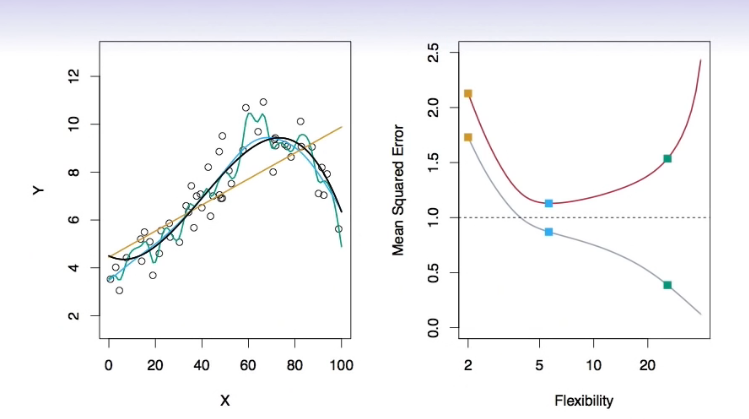
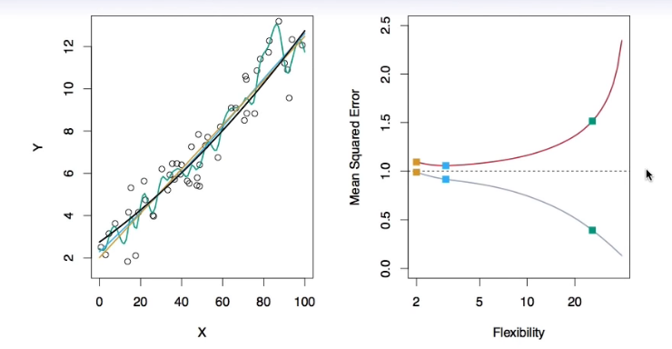
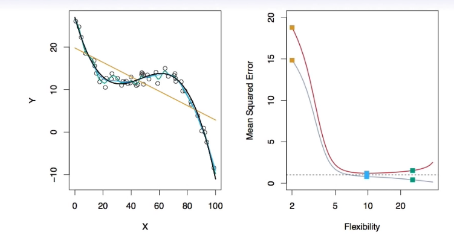
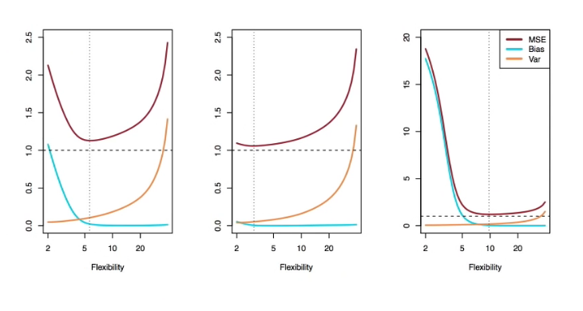

# Section 3 - Assessing Model Accuracy and Bias-Variance Trade-off
## Assessing Model Accuracy
Suppose we fit a model $\hat{f}(x)$ to some training data $\text{Tr}=\{x_i,y_i\}_1^N,$ and wish to see how well it performs.
* We could compute the average squared prediction error over $\text{Tr}:$
$$\text{MSE}_\text{Tr}=\text{Ave}_{i\in\text{Tr}}[y_i-\hat{f}(x_i)]^2$$
This may be biased toward more overfit models.
* Instead we should, if possible, compute it using fresh _test_ data $\text{Te}=\{x_i,y_i\}_1^M:$
$$\text{MSE}_\text{Te}=\text{Ave}_{i\in\text{Te}}[y_i-\hat{f}(x_i)]^2$$

Black curve is truth. Red curve on right is $\text{MSE}_\text{Te},$ grey curve is $\text{MSE}_\text{Tr}.$ Orange, blue and green curves/squares correspond to fits of different flexibility.

Here the truth is smoother, so the smoother fit and linear model do really well.

Here the truth is wiggly and the noise if low, so the more flexible fits do the best.

## Bias-Variance Trade-off
Suppose we have fit a model $\hat{f}(x)$ to some training data $\text{Tr},$ and let $(x_0,y_0)$ be a test observation drawn from some population. If the true model is $Y=f(X)+\epsilon$ (with $f(x)=E(Y|X=x)$), then
$$E(y_0-\hat{f}(x_0))^2=\text{Var}(\hat{f}(x_0))+[\text{Bias}(\hat{f}(x_0))]^2+\text{Var}(\epsilon).$$
The expectation averages over the variability of $y_0$ as well as the variability in $\text{Tr}.$ Note that $\text{Bias}(\hat{f}(x_0))=E[\hat{f}(x_0)]-f(x_0).$
Typically as the _flexibility_ of $\hat{f}$ increases, its variance increases, and its bias decreases. So choosing the flexibility based on average test error amounts to a _bias-variance trade-off._
## Bias-variance trade-off for the three examples
