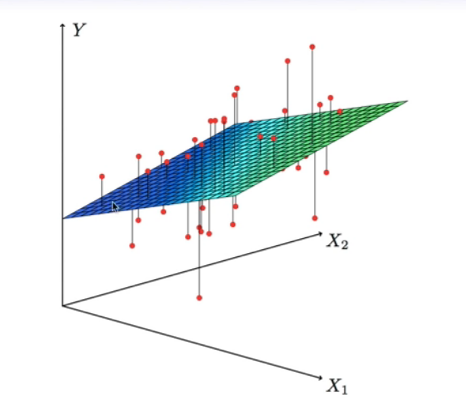
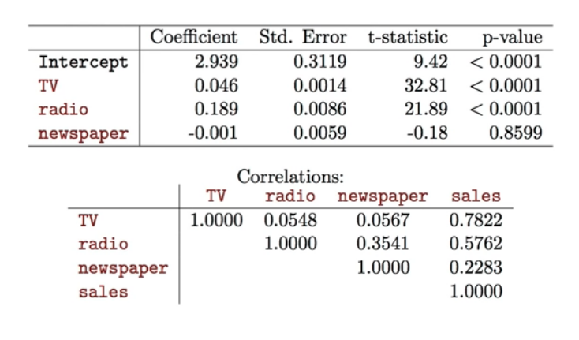

# Section 3 - Multiple Linear Regression and Interpreting Regression Coefficients
## Multiple Linear Regression
* Here our model is
$$Y=\beta_0+\beta_1X_1+\beta_2X_2+\dots+\beta_pX_p+\epsilon,$$
* We interpret $\beta_j$ as the _average_ effect on $Y$ of a one unit increase in $X_j,$ _holding all other predictors fixed._ In the advertising example, the model becomes
$$\text{sales}=\beta_0+\beta_1\times\text{TV}+\beta_2\times\text{radio}+\beta_3\times\text{newspaper}+\epsilon.$$
## Interpreting regression coefficients
* The ideal scenario is when the predictors are uncorrelated - a _balanced design:_
  * Each coefficient can be estimated and tested separately.
  * Interpretations such as _"a unit change in $X_j$ is associated with a $\beta_j$ change in $Y,$ while all the other variables stay fixed"_, are possible.
* Correlations amongst predictors cause problems:
  * The variance of all coefficients tends to increase, sometimes dramatically.
  * Interpretations become hazardous - when $X_j$ changes, everything else changes.
* _Claims of causality_ shoud be avoided for observational data.
## The woes of (interpreting) regression coefficients
_"Data Analysis and Regression" Mosteller and Tukey 1977_
* a regression coefficient $\beta_j$ estimates the expected change in $Y$ per unit change in $X_j$, _witl all other predictors held fixed._ But predictors usually change together!
* Example: $Y$ total amount of change in your pocket; $X_1=$ # of coins; $X_2=$ # of pennies, nickels and dimes. By itself, regression coeffiient of $Y$ on $X_2$ will be $>0.$ But how about $X_1$ with the model?
* $Y=$ number of tackles by a football player in a season; $W$ and $H$ are his weight and height. Fitted regression model is $\hat{Y}=b_0+.50W-.10W.$ How do we interpret $\hat{\beta}_2<0?$
## Two quotes by famous Statisticians
* _"Essentially, all models are wrong, but some are useful"_ - George Box
* _"The only way to find out what will happen when a complex system is disturbed is to disturb the system, not merely to observe it passively"_ - Fred Mosteller and John Tukey, paraphrasing George Box
## Estimation and Prediction for Multiple Regression
* Given estimates $\hat{\beta}_0,\hat{\beta}_1,\dots,\hat{\beta}_p,$ we can make predictions using the formula
$$\hat{y}=\hat{\beta}_0+\hat{\beta}_1x_1+\hat{\beta}_2x_2+\dots+\hat{\beta}_px_p.$$
* We estimate $\beta_0,\beta_1,\dots,\beta_p$ as the values that minimize the sum of squared residuals
$$\begin{aligned}
\text{RSS}&=\sum_{i=1}^n{(y_i-\hat{y}_i)^2}\\
&=\sum_{i=1}^n{(y_i-\hat{\beta}_0-\hat{\beta}_1x_{i1}-\dots-\hat{\beta}_px_{ip})^2}.
\end{aligned}$$
This is done using standard statistical software. The values $\hat{\beta}_0,\hat{\beta}_1,\dots,\hat{\beta}_p$ that minimize $\text{RSS}$ are the multiple least squares regression coefficient estimates.

## Results for advertising data

