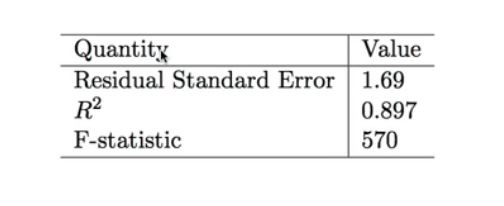
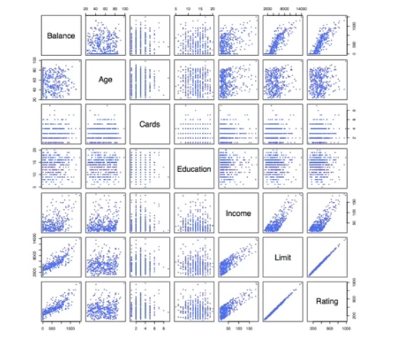
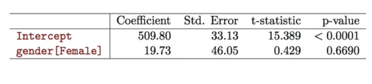
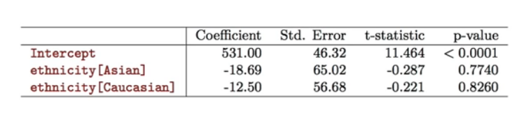

# Section 4 - Model Selection and Qualitative Predictors
## Some important questions
1. _Is at least one of the predictors $X_1,X_2,\dots,X_p$ useful in predicting the response?_
2. _Do all the predictors help to explain $Y$, or is only a subset of the predictors useful?_
3. _How well does the model fit the data?_
4. _Given a set of predictor values, what response value should we predict, and how accurate is our prediction?_
## Is at least one predictor useful?
For the first question, we can use the $F$-statistic
$$F=\frac{(\text{TSS}-\text{RSS})/p}{\text{RSS}/(n-p-1)}\approx F_{p,n-p-1}$$

## Deciding on the important variables
* The most direct approach is called _all subsets_ or _best subsets_ regression: we compute the least squares fit for all possible subsets and then choose between them based on some criterion that balances training error with model size.
* However we often can't examine all possible models, since they are $2^p$ of them; for example when $p=40$ there are over a billion models!
  Instead we need an automated approach that searches through a subset of them. We discuss two commonly used approaches next.
## Forward selection
* Begin with the _null model_ - a model that contains an intercept but no predictors.
* Fit $p$ simple linear regression and add to the null model the variable that results in the lowest $\text{RSS}.$
* Add to that model the variable that results in the lowest $\text{RSS}$ amongst all two-variable models.
* Continue until some stopping rule is satisfied, for example when all remaining variables have a $p$-value above some threshold.
## Backward selection
* Start with all the variables in the model.
* Remove the variable with the largest $p$-value - that is, the variable that is the least statistically significant.
* The new $(p-1)$-variable model is fit, and the variable with the largest $p$-value is removed.
* Continue until a stopping rule is reached. For instance, we may stop when all remaning variables have a significant $p$-value defined by some significance threshold.
## Model selection
* Later we discuss more systematic criteria for choosing an "optimal" member in the path of models produced by forward of backward stepwise selection.
* These include _Mallow's $C_p,$ Akaike information criterion $(AIC)$, Bayesian information criterion $(BIC),$ adjusted $R^2$_ and _Cross-validation $(CV)$._
## Other Considerations in the Regression Model
_Qualitative Predictors_
* Some predictors are not _quantitative_ but are _qualitative,_ taking a discrete set of values.
* These are also called _categorical_ predictors or _factor variables._
* See for example the scatterplot matrix of the credit card data below.
  In addition to the $7$ quantitative variables shown, there are four qualitative variables: $\text{gender, student}$ (student status), $\text{status}$ (marital status) , and $\text{ethnicity}$ (Caucasian, African American (AA) or Asian).
## Credit Card Data

## Qualitative Predictors
Example: investigate difference in credit card balance between males and females, ignoring the other variables. We create a new variable
$$x_i=\begin{cases}
1\quad&\text{if }i\text{th person is female}\\
0\quad&\text{if }i\text{th person is male}
\end{cases}$$
Resulting model:
$$y_i=\beta_0+\beta_1x_+\epsilon_i=\begin{cases}
\beta_0+\beta_1+\epsilon_i\quad&\text{if }i\text{th person is female}\\
\beta_0+\epsilon_i\quad&\text{if }i\text{th person is male}
\end{cases}$$
Interpretation?
## Credit card data - continued
Results for gender model:

## Qualitative predictors with more than two levels
* With more than two levels, we create additional dummy variables. For example, for the $\text{ethnicity}$ variable we create two dummy variables. The first could be
$$x_{i1}=\begin{cases}
1\quad&\text{if }i\text{th person is Asian}\\
0\quad&\text{if }i\text{th person is not Asian},
\end{cases}$$
and the second could be
$$x_{i2}=\begin{cases}
1\quad&\text{if }i\text{th person is Caucasian}\\
0\quad&\text{if }i\text{th person is not Caucasian}.
\end{cases}$$
* Then both of these variables can be used in the regression equation in order to obtain the model
$$y_i=\beta_0+\beta_1x_{i1}+\beta_2x_{i2}+\epsilon_i=\begin{cases}
\beta_0+\beta_1+\epsilon_i\quad&\text{if }i\text{th person is Asian}\\
\beta_0+\beta_2\epsilon_i\quad&\text{if }i\text{th person is Caucasian}\\
\beta_0+\epsilon_i\quad&\text{if }i\text{th person is AA}.\\
\end{cases}$$
* There will always be one fewer dummy variable than the number of levels. The level with no dummy variable - African American in this example - is known as the _baseline._
## Results for ethnicity

