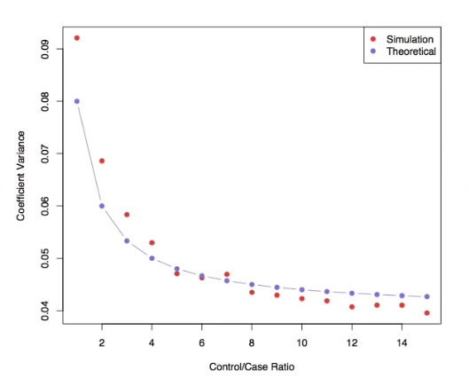

# Section 4 - Case-Control Sampling and Multiclass Logistic Regression
## Case-control sampling and logistic regression
* In South-African data, there are 160 cases, 302 controls - $\tilde{\pi}=0.35$ cases. Yet the prevalence of MI in this region is $\pi=0.05.$
* With case-control samples, we can estimate the regression parameters $\beta_j$ accurately (if our model is correct); the constant term $\beta_0$ is incorrect.
* We can correct the estimated intercept by a simple transformation
$$\hat{\beta}_0^*=\hat{\beta}_0+\log\frac{\pi}{1-\pi}-\log\frac{\tilde{\pi}}{1-\tilde{\pi}}$$
* Often cases are rare and we take them all; up to five times that number of controls is sufficient. See below.
## Diminishing returns in unbalanced binary data

Sampling more controls than cases reduces the variance of the parameter estimates. But after a ratio of about $5$ to $1¡ the variance reduction flattens out.
## Logistic regression with more than two classes
So far we have discussed logistic regression with two classes. It is easily generalized to more than two classes. One version (used in R package `glmnet`) has the symmetric form
$$\text{Pr}(Y=k|X)=\frac{e^{\beta_{0k}+\beta_{1k}X_1+\dots+\beta_{pk}X_p}}{\sum_{l=1}^K{e^{\beta_{0l}+\beta_{1l}X_1+\dots+\beta_{pl}X_p}}}$$
Here there is a linear function for _each_ class.
(The _mathier_ students will recognize that some cancellation is possible, and only $K-1$ linear functions are needed as in $2$-class logistic regression.)
Multiclass logistic regression is also referred to as _multinomial regression._
