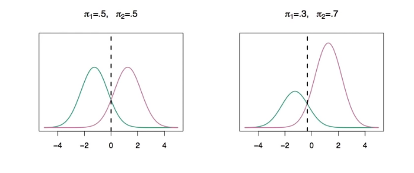

# Section 5 - Linear Discriminant Analysis and Bayes Theorem
## Discriminant Analysis
Here the approach is to model the distribution of $X$ in each of the classes separately, and then use _Bayes theorem_ to flip things around and obtain $\text{Pr}(Y|X).$
When we use normal (Gaussian) distribution for each class, this leads to linear or quadratic discriminant analysis.
However, this approach is quite general, and other distributions can be used as well. We will focus on normal distributions.
## Bayes theorem for classification
Thomas Bayes was a famous mathematician whose name represents a big subfield of statistical and probablistic modeling. Here we focus on a simple result, known as Bayes theorem:
$$\text{Pr}(Y=k|X=x)=\frac{\text{Pr}(X=x|Y=k)\cdot\text{Pr}(Y=k)}{\text{Pr}(X=x)}$$
One writes this slightly different for discriminant analysis:
$$\text{Pr}(Y=k|X=x)=\frac{\pi_kf_k(x)}{\sum_{l=1}^K{\pi_lf_l(x)}},\quad\text{where}$$
* $f_k(x)=\text{Pr}(X=x|Y=k)$ is the _density_ for $X$ in class $k.$
  Here we will use normal densities for these, separately in each class.
* $\pi_k=\text{Pr}(Y=k)$ is the marginal or _prior_ probability for class $k.$
## Classify to the highest density

We classify a new point according to which density is highest.
When the priors are different, we take them into account as well, and compare $\pi_kf_k(x).$ On the right, we favor the pink class - the decision boundary shifted to the left.
# Why discriminant analysis?
* When the classes are well-separated, the parameter estimates for the logistic regression model are surprisingly unstable. Linear discriminant analysis does not suffer from this problem.
* If $n$ is small and the distribution of the predictors $X$ is approximately normal in each of the classes, the linear discriminant model is again more stable than the logistic regression model.
* Linear discriminant analysis is popular when we have more than two response classes, because it also provides low-dimensional views of the data.