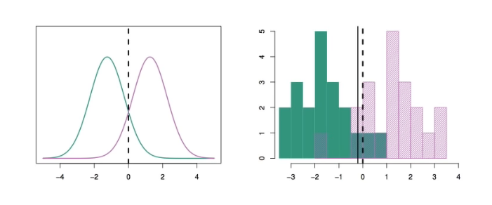

# Section 6 - Univariate Linear Discriminant Analysis
## Linear Discriminant Analysis when $p=1$
The Gaussian density has the form
$$f_k(x)=\frac{1}{\sqrt{2\pi}\sigma_k}e^{-\frac{1}{2}\left(\frac{x-\mu_k}{\sigma_k}\right)^2}$$
Here $\mu_k$ is the mean, and $\sigma_k^2$ is the variance (in class $k.$) We will assume that all the $\sigma_k=\sigma$ are the same.
Plugging this into the Bayes formula, we get a rather complex expression for $p_k(x)=\text{Pr}(Y=k|X=x):$
$$p_k(X)=\frac{\pi_k\frac{1}{\sqrt{2\pi}\sigma}e^{-\frac{1}{2}\left(\frac{x-\mu_k}{\sigma}\right)^2}}{\sum_{l=1}^K{\pi_l\frac{1}{\sqrt{2\pi}\sigma}e^{-\frac{1}{2}\left(\frac{x-\mu_l}{\sigma}\right)^2}}}$$
Happily, there are simplifications and cancellations.
## Discriminant functions
To classify at the value $X=x,$ we need to see which of the $p_k(x)$ is largest. Taking logs, and discarding the terms that do not depend on $k,$ we see that this is equivalent to assigning $x$ to the class with the largest _discriminant score:_
$$\delta_k(x)=x\cdot\frac{\mu_k}{\sigma^2}-\frac{\mu_k^2}{2\sigma^2}+\log(\pi_k)$$
Note that $\delta_k(x)$ is a _linear_ function of $x.$
If there are $K=2$ classes and $\pi_1=\pi_2=0.5,$ then one can see that the _decision boundary_ is at
$$x=\frac{\mu_1+\mu_2}{2}.$$
(See if you can show this)

Example with $\mu_1=-1.5,\mu_2=1.5,\pi_1=\pi_2=0.5,$ and $\sigma^2=1.$
Typically we don't know the parameters; we just have the training data. In that case we simply estimate the parameters and plug them into the rule.
## Estimating the parameters
$$\begin{aligned}
\hat{\pi}_k&=\frac{n_k}{n}\\
\hat{\mu}_k&=\frac{1}{n_k}\sum_{i:y_i=k}{x_i}\\
\hat{\sigma}^2&=\frac{1}{n-K}\sum_{k=1}^K{\sum_{i:y_i=k}{(x_i-\hat{\mu}_k)^2}}\\
&=\sum_{k=1}^K{\frac{n_k-1}{n-K}\cdot\hat{\sigma}_k^2}
\end{aligned}$$
where $\hat{\sigma}_k^2=\frac{1}{n_k-1}\sum_{i:y_i=k}{(x_i-\hat{\mu}_k)^2}$ is the usual formula for the estimated variance in the $k$th class.