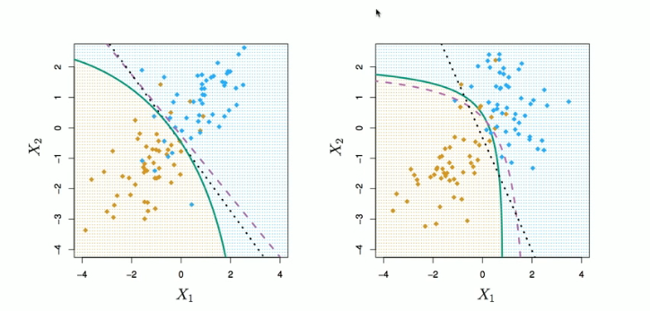

# Section 8 - Quadratic Discriminant Analysis and Naive Bayes
## Other forms of Discriminant Analysis
$$\text{Pr}(Y=K|X=x)=\frac{\pi_kf_k(x)}{\sum_{l=1}^K{\pi_lf_l(x)}}$$
When $f_k(x)$ are Gaussian densities, with the same covariance matrix $\mathbf{\Sigma}$ in each class, this leads to linear discriminant analysis.
By altering the forms for $f_k(x),$ we get different classifiers.
* With Gaussians but different $\mathbf{\Sigma}_k$ in each class, we get _quadratic discriminant analysis._
* With $f_k(x)=\prod_{j=1}^p{f_{jk}(x_j)}$ (conditional independence model) in each class we get _naive Bayes._ For Gaussian this means the $\mathbf{\Sigma}_k$ are diagonal.
* Many other forms, by proposing specific density models for $f_k(x),$ including nonparametric approaches.
## Quadratic Discriminant Analysis

$$\delta_k(x)=-\frac{1}{2}(x-\mu_k)^T\mathbf{\Sigma}_k^{-1}(x-\mu_k)+\log\pi_k-\frac{1}{2}\log|\Sigma_k|$$
Because the $\mathbf{\Sigma}_k$ are different, the quadratic terms matter.
## Naive Bayes
Assume features are independent in each class.
Useful when $p$ is large, and so multivariate methods like QDA and even LDA break down.
* Gaussian naive Bayes assumes each $\mathbf{\Sigma}_k$ is diagonal:
$$\begin{aligned}
\delta_k(x)&\propto\log\left[\pi_k\prod_{j=1}^p{f_{kj}(x_j)}\right]\\
&=-\frac{1}{2}\sum_{j=1}^p\left[\frac{(x_j-\mu_{kj})^2}{\sigma_{kj}^2}+\log\sigma_{kj}^2\right]+\log\pi_k
\end{aligned}
$$
* can use for _mixed_ feature vectors (qualitative and quantitative). If $X_j$ is qualitative, replace $f_{kj}(x_j)$ with probability mass function (histogram) over discrete categories.

Despite strong assumptions, naive Bayes often produces good classification results.
## Logistic Regression versus LDA
For a two-class problem, one can show that for LDA
$$\log\left(\frac{p_1(x)}{1-p_1(x)}\right)=\log\left(\frac{p_1(x)}{p_2(x)}\right)=c_0+c_1x_1+\dots+c_px_p$$
So it has the same form as logistic regression.
The difference is in how the parameters are estimated.
* Logistic regression uses the conditional likelihood based on $\text{Pr}(Y|X)$ (known as _discriminative learning_).
* LDA uses the full likelihood based on $\text{Pr}(X,Y)$ (known as _generative learning_).
* Despite these differences, in practise the results are often very similar.

Footnote: logistic regression can also fit quadratic boundaries like QDA by explicitly including quadratic terms in the model.
## Summary
* Logistic regression is very popular for classification, especially when $K=2.$
* LDA is useful when $n$ is small, or the classes are well separated, and Gaussian assumptions are reasonable. Also when $K>2.$
* Naive Bayes is useful when $p$ is very large.
* See Section 4.5 for some comparisons of logistic regression, LDA and KNN.