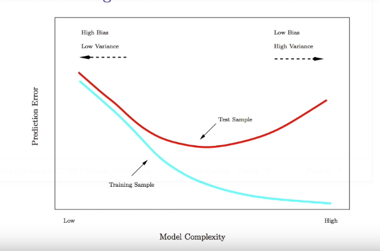
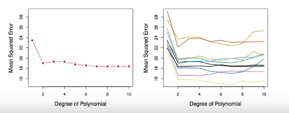

# Section 1 - Estimating Prediction Error and Validation Set Approach
## Cross-validation and the Bootstrap
* In this section we discuss two _resampling_ methods: cross-validation and the bootstrap.
* These methods refit a model of interest to samples formed from the training set, in order to obtain additional information about the fitted model.
* For example, they provide estimates of test-set prediction error, and the standard deviation and bias of our parameter estimates.
## Training Error versus Test error
* Recall the distinction between the _test error_ and the _training error:_
* The _test error_ is the average error that results from using a statistical learning method to predict the response on a new observation, one that was not used in training the model.
* In contrast, the _training error_ can be easily calculated by applying the statistical learning method to the observations used in its training.
* But the training error rate often is quite different from the test error rate, and in particular the former can _dramatically  underestimate_ the latter.
## Training- versus Test-Set Performance

## More on prediction-error estimates
* Best solution: a large designated test set. Often not available
* Some methods make a _mathematical adjustment_ to the training error rate in order to estimate the test error rate. These include the _Cp statistic, AIC_ and _BIC._ They are discussed elsewhere in this course.
* Here we instead consider a class of methods that estimate the test error by _holding out_ a subset of the training observations from the fitting process, and then applying the statistical learning method to those held out observations.
## Validation-set approach
* Here we randomly divide the available set of samples into two parts: a _training set_ and a _validation_ or _hold-out set._
* The model is fit on the training set, and the fitted model is used to predict the response of the observations in the validation set.
* The resulting validation-set error provides an estimate of the test error. This is typically assessed using MSE in the case of a quantiative response and misclassification rate in the case of qualitative (discrete) response.
## The Validation process

A random splitting into two halves: left part is training set, right part is validation set.
## Example: automobile data
* Want to compare linear vs higher-order polynomial terms in a linear regression
* We randomly split the $392$ observations into two sets, a trsaining set containing of $196$ of the data points, and a validation set containing of the remaning $196$ observations

_Left panel shows single split; right panel shows multiple splits_
## Drawbacks of validation set approach
* the validation estimate of the test error can be highly variable, depending on precisely which observations are included in the training set and which observations are included in the validation set.
* In the validation approach, only a subset of the observations - those that are included in the training set rather than in the valdiation set - are used to fit the model.
* This suggets that the validation set error may tend to _overestimate_ the test error for the model fit on the entire data set. _Why?_