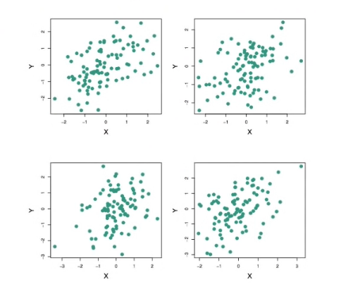
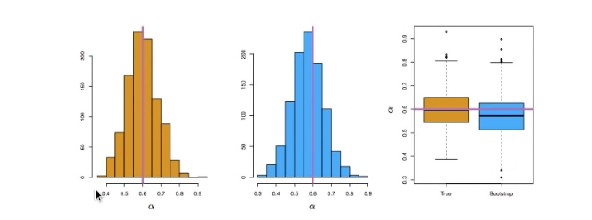
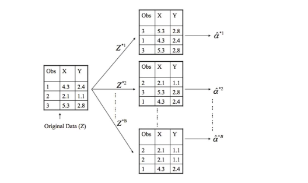

# Section 3 - The Bootstrap
## The Bootstrap
* The _bootstrap_ is a flexible and powerful statistical tool that can be used to quantify the uncertainty associated with a given estimator or statistical learning method.
* For example, it can provide an estimate of the standard error of a coefficient, or a confidence interval for that coefficient.
## Where does the name come from?
* The use of the term bootstrap derives from the phrase _to pull oneself up by one's bootstrap,_ widely thought to be based on one of the eighteenth century "The Surprising Adventures of Baron Munchausen" by Rudolph Erich Raspe:
_The Baron had fallen to the bottom of a deep lake. Just when it looked like all was lost, he thought to pick himself up by his own bootstraps._
* It is not the same as the term "bootstrap" used in computer science meaning to "boot" a computer from a set of core instructions, though the derivation is similar.
## A simple example
* Suppose that we wish to invest a fixed sum of money in two financial assets that yield returns of $X$ and $Y,$ respectively, where $X$ and $Y$ are random quantities.
* We will invest a fraction $\alpha$ of our money in $X,$ and will invest the remaining $1-\alpha$ in $Y.$
* We wish to choose $\alpha$ to minimize the total risk, or variance, of our investment. In other words, we want to minimize $\text{Var}(\alpha X+(1-\alpha)Y).$
* One can show that the value that minimzes the risk is given by
$$\alpha=\frac{\sigma_Y^2-\sigma_{XY}}{\sigma_X^2+\sigma_Y^2-2\sigma_{XY}},$$
where $\sigma_X^2=\text{Var}(X),\sigma_Y^2=\text{Var}(Y),$ and $\sigma_{XY}=\text{Cov}(X,Y).$
* But the values of $\sigma_X^2,\sigma_Y^2,$ and $\sigma_{XY}$ are unknown.
* We can compute estimates for these quantities, $\hat{\sigma}_X^2,\hat{\sigma}_Y^2,$ and $\hat{\sigma}_{XY},$ using a data set that contains measurements for $X$ and $Y.$
* We can then estimate the value of $\alpha$ that minimzes the variance of our investment using
$$\hat{\alpha}=\frac{\hat{\sigma}_Y^2-\hat{\sigma}_{XY}}{\hat{\sigma}_X^2+\hat{\sigma}_Y^2-2\hat{\sigma}_{XY}}.$$

_Each panel displays $100$ simulated returns for interesting investments $X$ and $Y.$ From left to right and top to botto, the resulting estimates for $\alpha$ are $0.576,0.532,0.657,$ and $0.651.$_
* To estimate the standard deviation of $\hat{\alpha},$ we repeated the process of simulating $100$ paired observations of $X$ and $Y,$ and estimating $\alpha$ $1,000$ times.
* We thereby obtained $1,000$ estimates for $\alpha,$ which we can call $\hat{\alpha}_1,\hat{\alpha}_2,\dots,\hat{\alpha}_{1000}.$
* The left-hand panel of the Figure below displays a histogram of the resulting estimates.
* For these simulations the parameters were set to $\sigma_X^2=1,\sigma_Y^2=1.25,$ and $\sigma_{XY}=0.5,$ and so we know that the true value of $\alpha$ is $0.6$ (indicated by the red line).
* The mean over all $1,000$ estimates for $\alpha$ is
$$\bar{\alpha}=\frac{1}{1000}\sum_{r=1}^{1000}{\bar{\alpha}_r}=0.5996,$$
very close to $\alpha=0.6,$ and the standard deviation of the estimates is
$$\sqrt{\frac{1}{1000-1}\sum_{r=1}^{1000}{(\hat{\alpha}_r-\bar{\alpha})^2}}=0.083.$$
* This gives us a very good idea of the accuracy of $\hat{\alpha}:$
$$\text{SE}(\hat{\alpha})\approx0.083.$$
* So rougly speaking, for a random sample from the population, we would expect $\hat{\alpha}$ to differ from $\alpha$ by approximately $0.08,$ on average.
## Results

_Left:_ A histogram of the estimates of $\alpha$ obtained by generating $1,000$ simulated data sets from the true population. _Center:_ A histogram of the estimates of $\alpha$ from $1,000$ bootstrap samples from a single data set. _Right:_ The estimates of $\alpha$ displayed in the left and center panels are shown as boxplots. In each panel, the pink line indicates the true value of $\alpha.$
## Now back to the real world
* The procedure outlined above cannot be applied, because for real data we cannot generate new samples from the original population.
* However, the bootstrap approach allows us to use a computer to mimic the process of obtaining new data sets, so that we can estimate the variability of our estimate without generating additional samples.
* Rather than repeatedly obtaining independent data sets from the population, we instead obtain distinct data sets by repeatedly sampling observations from the original data set _with replacement._
* Each of these "bootstrap data sets" is created by sampling _with replacement,_ and is the _same size_ as our original dataset. As a result some observations may appear more than once in a given bootstrap data set and some not at all.
## Example with just $3$ observations

A graphical illustration of the bootstrap approach on a small sample containing $n=3$ observations. Each bootstrap data set contain $n$ observations, sampled with replacement from the original data set. Each bootstrap data set is used to obtain an estimate of $\alpha.$
* Denoting the first bootstrap data set by $Z^{*1},$ we use $Z^{*1}$ to produce a new bootstrap estimate for $\alpha,$ which we call $\hat{\alpha}^{*1}$
* This procedure is repeated $B$ times for some large value of $B$ (say $100$ or $1000$), in order to produce $B$ different bootstrap data sets, $Z^{*1},Z^{*2},\dots,Z^{*B},$ and $B$ corresponding $\alpha$ estimates, $\hat{\alpha}^{*1},\hat{\alpha}^{*2},\dots,\hat{\alpha}^{*B}.$
* We estimate the standard error of these bootstrap estimates using the formula
$$\text{SE}_B(\hat{\alpha})=\sqrt{\frac{1}{B-1}\sum_{r=1}^B{(\hat{\alpha}^{*r}-\bar{\hat{\alpha}}^{*})^2}}.$$
* This serves as an estimate of the standard error of $\hat{\alpha}$ estimated from the original data set. See center and right panels of the Figure above. Bootstrap results are in blue. For this example $\text{SE}_B(\hat{\alpha})=0.087.$