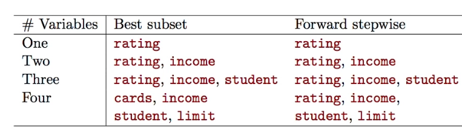

# Section 2 - Forward Stepwise Selection
## Extensions to other models
* Although we have presented best subset selection here for least squares regression, the same idea apply to other types of models, such as logistic regression.
* The _deviance_ - negative two times the maximimzed log-likelihood - plays the role of RSS for a broader class of models.
## Stepwise Selection
* For computational reasons, best subset selection cannot be applied with very large $p.$ _Why not?_
* Best subset selection may also suffer from statistical problems when $p$ is large: larger the search space, the higher the chance of finding models that look good on the training data, even though they might not have any predictive power on future data.
* Thus an enormous search space can lead to _overfitting_ and high variance of the coefficient estimates.
* For both of these reasons, _stepwise_ methods, which explore a far more restricted set of models, are attractive alternatives to best subset selection.
## Forward Stepwise Selection
* Forward stepwise selection begins with a model containing no predictors, and then adds predictors to the model, one-at-a-time, until all of the predictores are in the model.
* In particular, at each step the variable that gives the greatest _additional_ to the fit is added to the model.  
## In Detail
### Forward Stepwise Selection
1. Let $\mathcal{M}_0$ denote the _null_ model, which contains no predictors.
2. For $k=0,\dots,p-1:$
   2.1 Consider all $p-k$ models that augment the predictors in $\mathcal{M}_k$ with one additional predictor.
   2.2 Choose the _best_ among these $p-k$ models, and call it $\mathcal{M}_{k+1}.$ Here _best_ is defined as having smallest RSS or highest $R^2.$
3. Select a single best model from among $\mathcal{M}_0,\dots,\mathcal{M}_p$ using cross-validated prediction error, $C_p$ (AIC), BIC, or adjusted $R^2.$
## More on Forward Stepwise Selection
* Computational advantage ober best subset selection is clear.
* It is not guaranteed to find the best possible model out of all $2^p$ models containing subset of the $p$ predictors. _Why not? Give an example._
## Credit data example

_The first four selected models for best subset selection and forward stepwise selection on the $\text{Credit}$ data set. The first three models are identical but the fourth models differ._