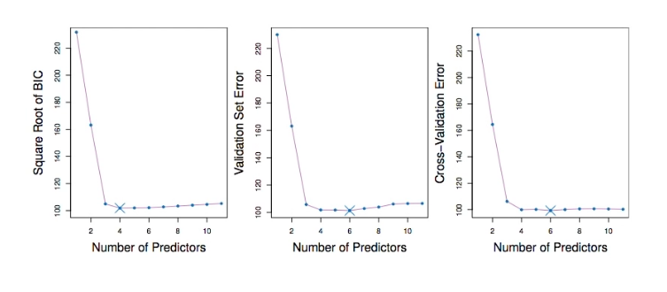

# Section 5 - Estimating Test Error Using Cross-Validation
## Validation and Cross-Validation
* Each of the procedures returns a sequence of models $\mathcal{M}_k$ indexed by model size $k=0,1,2,\dots.$ Our job here is to select $\hat{k}.$ Once selected, we will return model $\mathcal{M}_{\hat{k}}.$
* We compute the validation set error or the cross-validation error for each model $\mathcal{M}_k$ under consideration, and then select the $k$ for which the resulting estimated test error is smallest.
* This procedure has an advantage relative to AIC, BIC, $C_p,$ and adjusted $R^2,$ in that it provides a direct estimate of the test error, and _doesn't require an estimate of the error variance $\sigma^2.$
* It can also be used in a wider range of model selection tasks, even when in cases where it is hard to pinpoint the model degrees of freedom (e.g. the number of predictors in the model) or hard to estimate the error variance $\sigma^2.$
## Credit data example

## Details of the Previous Figure
* The validation errors were calculated by randomly selecting three-quarters of the observations as the training set, and the remainder as the validation set.
* The cross-validation errors were computed using $k=10$ folds. In this case, the validation and cross-validation methods best result in six-variable models.
* However, all three approaches suggest the four-, five-, and six-variable models are rougly equivalent in terms of their test errors.
* In this setting, we can select a model using the _one-standard-error rule._ We first calculate the standard error of the estimated test MSE for each model size, and then select the smallest model for which the estimated test is within one standard error of the lowest point on the curve. _What is the rationale for this?_