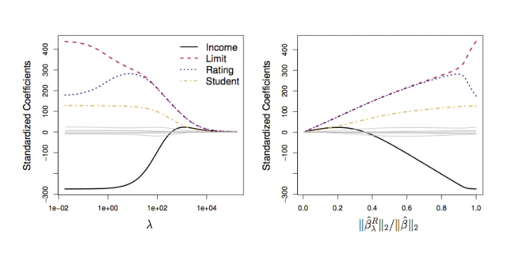
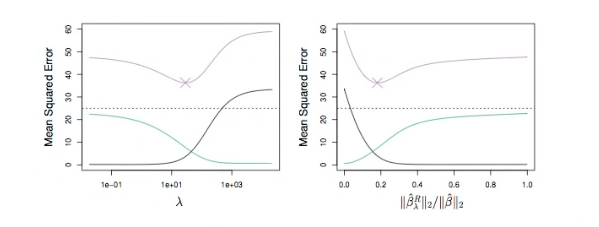

# Section 6 - Shrinkage Methods and Ridge Regression
## Shrinkage Methods
_Ridge regression_ and _Lasso_
* The subset selection methods use least squares to fit a linear model that contains a subset of the predictors.
* As an alternative, we can fit a model containing all $p$ predictors using a technique that _constraints_ or _regularizes_ the coefficient estimates, or equivalently, that _shrinks_ the coefficient estimates towards zero.
* It may not be immediately obvious why such a constraint should improve the fit, but it turns out that shrinking the coefficient estimates can significantly reduce their variance.
## Ridge regression
* Recall that the least squares fitting procedures estimates $\beta_0,\beta_1,\dots,\beta_p$ using the values that minimizes
$$\text{RSS}=\sum_{i=1}^n{\left(y_i-\beta_0-\sum_{j=1}^p{\beta_jx_{ij}}\right)^2}.$$
* In contrast, the ridge regression coefficient estimates $\hat{\beta}^R$ are the values that minimize
$$\sum_{i=1}^n{\left(y_i-\beta_0-\sum_{j=1}^p{\beta_jx_{ij}}\right)^2}+\lambda\sum_{j=1}^p{\beta_j^2}=\text{RSS}+\lambda\sum_{j=1}^p{\beta_j^2},$$
where $\lambda\geq0$ is a _tuning parameter,_ to be determined separately.
* As with least squares, ridge regression seeks coefficient estimates that fit the data well, by making the RSS small.
* However, the second term, $\lambda\sum_{j=1}^p{\beta_j^2},$ called a _shrinkage penalty,_ is small when $\beta_1,\dots,\beta_p$ are close to zero, and so it has the effect of _shrinking_ the estimates of $\beta_j$ towards zero.
* The tuning parameter $\lambda$ serves to control the relative impact of these two terms on the regression coefficient estimates.
* Selecing a good value for $\lambda$ is critical; cross-validation is used for this.
## Credit data example

## Details of Previous Figure
* In the left-hand panel, each curve corresponds to the ridge regression coefficient estimate for one of the ten variables, plotted as a function of $\lambda.$
* The right-hand panel displays the same ridge coefficient estimates as the left-hand panel, but instead of displaying $\lambda$ on the $x$-axis, we now display $||\hat{\beta}_\lambda^R||_2/||\hat{\beta}||_2,$ where $\hat{\beta}$ denotes the vector of least squares coefficient estimates.
* The notation $||\beta||_2$ denotes the $l_2$ norm (pronounced "ell $2$") of a vector, and is defined as $||\beta||_2=\sqrt{\sum_{j=1}^p{\beta_j^2}}.$
## Ridge regression: scaling of predictors
* The standard least squares coefficient estimates are _scale equivariant:_ multiplying $X_j$ by a constant $c$ simply leads to a scaling of the least squares coefficient estimates by a factor of $1/c.$ In other words, regardless of how the $j$th predictor is scaled, $X_j\hat{\beta}_j$ will remain the same.
* In contrast, the ridge regression coefficent estimates can change _substantially_ when multipliying a predictor by a constant, due to the sum of squared coefficients term in the penalty part of the ridge regression objective function.
* Therefore, it is best to apply ridge regression after _standardizing the predictors,_ using the formula
$$\tilde{x}_{ij}=\frac{x_{ij}}{\sqrt{\frac{1}{n}\sum_{i=1}^n{(x_{ij}-\bar{x}_j)^2}}}$$
## Why does Ridge Regression Improve Over Least Squares?
_The Bias-Variance tradeoff?_

_Simulated data with $n=50$ observations, $p=45$ predictors, all having nonzero coefficients. Squared bias (black), variance (green), and test mean squared error (purple) for the ridge regression predictions on a simulated data set, as a function of $\lambda$ and $||\hat{\beta}_\lambda^R||_2/||\hat{\beta}||_2.$ The horizontal dashed lines indicate the minimum possible MSE. The purple crosses indicate the ridge regression models for which the MSE is smallest.