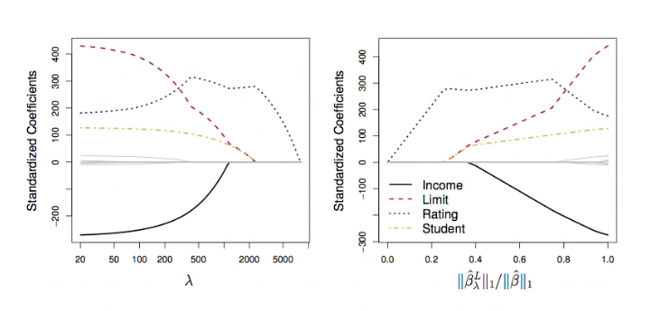
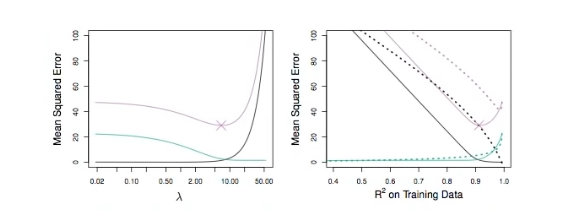

# Section 7 - The Lasso
## The Lasso
* Ridge regression does have one obvious disadvantage:
  unlike subset selection, which will generally select models that involve just a subset of the variables, ridge regression will include all $p$ predictors in the final model.
* The _Lasso_ is a relatively recent alternative to ridge regression that overcomes this disadvantage. The lasso coefficients, $\hat{\beta}_\lambda^L,$ minimize the quantity
$$\sum_{i=1}^n{\left(y_i-\beta_0-\sum_{j=1}^p{\beta_jx_{ij}}\right)^2}+\lambda\sum_{j=1}^p{|\beta_j|}=\text{RSS}+\lambda\sum_{j=1}^p{|\beta_j|}.$$
* In statistical parlance, the lasso uses an $l_1$ (pronounced "ell $1$") penalty instead of an $l_2$ penalty. The $l_1$ norm of a coefficient vector $\beta$ is given by $||\beta||_1=\sum{|B_j|}.$
* As with ridge regression, the lasso shrinks the coefficient estimates towards zero.
* However, in the case of the lasso, the $l_1$ penalty has the effect of forcing some of the coefficient estimates to be exactly equal to zero when the tuning of parameter $\lambda$ is sufficiently large.
* Hence, much like the subset selection, the lasso performs _variable selection._
* We say that the lasso yields _sparse_ models - that is, models that involve only a subset of the variables.
* As in ridge regression, selecting a good value of $\lambda$ for the lasso is critical; cross-validation is again the method of choice.
## Example: Credit dataset

## The Variable Selection Property of the Lasso
Why is it that the lasso, unlike ridge regression, results in coefficient estimates that are exactly equal to zero?

One can show that the lasso and ridge regression coefficient estimates solve the problem
$$\min_\beta{\sum_{i=1}^n{\left(y_i-\beta_0-\sum_{j=1}^n{\beta_jx_{ij}}\right)^2}}\text{ subject to }\sum_{j=1}^p{|\beta_j|}\leq s$$
and
$$\min_\beta{\sum_{i=1}^n{\left(y_i-\beta_0-\sum_{j=1}^n{\beta_jx_{ij}}\right)^2}}\text{ subject to }\sum_{j=1}^p{\beta_j^2}\leq s,$$
respectively.
## The Lasso Picture

## Comparing the Lasso and Ridge Regression

__Left:__ _Plot of squared bias (black), variance (green), and test MSE (purple) for the lasso on simulated data set of the Figure above._
__Right:__ _Comparison of squared bias, variance and test MSE between lasso (solid) and ridge (dashed). Both are plotted against their $R^2$ on the training data, as a common form of indexing. The crosses in both plots indicate the lasso model for which the MSE is smallest._

__Left:__ _Plot of squared bias (black), variance (green), and test MSE (purple) for the lasso. The simulated data is similar to the Figure above, except that now only two predictors are related to the response._
__Right:__ _Comparison of squared bias, variance and test MSE between lasso (solid) and ridge (dashed). Both are plotted against their $R^2$ on the training data, as a common form of indexing. The crosses in both plots indicate the lasso model for which the MSE is smallest._
## Conclusions
* These two examples illustrate that neither ridge regression nor the lasso will universally dominate the other.
* In general, one might expect the lasso to perform better when the response is a function of only a relatively small number of predictors.
* However, the number of predictors that is related to the response is never known _a priori_ for real data sets.
* A technique such as cross-validation can be used in order to determine which approach is better on a particular data set.