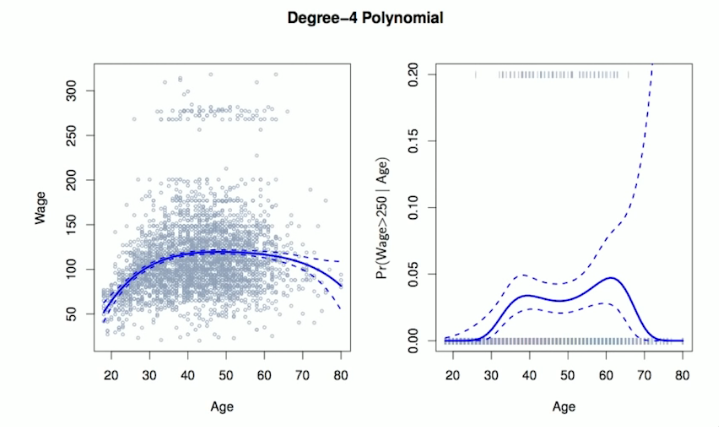
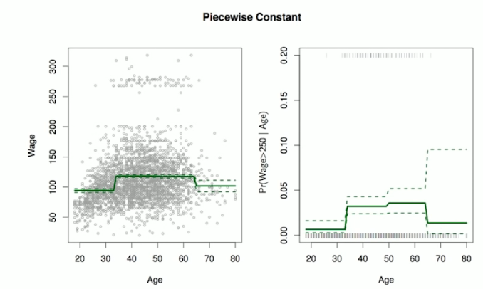

# Section 1 - Polynomial Regression and Step Functions
## Moving Beyond Linearity
The truth is never linear!
Or almist never!

But often the linearity assumption is good enough.

When its not...
* polynomials,
* step functions,
* splines,
* local regression, and
* generalized additive models

offer a lot of flexibility, without losing the ease and interpretability of linear models.
## Polynomial Regression
$$y_i=\beta_0+\beta_1x_i+\beta_2x_i^2+\beta_3x_i^3+\dots+\beta_dx_i^d+\epsilon_i$$

## Details
* Create new variables $X_1=X,X_2=X^2,$ etc and then treat as multiple linear regression.
* Not really interested in the coefficients; more interested in the fitted function values at any value $x_0:$
$$\hat{f}(x_0)=\hat{\beta}_0+\hat{\beta}_1x_0+\hat{\beta}_2x_0^2+\hat{\beta}_3x_0^3+\hat{\beta}_4x_0^4.$$
* Since $\hat{f}(x_0)$ is a linear function of the $\hat{\beta}_l,$ can get a simple expression for _pointwise-variances_ $\text{Var}\left[\hat{f}(x_0)\right]$ at any value $x_0.$ In the figure we have computed the fit and pointwise standard errors on a grid of values for $x_0.$ We show $\hat{f}(x_0)\pm2\cdot\text{SE}\left[\hat{f}(x_0)\right].$
* We either fix the degree $d$ at some reasonably low value, else use cross-validation to choose $d.$
* Logistic regression follows naturally. For example, in figure we model
$$\text{Pr}(y_i>250|x_i)=\frac{\exp(\beta_0+\beta_1x_i+\beta_2x_i^2+\dots+\beta_dx_i^d)}{1+\exp(\beta_0+\beta_1x_i+\beta_2x_i^2+\dots+\beta_dx_i^d)}$$
* To get the confidence interval, compute upper and lower bonds _on the logit scale,_ and then invert to get on probability scale.
* Can do separately on several variables - just stack the variables into one matrix, and separate out the pieces afterwards (see GAMs later).
* Caveat: polynomials have notorious tail behavior - very bad for extrapolation.
* Can fit using `y ~ poly(x, degree = 3)` in formula.
## Step Functions
Another way of creating transformations of a variable - cut the variable into distinct regions.
$$C_1(X)=I(X<35),\quad C_2(X)=I(35\leq X<50),\dots,\quad C_3(X)=I(X\geq65)$$

* Easy to work with. Creates a series of dummy variables representing each group.
* Useful way of creating interactions that are easy to interpret. For example, interaction effect of $\text{Year}$ and $\text{Age}:$
$$I(\text{Year}<2005)\cdot\text{Age},\quad I(\text{Year}\geq2005)\cdot\text{Age}$$
would allow for different linear functions in each age category.
* In R: `I(year < 2005)` or `cut(age, c(18,25,40,65,90))`.
* Choice of cutpoints or _knots_ can be problematic. For creating nonlinearities, smoother alternatives such as _splines_ are available.