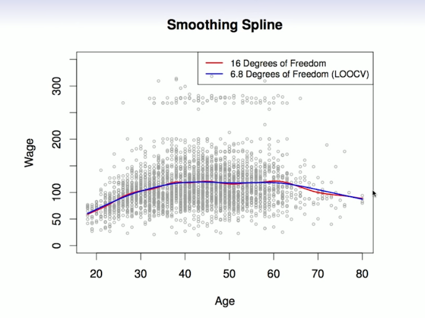

# Section 3 - Smoothing Splines
## Smoothing Splines
This section is a little bit mathematical.

Consider this criterion for fitting a smooth function $g(x)$ to some data:
$$\min_{g\in S}{\sum_{i=1}^n{(y_i-g(x_i))^2}+\lambda\int{g''(t)^2\,dt}}$$
* The first term is RSS, and tries to make $g(x)$ math the data at each $x_i.$
* The second term is a _roughness penalty_ and controls how wiggly $g(x)$ is. It is modulated by the _tuning parameter $\lambda\geq0$_.
  * The smaller $\lambda,$ the more wiggly the function, eventually interpolating $y_i$ when $\lambda=0.$
  * As $\lambda\to\infty,$ the function $g(x)$ becomes linear.

The solution is a natural cubic spline, with a knot at every unique value of $x_i.$ The roughness penalty stull controls the roughness via $\lambda.$

Some details
* Smoothing splines avoid the knot-selection issue, leaving a single $\lambda$ to be chosen.
* The algorithmic details are too complex to describe here. In R, the funcion `smooth.spline()` will fit a smoothing spline.
* The vector of $n$ fitted values can be written as $\hat{\bf{g}}_\lambda=\bf{S}_\lambda\bf{y}$ where $\bf{S}_\lambda$ is a $n\times n$ matrix (determined by the $x_i$ and $\lambda$).
* The _effective degrees of freedom_ are given by
$$df_\lambda=\sum_{i=1}^n{\{\bf{S}_\lambda\}_{ii}}.$$
### Choosing $\lambda$
* We can specify _df_ rather than $\lambda!$
  In R: `smooth.spline(age,wage,df=10)`
* The leave-one-out (LOO) cross-validated error is given by
$$\text{RSS}_{cv}(\lambda)=\sum_{i=1}^n{(y_i-\hat{g}_\lambda^{(-i)}(x_i))^2}=\sum_{i=1}^n{\left[\frac{y_i-\hat{g}_\lambda(x_i)}{1-\{\bf{S}_\lambda\}_{ii}}\right]^2}.$$
In R: `smooth.spline(age,wage)`

