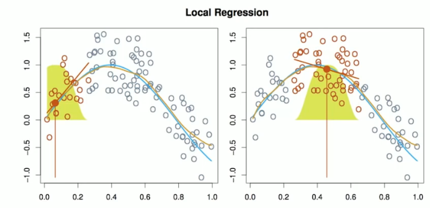
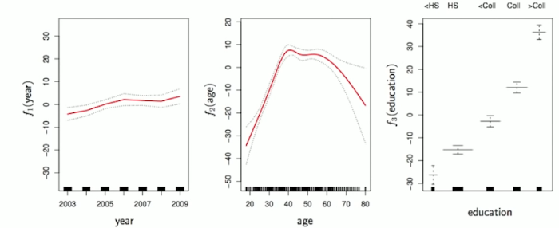
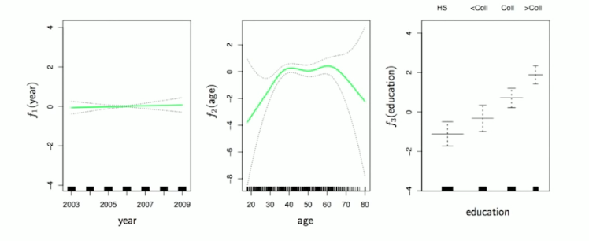

# Section 4 - Local Regression and Generalized Additive Models
## Local Regression

With a sliding weight function, we fit separate linear fits over the range of $X$ by weighted least squares.
See text for more details, and `loess()` function in R. 
## Generalized Additive Models
Allows for flexible nonlinearities in several variables, but retains the additive structure of linear models.
$$y_i=\beta_0+f_1(x_{i1})+f_2(x_{i2})+\dots+f_p(x_{ip})+\epsilon_i.$$

## GAM details
* Can fit a GAM simply using, e.g., natural splines
`lm(wage ~ ns(year, df=5) + ns(age, df=5) + education)`
* Coefficients not that interesting; fitted functions are. The previous plot was produced using `plot.gram`.
* Can mix terms - some linear, some nonlinear - and use `anova()` to compare models.
* Can use smoothing splines or local regression as well:
`gam(wage ~ s(year, df=5) + lo(age, span=.5) + education)`
* GAMs are additive, although low-order interactions can be included in a natural way using, e.g., bivariate smoothers or interactions of the form `ns(age,df=5):ns(year,df=5)`.
## GAMs for classification
$$\log\left(\frac{p(X)}{1-p(X)}\right)=\beta_0+f_1(X_1)+f_2(X_2)+\dots+f_p(X_p).$$

`gam(I(wage > 250) ~ year + s(age, df=5) + education, family=binomial)`