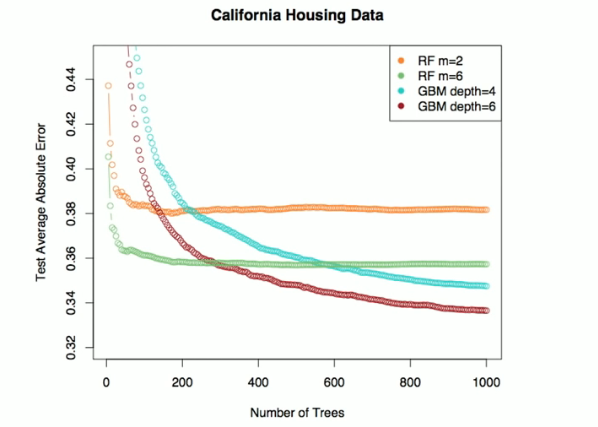
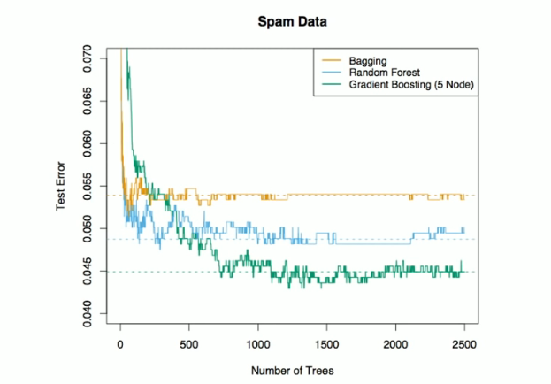

# Section 5 - Boosting and Variable Importance
## Boosting
* Like bagging, boosting is a general approach that can be applied to many statistical learning methods for regression or classification. We only discuss boosting for decision trees.
* Recall that bagging involves creating multiple copies of the original training data set using the bootstrap, fitting a separate decision tree to each copy, and then combining the trees in order to create a single predictive model.
* Notably, each tree is built on a bootstrap data set, independent of the other trees.
* Boosting works in a similar way, except that the trees are grown _sequentially_: each tree is grown using information from previously grown trees.
## Boosting algorithm for regression trees
1. Set $\hat{f}(x)=0$ for $r_i=y_i$ for all $i$ in the training set.
2. For $b=1,2,\dots,B,$ repeat
   2.1 Fit a tree $\hat{f}^b$ with $d$ splits ($d+1$ terminal nodes) to the training data $(X,r).$
   2.2 Update $\hat{f}$ by adding in a shrunken value of the new tree:
   $$\hat{f}(x)\leftarrow\hat{f}(x)+\lambda\hat{f}^b(x).$$
   2.3 Update the residuals
   $$r_i\leftarrow r_i-\lambda\hat{f}^b(x_i).$$
3. Output the boosted model,
$$\hat{f}(x)=\sum_{b=1}^B{\lambda\hat{f}^b(x)}.$$
## What is the idea behing this procedure?
* Unlike fitting a single large decision tree to the data, which amounts to _fitting the data hard_ and potentially overfitting the boosting approach instead _learns slowly_.
* Given the current model, we fit a decision tree to the residuals from the model. We then add this new decision tree into the fitted function in order to update the residuals.
* Each of these trees can be rather small, with just a few terminal nodes, determined by the parameter $d$ in the algorithm.
* By fitting small trees to the residuals, we slowly improve $\hat{f}$ in areas where it does not perform well. The shrinkage parameter $\lambda$ slows the process down even further, allowing more and different shaped trees to attack the residuals.
## Boosting for classification
* Boosting for classification is similar in spirit to boosting for regression, but is a bit more complex. We will not go into detail here, nor do we in the text book.
* Students can learn about the details in _Elements of Statistical Learning, chapter 10._
* The R package `gbm` (gradient boosted models) handles a variety of regression and classification problems.
## Gene expression data continued

## Details of previous figure
* Results from performing boosting and random forests on the fifteen-class gene expression data set in order to predict _cancer_ versus _normal_.
* The test error is displayed as a function of the number of trees. For the two boosted models, $\lambda=0.01.$ Depth-$1$ tees slightly outperform depth-$2$ trees, and both outperform the random forest, although the standard errors are around $0.02,$ making none of these significant.
* The test error rate for a single tree is $24\%.$
## Tuning parameters for boosting
1. The _number of trees_ $B.$ Unlike bagging and random forests, boosting can overfit if $B$ is too large, although this overfitting tends to occur slowly if all. We use cross-validation to select $B.$
2. The _shrinkage parameter $\lambda$_, a small positive number. This controls the rate at which boosting learns. Typical values are $0.01$ or $0.001,$ and the right choice can depend on the problem. Very small $\lambda$ can require using a very large value of $B$ in order to achieve good performance.
3. The _number of splits_ $d$ in each tree, which controls the complexity of the boosted ensemble. Often $d=1$ works well, in which case each tree is a _stump,_ consisting of a single split and resulting in an additive model. More generally $d$ is the _interaction depth_ and controls the interaction order of the boosted model, since $d$ splits can involve at most $d$ variables.
## Another regression example

from _Elements of Statistical Learning, chapter 15._
## Another classification example

from _Elements of Statistical Learning, chapter 15._
## Variable importance measure
* For bagged/RF regression trees, we record the total amount that the RSS is decreased due to splits over a given predictor, averaged over all $B$ trees. A large value indicates an important predictor.
* Similary, for bagged/RF classification rees, we add up the total amount that the Gini index is decreased by splits over a given predictor, averaged over all $B$ trees.

Variable importance plot for the $\text{Heart}$ data.
## Summary
* Decision trees are simple and interpretable methods for regression and classification.
* However they are often not competitive with other methods in terms of prediction accuracy.
* Bagging, random forests and boosting are good methods for improving the prediction on the training data and then combining the predictions of the resulting ensemble of trees.
* The latter two methods - random forests and boosting - are among the state-of-the-art methods for supervised learning. However their results can be different to interpret.