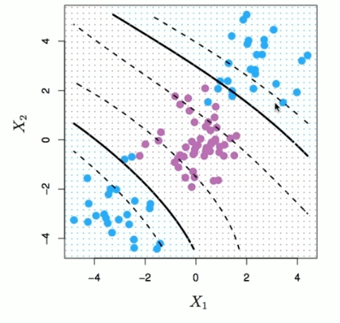
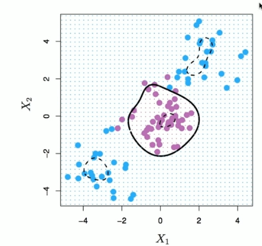

# Section 3 - Kernels and Support Vector Machines
## Feature Expansion
* Enlarge the space of features by including transformations; e.g. $X_1^2,X_1^3,X_1X_2,X_1X_2^2,\dots.$ Hence go from a $p$-dimensional space to a $M>p$ dimensional space.
* Fit a support-vector classifier in the enlarged space.
* This results in non-linear decision boundaries in the original space.

Example: Suppose we use $(X_1,X_2,X_1^2,X_2^2,X_1X_2)$ instead of just $(X_1,X_2).$ Then the decision boundary would be of the form
$$\beta_0+\beta_1X_1+\beta_2X_2+\beta_3X_1^2+\beta_4X_2^2+\beta_5X_1X_2=0$$
This leads to nonlinear decision boundaries in the original space (quadratic conic sections).
## Cubic Polynomials

Here we use a basis expansion of cubic polynomials.

From $2$ variables to $9$

The support vector classifier in the enlarged space solves the problem in the lower dimensional space.

$$\beta_0+\beta_1X_1+\beta_2X_2+\beta_3X_1^2+\beta_4X_2^2+\beta_5X_1X_2+\beta_6X_1^3+\beta_7X_2^3+\beta_8X_1X_2^2+\beta_9X_1^XX_2=0$$
## Nonlinearities and Kernels
* Polynomials (especially high-dimensional ones) get wild rather fast.
* There is a more elegant and controlled way to introduce nonlinearities in support-vector classifiers - through the use of _kernels._
* Before we discuss these, we must understand the role of _inner products_ in support-vector classifier. 
## Inner products and support vectors
$$\langle x_i,x_{i'}\rangle=\sum_{j=1}^p{x_{ij}x_{i'j}}\quad-\textit{inner product between vectors}$$
* The linear support vector classifier can be represented as
$$f(x)=\beta_0+\sum_{i=1}^n{\alpha_i\langle x_i, x_{i'}\rangle}\quad-n\textit{ parameters}$$
* To estimate the parameters $\alpha_1,\dots,\alpha_n$ and $\beta_0$ all we need are the $\binom{n}{2}$ inner products $\langle x_i, x_{i'}\rangle$ between all pairs of training observations.

It turns out that most of the $\hat{\alpha}_i$ can be zero:
$$f(x)=\beta_0+\sum_{i\in S}{\hat{\alpha}_i\langle x,x_i\rangle}$$
$S$ is the _support set_ of indices $i$ such that $\hat{\alpha}_i>0.$
## Kernel and Support Vector Machines
* If we can compute inner-products between observations, we can fit a SV classifier. Can be quite abstract!
* Some special _kernel functions_ can do this for us. E.g.
$$K(x_i,x_{i'})=\left(1+\sum_{j=1}^p{x_{ij}x_{i'j}}\right)^d$$
computes the inner-products nneded for $d$ dimensional polynomials - $\binom{p+d}{d}$ basis functions!
$$\textit{Try it for }p=2\textit{ and }d=2.$$
* The solution has the form
$$f(x)=\beta_0+\sum_{i\in S}{\hat{\alpha}_iK(x,x_i)}.$$
## Radial Kernel
$$K(x_i,x_{i'})=\exp\left(-\gamma\sum_{j=1}^p{(x_{ij}-x_{i'j})^2}\right).$$

$$f(x)=\beta_0+\sum_{i\in S}{\hat{\alpha}_iK(x,x_i)}$$
Implicit feature space; very high dimensional.

Controls variance by squashing down most dimensions severely.