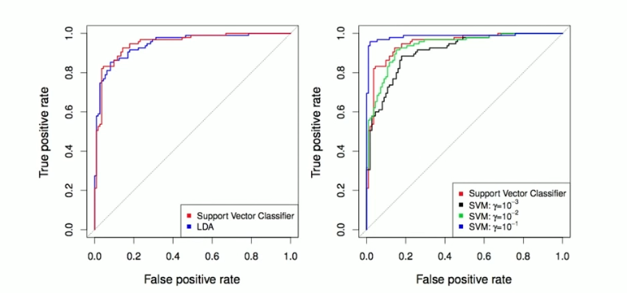
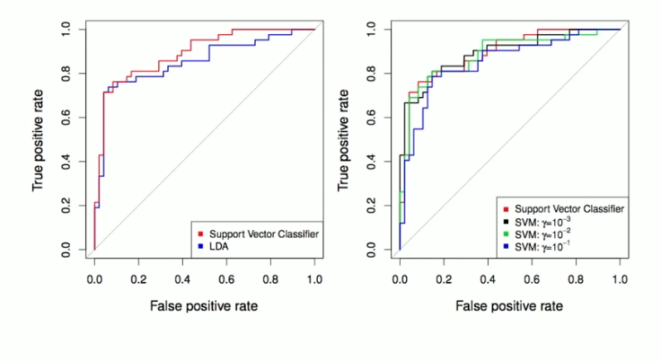
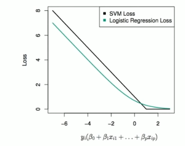

# Section 4 - Example and Comparison with Logistic Regression
## Example: Heart Data

ROC curve is obtained by changing the threshold $0$ to threshold $t$ in $\hat{f}(X)>t,$ and recording _false positive_ and _true positive_ rates as $t$ varies. Here we see ROC curves on training data.
## Example continued: Heart Test Data

## SVMs: more than $2$ classes?
The SVM as defined works for $K=2$ classes. What do we do if we have $K>2$ classes?

__OVA__
One versus All. Fit $K$ different $2$-class SVM classifiers $\hat{f}_k(x),k=1,\dots,K;$ each class versus the rest. Classify $x^*$ to the class for which $\hat{f}(x^*)$ is largest.

__OVO__
One versus One. Fit all $\binom{K}{2}$ pairwise classifiers $\hat{f}_{kl}(x).$ Classify $x^*$ to the class that wins the most pairwise competitions.

Which to choose? If $K$ is not too large, use OVO.
## Support Vector versus Logistic Regression?
With $f(X)=\beta_0+\beta_1X_1+\dots+\beta_pX_p$ can rephrase support-vector classifier optimization as
$$\min_{\beta_0,\beta_1,\dots,\beta_p}{\{\sum_{i=1}^n{\max[0,1-y_if(x_i)]}+\lambda\sum_{j=1}^p{\beta_j^2}\}}$$

This has the form _loss plus penalty._
The loss is known as the _hinge loss._
Very similar to "loss" in logistic regression (negative log-likelihood).
## Which to use: SVM or Logistic Regression?
* When classes are (nearly) separable, SVM does better than LR. So does LDA.
* When not, LR (with ridge penalty) and SVM very similar.
* If you wish to estimate probabilities, LR is the choice.
* For nonlinear boundaries, kernel SVMs are popular. Can use kernels with LR and LDA as well, but computations are more expensive.