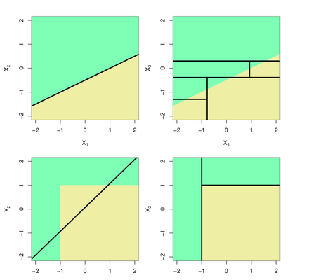

# Module 8: Tree-based Methods
* Same prediction on leaves is OK, since they can have different probabilities.
* Is also OK to build a large tree, and then prune later. Better than stopping too early.
* Can use cross-validation to make tree simpler. No unecessary splits.
## Questions
* What happens to bias?
  * Short trees have low accuracy, so high bias
* What happens to the variance of a prediction if we reduce the tree size?
  * If we have a deep tree, we can get overfitting, and can get higher variance.

__Tree-pruning helps us with variance-bias tradeoff__

## Trees versus linear models
* What if we have $x_1$ and $x_2$ and the true class boundary (two classes) is linear in $x_1,xx_2$ space. How can we do that with our binary recursive splits?
* What about a rectangular boundary?



## From trees to forests

__Advantages (+)__
* Trees automaticallly select variables
* Tree-growing algorithms scale well to large $n$, growing a tree greedily.
* Trees can be displayed graphically

__Disadvantages (-)__
* Large trees are not easy to interpret.
* Trees do not generally have good prediction performance (high variance).

## Bagging
* Decision trees often suffer from high variance. By this we man that the trees are sensitive to small changes in the predictors: If we change the observation set, we may get a very different tre.e
* Another way to understand "high variance" is that, if we split our training data into two parts and fit a tree on each, we might get rather different decison trees.
* Use bootstrap to choose different obervations and build different trees, and average over the trees in the end.
* However, we do not have many independent data set - so we use _bootstrapping_ to construct $B$ data sets.

$$\hat{f}_{avg}(x)=\frac{1}{B}\sum_{b=1}^B{\hat{f}_b(x)}.$$

* For classifiation we use majority vote instead of average.

## Out-of-bag error estimation
__Terminology:__
* The observations left out are referred to as the _out-of-bag_ (OOB) observations
* The measured error of the $B/3$ predictions is called the _out-of-bag_ error.
* Not possible to make graphs of the trees, so less interpretable.

```{R}
library(randomForest)
set.seed(1)
r.brain.bag <- randomForest(brain.injury ~ ., data=headInjury2, subset=train, mtry=10, ntree=500, importance=TRUE)
r.brain.bag$confusion
```

The variable `mtry=10` because we want to try all 10 predictors in each split of the tree.

## Variable importance plots
* Shows the relative importance of the predictors: the predictors are sorted according to their importance, such as the top variables have a higer improtance than the bottom variables.
* Two types:
  * variable importance based on decrease in node impurity
  * variable importance based on randomization.

## Variable importance based on node impurity
_Importance related to total decrease in the node impurity, over splits for a predictor_

__Regression trees:__
* Calculated with RSS

__Classification trees:__
* Based on Gini Index or CV.

## Variable importance based on randomization
_Variable importance based on randomization is calculated using the OOB Sample._
* If $x_j$ is important, permuting its observations will decrease the predictive performance.
* Calculating OOB error.

## Random Forests
* If there is a strong predictor in the dataset, the decision trees produced by each of the bootstrap samples in the vagging algorithm becomes vary similar: Most of the trees will use the same strong predictor in the top split.

## The effect on the variance of the mean

$$\begin{aligned}
Var(X)&=Var(\frac{1}{B}\sum_{i=1}^BX_i)\\
&=
\sum_{i=1}^BVar(X_i)+2\sum_{i=2}^B{\sum{j=1}}\frac{1}{B} Cov(X_i, X_j)\\
&=\frac{1}{B}\delta^2+\rho -\frac{1}{B}=\rho\delta^2+\frac{1-p}{B}\delta^2
\end{aligned}$$

* Random forests provide an improvement over agged trees by a small tweak that _decorrelates the trees._ This reduced the variance when we average tre trees.
* As in bagging, we build a number of decision trees on bootstrapped training samples.
* But each time a split in a tree is considered, a random celection of $m$ predictors is chosen as split coandidates from the full set of $p$ predictrs. The split is allowed to use only one of these $m$ predictors.
* A fresh selection of $m$ predictors is taken at each split, typically
  * $m\approx\sqrt{p}$ (classification)
  * $m=p/3$ (regression)

* Thus, we get a forest with many differen trees.

* The number of trees $B$ is not a tuning parameter. Best is to choose large enough. An increase in $B$ will not lead to overfitting.
* To find a sufficient $B$, we do _not_ need to run cross-validation, but can again use the OOB error.

## Boosting
* _Boosting_ is an alternative approach for improving the predictions resulting from a decision tree. We will not only consider the description of boosting regression trees (and not classification trees) in this course.

__Algorithm__
1. Set $\hat{f}(x)=0$ and $r_i=y_i$ $\forall i\in D$
2. For $b=1,2,\dots,B,$ repeat:
   1. Fit tree $\hat{f}^b$ with $d$ splits ($d+1$ terminal nodes) to the training data.
   2. Update $\hat{f}$ by adding in a shrunken version of the new tree

$$\hat{f}(x)\leftarrow \hat{f}(x)+\lambda\hat{f}^b(x).$$

    3. Update the residuals

$$r_i\leftarrow r_i-\lambda\hat{f}^b(x_i).$$

3. The boosted model is $\hat{f}(x)=\sum_{b=1}^B{\lambda\hat{f}^b(x)}.$

Boosting has three tuning parameters which need to be set ($B,\lambda,d$), and can found using cross-validation

## Tuning parameters
* __Number of trees $B$.__ Could be chosen using CV.
* __Shrinkage parameter__ $\lambda$: Controls the rate at which bossting learns.
* __Interaction depth__ $d$: The number of splits in each tree.

