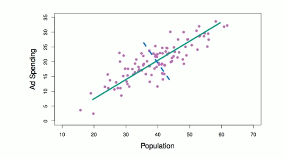

# Section 1 - Unsupervised Learning and Principal Components Analysis
## Unsupervised Learning
_Unsupervised vs Supervised Learning:_
* Most of this course focuses on _supervised learning_ methods such as regression and classification.
* In that setting we observe both a set of features $X_1,X_2,\dots,X_p$ for each object, as well as a response or outcome variable $Y.$ The goal is then to predict $Y$ using $X_1,X_2,\dots,X_p.$
* Here we instead focus on _unsupervised learning,_ where we observe only the features $X_1,X_2,\dots,X_p.$ We are not interested in prediction, because we do not have an associated response variable $Y.$
## The Goals of Unsupervised Learning
* The goal is to discover interesting things about the measurements: is there an informative way to visualize the data? Can we discover subgroups among the variables or among the observations?
* We discuss two methods:
  * _principal component analysis,_ a tool used for data visualization or data pre-processing before supervised techniques are applied, and
  * _clustering,_ a broad class of methods for discovering unknown subgroups in data.
## The Challenge of Unsupervised Learning
* Unsupervised learning is more subjective than supervised learning, as there is no simple goal for the analysis, such as prediction of a response.
* But techniques for unsupervised learning are of growing importance in a number of fields:
  * subgroups of breast cancer patients grouped by their gene expression measurements,
  * groups of shoppers characterized by their browsing and purchase histories,
  * movie grouped by the ratings assigned by movie viewers.
## Another advantage
* It is often easier to obtain _unlabeled data_ - from a lab instrument or a computer - than _labeled data_, which can require human intervention.
* For example it is difficult to automatically assess the overall sentiment of a movie review: is it favorable or not?
## Principal Component Analysis
* PCA produces a low-dimensional representation of a dataset. It finds a sequence of linear combinations of the variables that have maximal variance, and are mutually uncorrelated.
* Apart from producing derived variables for use in supervised learning problems, PCA also serves as a tool for data visualizaiton.
## Principal Component Analysis: details
* The _first principal component_ of a set of features $X_1,X_2,\dots,X_p$ is the normalized linear combination of the features
$$Z_1=\phi_{11}X_1+\phi_{21}X_2+\dots+\phi_{p1}X_p$$
that has the largest variance. By _normalized_, we mean that
$$\sum_{j=1}^p{\phi_{j1}^2}=1.$$
* We refer to the elements $\phi_{11},\dots,\phi_{p1}$ as the loadings of the first principal component; together, the loadings make up the principal component loading vector,
$$\phi_1=\begin{bmatrix}\phi_{11}&\phi_{21}&\dots&\phi_{p1}\end{bmatrix}^T.$$
* We constrain the loadings so that their sum of squares is equal to one, since otherwise setting these telements to be arbitratrily large in absolve value could result in an arbitrarily large variance.
## PCA: example

The population size $(\text{pop})$ and ad spending $(\text{ad})$ for $100$ different cities are shown as purple circles. The green solig line indicates the first principal component direction, and the blue dashed line indicates the second principal component direction.
## Computation of Principal Components
* Suppose we have a $n\times p$ data set $\mathbf{X}.$ Since we are only interested in variance, we assume that each of the variables in $\mathbf{X}$ has been centered to have mean zero (that is, the column means of $\mathbf{X}$ are zero).
* We then llok for the liner combination of the sample feature values of the form
$$z_{i1}=\phi_{11}x_{i1}+\phi_{21}x_{i2}+\dots+\phi_{p1}x_{ip}\tag{1}$$
for $i=1,\dots,n$ that has largest sample variance, subject to the constraint that 
$$\sum_{j=1}^p{\phi_{j1}^2}=1.$$
* Since each of the $x_{ij}$ has mean zero, then so does $z_{i1}$ (for any values of $\phi_{j1}$). 
* Hence the sample variance of the $z_{i1}$ can be written as
$$\frac{1}{n}\sum_{i=1}^n{z_{i1}^2}.$$
* Plugging in $(1)$ the first principal component loading vector solves the optimization problem
$$\max_{\phi_{11},\dots,\phi_{p1}}{\frac{1}{n}\sum_{i=1}^n{\left(\sum_{j=1}^p{\phi_{j1}x_{ij}}\right)^2}}\quad\text{subject to}\quad\sum_{j=1}^p{\phi_{j1}^2}=1.$$
* This problem can be solved via a singular-value decomposition of the matrix $\mathbf{X},$ a standard technique in linear algebra.
* We refer to $Z_1$ as the first principal component, with realized values $z_{11},\dots,z_{n1}.$
## Geometry of PCA
* The loading vector $\phi_1$ with elements $\phi_{11},\phi_{21},\dots,\phi_{p1}$ defined a direction in feature space along which the data vary the most.
* If we project $n$ data points $x_1,x_2,\dots,x_n$ onto this direction, the projected values are the principal component scores $z_{11},\dots,z_{n1}$ themselves.