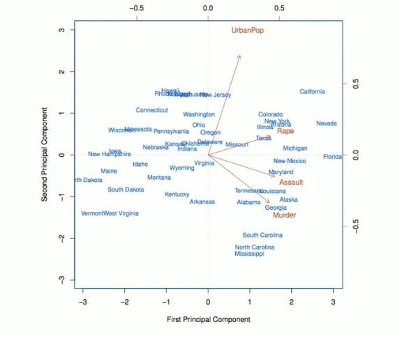
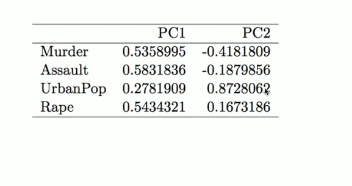
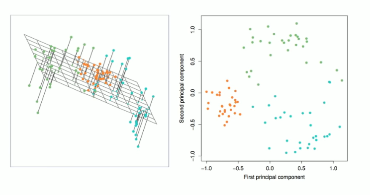
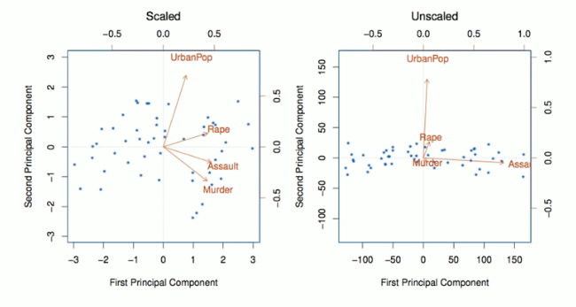
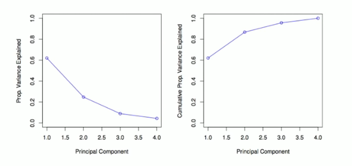

# Section 2 - Exploring Principal Components Analysis and Proportion of Variance Explained
## Further principal components
* The second principal component is the linear combination of $X_1,\dots,X_p$ that has maximal variance among all linear combinations that are _uncorrelated_ with $Z_1.$
* The second principal component scores $z_{12},z_{22},\dots,z_{n2}$ takes the form
$$z_{i2}=\phi_{12}x_{i1}+\phi_{22}x_{i2}+\dots+\phi_{p2}x_{ip},$$
where $\phi_{2}$ is the second principal component loading vector, with elements $\phi_{12},\phi_{22},\dots,\phi_{p2}.$
* It turns out that constraining $Z_2$ to be uncorrelated with $Z_1$ is equivalent to constraining the direction $\phi_2$ to be orthogonal (perpendicular) to the direction $\phi_1.$ And so on.
* The principal component directions $\phi_1,\phi_2,\phi_3,\dots$ are the ordered sequence of right singular vectors of the matrix $\mathbf{X},$ and the variances of the components are $\frac{1}{n}$ times the squares of the singular values. There are at most $\min{(n-1,p)}$ principal components.
## Illustration
* $\text{USAressts}$ data: For each of the fifty states in the United States, the data set contains the number of arrests per $100,000$ residents for each of the three crimes: $\text{Assault, Murder}$ and $\text{Rape}.$ We also record $\text{UrbanPop}$ (the percent of the population in each state living in urban areas).
* The principal component score vectors have length $n=50,$ and the principal component loading vectors have length $p=4.$
* PCA was performed after standardizing each variable to have mean zero and standard deviation one.
## USArrests data: PCA plot

## Figure details
The first two principal components for the USArrests data.
* The blue state names represent the scores for the first two principal components.
* The orange arrow indicate the first two principal component loading vectors (with axes on the top and right). For example, the loading for $\text{Rape}$ on the first component is $0.54,$ and its loading on the second principal component $0.17$ [the word $\text{Rape}$ is centered at the point $(0.54,0.17)$].
* This figure is known as a _biplot_, because it displays both the principal component scores and the principal component loadings.
## PCA loadings

## Another Interpretation of Principal Components

## PCA finds the hyperplane closest to the observations
* The first principal component loading vector has a very special property: it defines the line in $p$-dimensional space that is _closest_ to the $n$ observations (using average squared Euclidian distance as a measure of closeness).
* The notion of principal components as the dimensions that are closest to the $n$ observations extends beyond just the first principal component.
* For instance, the first two principal components of a data set span the plane that is closest to the $n$ observations, in terms of average squared Euclidian distance.
## Scaling of the variables matters
* If the variables are in different units, scaling each to have standard deviation equal to one is recommended.
* If they are in the same units, you might or might not scale the variables.

## Proportion Variance Explained
* To understand the strength of each component, we are interested in knowing the proportion of variance explained (PVE) by each one.
* The _total variance_ present in a data set (assuming that the variables have been centered to have mean zero) is defined as
$$\sum_{j=1}^p{\text{Var}(X_j)}=\sum_{j=1}^p{\frac{1}{n}\sum_{i=1}^n{x_{ij}^2}},$$
and the variance explained by the $m$th principal component is
$$\text{Var}(Z_m)=\frac{1}{n}\sum_{i=1}^n{z_{im}^2}.$$
* It can be shown that
$$\sum_{j=1}^p{\text{Var}(X_j)}=\sum_{m=1}^M{\text{Var}(Z_m)},$$
with
$$M=\min{(n-1,p)}.$$
* Therefore, the PVE of the $m$th principal component is given by the positive quantity between $0$ and $1$
$$\frac{\sum_{i=1}^n{z_{im}^2}}{\sum_{j=1}^p{\sum_{i=1}^n{x_{ij}^2}}}.$$
* The PVEs sum to one. We sometimes display the cumulative PVEs.

## How many principal components should we use?
If we use principal components as a summary of our data, how many components are sufficient?
* No simple answer to this question, as cross-validation is not available for this purpose.
  * _Why not?_
  * When could we use cross-validation to select the number of components?
* the "scree plot" on the previous slide can be used as a guide: we look for an "elbow".