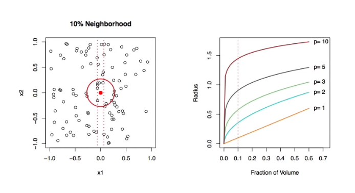
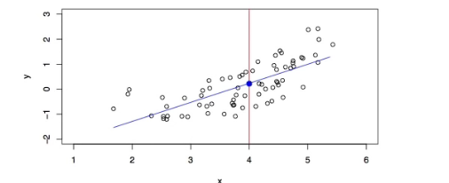
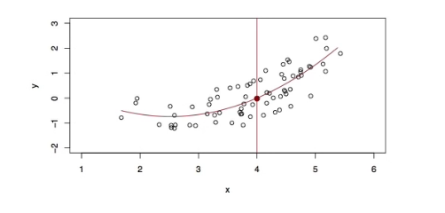
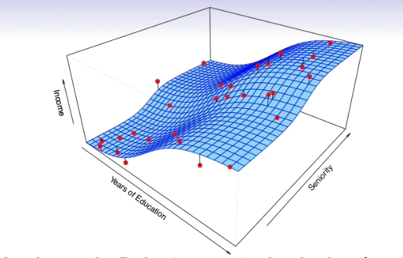
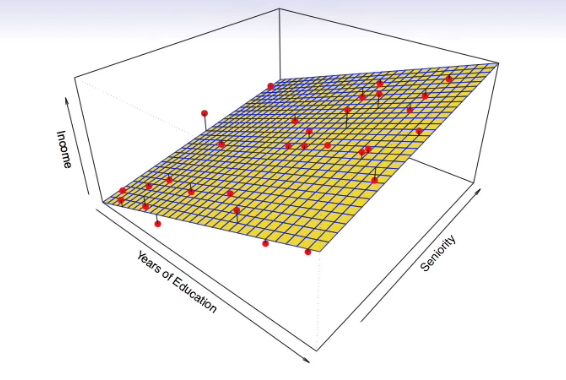
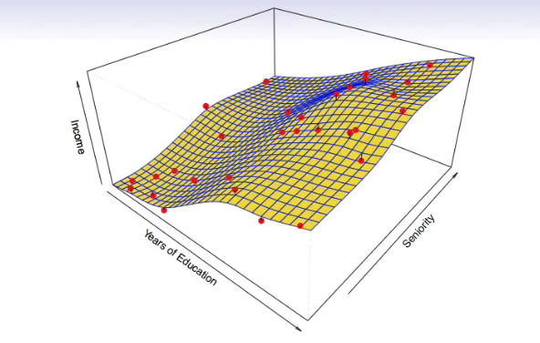
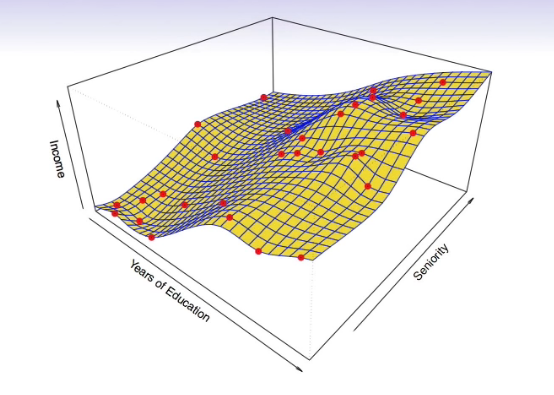
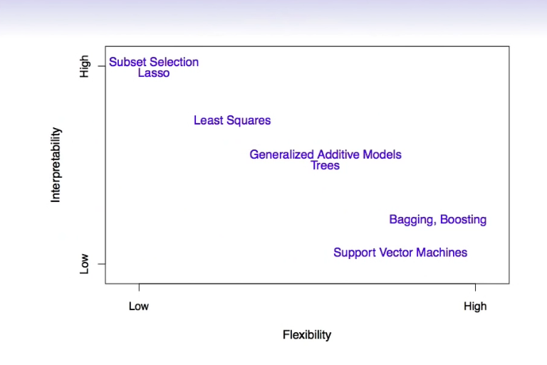

# Section 2 - Curse of Dimensionality and Parametric Models
* Nearest neighbor averaging can be pretty good for small $p$ - i.e. $p\leq 4$ and large-ish $N.$
* We will discuss smoother versions, such as kernel and spline smoothing later in the course.
* Nearest neighbor can be _lousy_ when $p$ is large. Reason: the _curse of dimensionality_. Nearest neighbors tend to be far away in high dimensions.
  * We need to get a reasonable fraction of $N$ values of $y_i$ to average to bring the variance down - e.g. $10\%$
  * A $10\%$ neighborhood in high dimensions need no longer be local, so we lose the spirit of estimating $E(Y|X=x)$ by local averaging.
## The curse of dimentionality

## Parametric and structured models
The _linear_ model is an important example of a parametric model:
$$f_L(X)=\beta_0+\beta_1X_1+\beta_2X_2+\dots+\beta_pX_p.$$
* A linear model is specified in terms of $p+1$ parameters $\beta_0,\beta_1,\dots,\beta_p.$
* We estimate the parameters by fitting the model to training data.
* Although it is _almost never correct,_ a linear model often serves as a good and interpretable approximation to the unknown true function $f(X).$

A linear model $\hat{f}_L(X)=\hat{\beta}_0+\hat{\beta}_1X$ gives a reasonable fit here

A quadratic model $\hat{f}_Q(X)=\hat{\beta}_0+\hat{\beta}_1X+\hat{\beta}_2X^2$ fits slightly better.

Simulated example. Red points are simulated values for _income_ from the model
$$\textit{income}=f(\textit{education,seniority})+\epsilon$$
$f$ is the blue surface.

Linear regression model fit to the simulated data.
$$f_L(\textit{education, seniority})=\hat{\beta}_0+\hat{\beta}_1\times\textit{education}+\hat{\beta}_2\times\textit{seniority}$$

More flexible regression model $\hat{f}_S(\textit{education,seniority})$ fit to the simulated data. Here we use a technique called a _thin-plate spline_ to fit a flexible surface. We control the roughness of the fit (chapter 7).

Even more flexible spline regression model $\hat{f}_S(\textit{education, seniority})$ fit to the simulated data. Here the fitted model makes no errors on the training data! Also known as _overfitting._

## Some trade-offs
* Prediction accuracy versus interpretability.
  * Linear models are easy to interpret; thin-plate splines are not.
* Good fit versus over-fit versus under-fit.
  * How do we know when the fit is just right?
* Parsimony versus black-box.
  * We often prefer a simpler model involving fewer variables over a black-box predictor involving them all.

