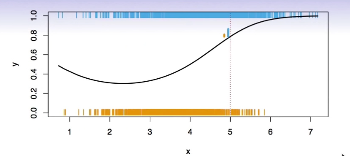
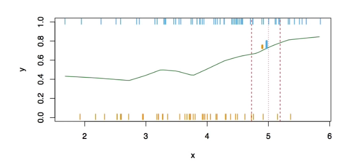
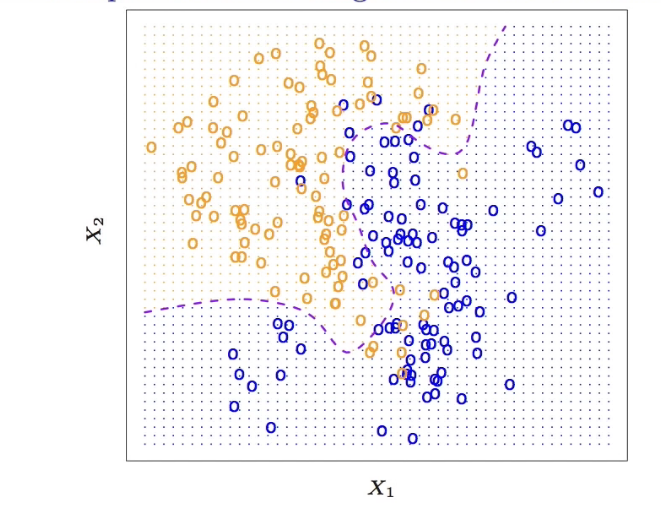
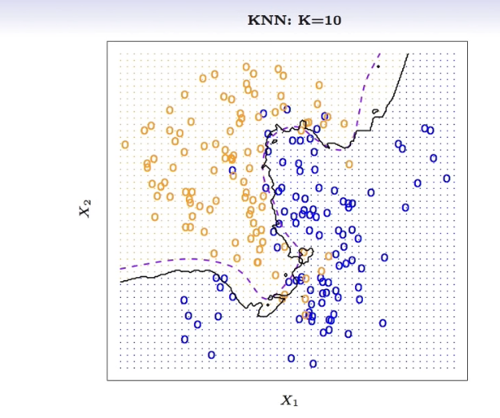
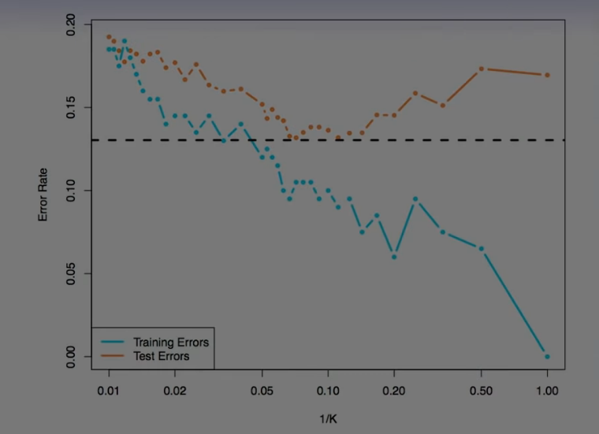

# Section 4 - Classification Problems and K-Nearest Neighbors
## Classification Problems
Here the response variable $Y$ is _qualitative_ - e.g. email is one of $C=(\textit{spam,ham}) (\textit{ham}=\text{good email}),$ digit class is one of $C=\{0,1,\dots,9\}.$ Our goals are to:
* Build a classifier $C(X)$ that assigns a class label from $C$ to a future unlabeled observation $X.$
* Assess the uncertainty in each classification.
* Understanding the roles of the different predictors among $X=(X_1,X_2,\dots,X_p).$

Is there an ideal $C(X)?$ Suppose the $K$ elements in $C$ are numbered $1,2\dots,K.$ Let
$$p_k(x)=\text{Pr}(Y=k|X=x),k=1,2,\dots,K.$$
These are the _conditional class probabilities_ at $x;$ e.g. see little barplot at $x=5.$ Then the _Bayes optimal_ classifier at $x$ is
$$C(x)=j\text{ if }p_j(x)=\max\{p_1(x),p_2(x),\dots,p_K(x)\}$$

Nearest-neighbor averaging can be used as before.
Also breaks down as dimension grows. However, the impact on $\hat{C}(x)$ is less than on $\hat{p}_k(x),k=1,\dots,K.$
## Classification: some details
* Typically we measure the performance of $\hat{C}(x)$ using the misclassification error rate:
$$\text{Err}_\text{Te}=\text{Ave}_{i\in\text{Te}}I[y_i\ne\hat{C}(x_i)]$$
* The Bayes classifier (using the true $p_k(x)$) has smallest error (in the population).
* Support-vector machines build structured models for $C(x).$
* We will also build structured models for representing the $p_k(x).$ e.g. Logistic regression, generalized additive models.
## Example: K-nearest neighbors in two dimensions

