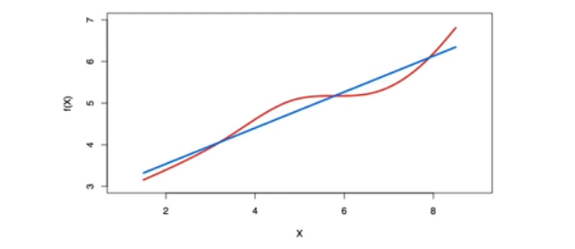
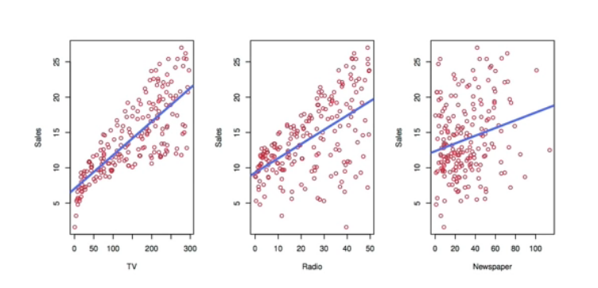
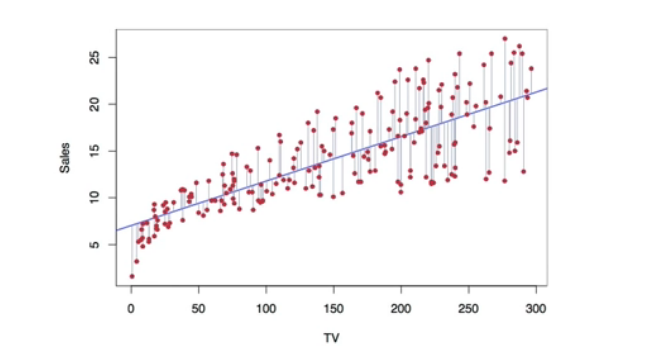

# Section 1 - Simple Linear Regression and Confidence Intervals
## Linear regression
* Linear regression is a simple approach to supervised learning. It assumes that the dependence of $Y$ on $X_1,X_2,\dots,X_p$ is linear.
* True regression functions are never linear!

* although it may seem overly simplistic, linear regression is extremely useful both conceptually and practically.
## Linear regression for the advertising data
Consider the advertising data shown below.
Questions we might ask:
* Is there a relationship between advertising budget and sales?
* How strong is the relationship between advertising budget and sales?
* Which media contribute to sales?
* How accurately can we predict future sales?
* Is the relationship linear?
* Is there synergy among the advertising media?
## Advertising data

## Simple linear regression using a single predictor $X.$
* We assume a model
$$Y=\beta_0+\beta_1X+\epsilon,$$
where $\beta_0$ and $\beta_1$ are two unknown constants that represent the _intercept_ and _slope,_ also known as _coefficients_ or _parameters,_ and $\epsilon$ is the error term.
* Given some estimates $\hat{\beta}_0$ and $\hat{\beta}_1$ for the model coefficients, we predict future sales using
$$\hat{y}=\hat{\beta}_0+\hat{\beta}_1x,$$
where $\hat{y}$ indicates a prediction of $Y$ on the basis of $X=x.$
The _hat_ symbol denotes an estimated value.
## Estimation of the parameters by least squares
* Let $\hat{y}_i=\hat{\beta}_0+\hat{\beta}_1x_i$ be the prediction for $Y$ based on the $i$th value of $X.$ Then $e_i=y_i-\hat{y}_i$ represent the $i$th _residual._
* We define the _residual sum of squares_ (RSS) as
$$\text{RSS}=e_1^2+e_2^2+\dots+e_n^2,$$
or equivalently as
$$\text{RSS}=(y_1-\hat{\beta}_0-\hat{\beta}_1x_1)^2+(y_2-\hat{\beta}_0-\hat{\beta}_1x_2)^2+\dots+(y_n-\hat{\beta}_0-\hat{\beta}_1x_n)^2.$$
* The least squares approach chooses $\hat{\beta}_0$ and $\hat{\beta}_1$ to minimize the $\text{RSS}.$ The minimizing values can be shown to be
$$\begin{aligned}
\hat{\beta}_1&=\frac{\sum_{i=1}^n{(x_i-\bar{x})(y_i-\bar{y})}}{\sum_{i=1}^n{(x_i-\bar{x})^2}},\\
\hat{\beta}_0&=\bar{y}-\hat{\beta}_1\bar{x},
\end{aligned}$$
where $\bar{y}=\frac{1}{n}\sum_{i=1}^n{y_i}$ and $\bar{x}=\frac{1}{n}\sum_{i=1}^n{x_i}$ are the sample means.
## Example: advertising data

The least squares fit for the regression of _sales_ onto _TV._
In this case a linear fit captures the essence of the relationship, although it is somewhat deficient in the left of the plot.
## Assessing the Accuracy of the Coefficient Estimates
* The standard error of an estimator reflects how it varies under repeated sampling. We have
$$\text{SE}(\hat{\beta}_1)^2=\frac{\sigma^2}{\sum_{i=1}^n{(x_i-\bar{x})^2}},\quad\text{SE}(\hat{\beta}_0)^2=\sigma^2\left[\frac{1}{n}+\frac{\bar{x}^2}{\sum_{i=1}^n{(x_i-\bar{x})^2}}\right],$$
where $\sigma^2=\text{Var}(\epsilon)$
* These standard errors can be used to compute _confidence intervals._ A $95\%$ confidence interval is defined as a range of values such that with $95\%$ probability, the range will contain the true value of the parameter. It has the form
$$\hat{\beta}_1\pm2\cdot\text{SE}(\hat{\beta}_1).$$
That is, there is approximately a $95\%$ chance that the interval
$$\left[\hat{\beta}_1-2\cdot\text{SE}(\hat{\beta}_1),\hat{\beta}_1+2\cdot\text{SE}(\hat{\beta}_1)\right]$$
will contain the trye value of $\beta_1$ (under a scenario where we got repeated samples like the present sample)
For the advertising data, the $95\%$ confidence interval for $\beta_1$ is $[0.042,0.053]$