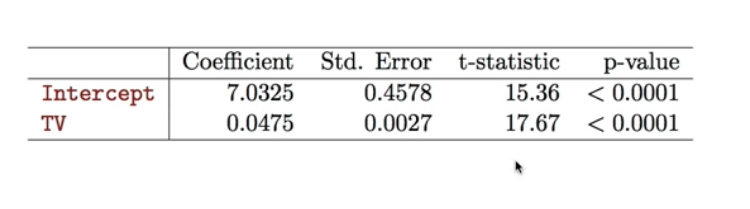
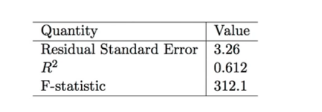

# Section 2 - Hypothesis Testing
## Hypothesis testing
* Standard errors can also be used to perform _hypothesis tests_ on the coefficients. The most common hypothesis test involves testing the _null hypothesis_ of
  * $H_0:$ There is no relationhip between $X$ and $Y$ versus the _alternative hypothesis_
  * $H_1:$ There is some relationship between $X$ and $Y.$
* Mathematically, this corresponds to testing
$$H_0:\beta_1=0$$
versus
$$H_A:\beta_1\ne0,$$
since if $\beta_1=0$ then the model reduces to $Y=\beta_0+\epsilon,$ and $X$ is not associated with $Y.$
* To test the null hypothesis, we compute a $t$-_statistic_, given by
$$t=\frac{\hat{\beta}_1-0}{\text{SE}(\hat{\beta}_1)},$$
* This will have a $t$-distribution with $n-2$ degrees of freedom, assuming $\beta_1=0.$
* Using statistical software, it is easy to compute the probability of observing any value equal to $|t|$ or larger. We call this probability the $p$-_value._
## Results for the advertising data

## Assessing the Overall Accuracy of the Model
* We compute the _Residual Standard Error_
$$\text{RSE}=\sqrt{\frac{1}{n-2}\text{RSS}}=\sqrt{\frac{1}{n-2}\sum_{i=1}^n{(y_i-\hat{y}_i)^2}},$$
where the _residual sum-of-squares_ is $\text{RSS}=\sum_{i=1}^n{(y_i-\hat{y}_i)^2}.$
* $R$-_squared_ or fraction of variance explained is
$$R^2=\frac{\text{TSS}-\text{RSS}}{\text{TSS}}=1-\frac{\text{RSS}}{\text{TSS}}$$
where $\text{TSS}=\sum_{i=1}^n{(y_i-\bar{y})^2}$ is the _total sum of squares._
* It can be shown that in this simple linear regression setting that $R^2=r^2,$ where $r$ is the correlation between $X$ and $Y:$
$$r=\frac{\sum_{i=1}^n{(x_i-\bar{x})(y_i-\bar{y})}}{\sqrt{\sum_{i=1}^n{(x_i-\bar{x})^2}}\sqrt{\sum_{i=1}^n{(y_i-\bar{y})^2}}}.$$
## Advertising data results
