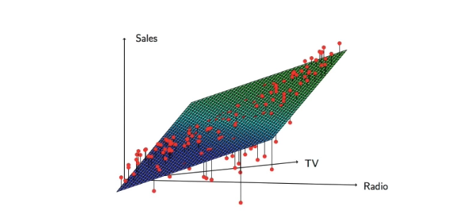
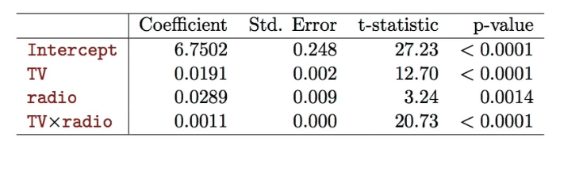
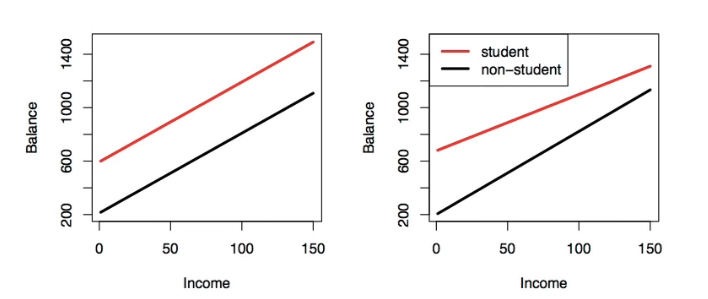
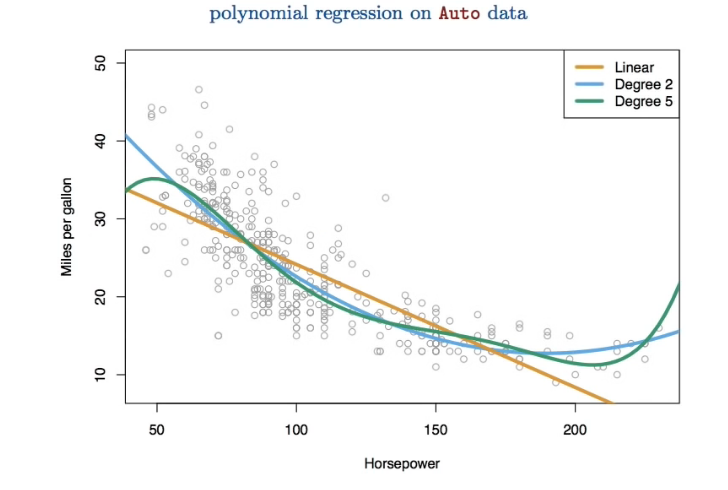
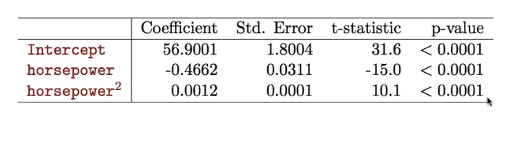

# Section 5 - Interactions and Nonlinearity
## Extensions of the Linear Model
Removing the additive assumption: _interactions_ and _nonlinearity_
_Interactions:_
* In our previous analysis of the $\text{Advertising}$ data, we assumed that the effect on $\text{sales}$ of increasing one advertising medium is independent of the amount spent on the other media.
* For example, the liner model
$$\widehat{\text{sales}}=\beta_0+\beta_1\times\text{TV}+\beta_2\times\text{radio}+\beta_3\times\text{newspaper}$$
states that the average effect on $\text{sales}$ of a one-unit increase in $\text{TV}$ is always $\beta_1,$ regardless of the amount spent on $\text{radio.}$
## Interactions
* But suppose that spending money on radio advertising actually increases the effectiveness of TV advertising, so that the slope term for $\text{TV}$ should increase as $\text{radio}$ increases.
* In this situation, given a fixed budget of $\$100,000,$ spending half on $\text{radio}$ and half on $\text{TV}$ may increase $\text{sales}$ more than allocating the entire amount to either $\text{TV}$ or to $\text{radio}.$
* In marketing, this is known as a _synergy_ effect, and in statistics it is referred to as an _interaction_ effect.
## Interaction in the Advertising data?

When levels of either $\text{TV}$ or $\text{radio}$ are low, then the true $\text{sales}$ are lower than predicted by the linear model.
But when advertising is split between the two media, then the model tends to underestimate $\text{sales}.$
## Modelling interactions - Advertising data
Model takes the form
$$\begin{aligned}
\text{sales}&=\beta_0+\beta_1\times\text{TV}+\beta_2\times\text{radio}+\beta_3\times(\text{radio}\times\text{TV})+\epsilon\\
&=\beta_0+(\beta_1+\beta_3\times\text{radio})\times\text{TV}+\beta_2\times\text{radio}+\epsilon\\
\end{aligned}$$
Results:

## Interpretation
* The results in this table suggests that interactions are important.
* The $p$-value for the interaction term $\text{TV}\times\text{radio}$ is extremely low, indicating that there is a strong evidence for $H_A:\beta_3\ne0.$
* The $R^2$ for the interaction model is $96.8\%,$ compared to only $89.7\%$ for the model that predicts $\text{sales}$ using $\text{TV}$ and $\text{radio}$ without an interaction term.
* This means that $(96.8-89.7)/(100-89.7)=69\%$ of the variability in $\text{sales}$ that remains after fitting the additive model has been explained by the interaction term.
* The coefficient estimates in the table suggests that an increase in $\text{TV}$ of $\$1,000$ is associated with increased sales of
$(\hat{\beta}_1+\hat{\beta}_3\times\text{radio})\times1000=19+1.1\times\text{radio}$ units.
* An increase in radio advertising of $\$1,000$ will be associated with an increase in sales of
$(\hat{\beta}_2+\hat{\beta}_3\times\text{TV})\times1000=29+1.1\times\text{radio}$ units.
## Hierarchy
* Sometimes it is the case that an interaction term has a very small $p$-value, but the associated main effects (in this case, $\text{TV}$ and $\text{radio}$) do not.
* The _hierarchy principle:_
  _If we include an interaction in a model, we should also include the main effects, even if the $p$-values associated with their coefficients are not significant._
* The rationale for this principle is that interactions are hard to interpret in a model without main effects - their meaning is changed.
* Specifically, the interaction terms also contain main effects, if the model has no main effects.
## Interactions between qualitative and quantitative variables
Consider the $\text{Credit}$ data set, and suppose that we wish to predict $\text{balance}$ using $\text{income}$ (quantitative) and $\text{student}$ (qualitative).
Without an interaction term, the model takes the form
$$\begin{aligned}
\text{balance}_i&\approx\beta_0+\beta_1\times\text{income}_i+\begin{cases}
\beta_2\quad&\text{if }i\text{th person is a student}\\
0\quad&\text{if }i\text{th person is not a student}.
\end{cases}\\
&=\beta_1\times\text{income}_i+\begin{cases}
\beta_0+\beta_2\quad&\text{if }i\text{th person is a student}\\
\beta_0\quad&\text{if }i\text{th person is not a student}.
\end{cases}
\end{aligned}$$
With interaction, it takes the form
$$\begin{aligned}
\text{balance}_i&\approx\beta_0+\beta_1\times\text{income}_i+\begin{cases}
\beta_2+\beta_3\times\text{income}_i\quad&\text{if }i\text{th person is a student}\\
0\quad&\text{if }i\text{th person is not a student}.
\end{cases}\\
&=\begin{cases}
(\beta_0+\beta_2)+(\beta_1+\beta_3)\times\text{income}_i\quad&\text{if }i\text{th person is a student}\\
\beta_0+\beta_1\times\text{income}_i\quad&\text{if }i\text{th person is not a student}.
\end{cases}
\end{aligned}$$

Credit data; Left: no interaction between $\text{income}$ and $\text{student}.$
Right: with an interaction term between $\text{income}$ and $\text{student}.$
## Non-linear effects of predictors

The figure suggests that
$$\text{mpg}=\beta_0+\beta_1\times\text{horsepower}+\beta_2\times\text{horsepower}^2+\epsilon$$
may provide a better fit.

## What we did not cover
* Outliers
* Non-constant variance of error terms
* High leverage points
* Collinearity
See text Section $3.33$
## Generalizations of the Linear Model
In much of the rest of this course, we discuss methods that expand the scope of linear models and how they are fit:
* _Classification problems:_ logistic regression, support vector machines
* _Non-linearity:_ kernel smoothing, splines and generalized additive models; nearest neighbor methods.
* _Interactions:_ Tree-based methods, bagging, random forests and boosting (these also capture non-linearities)
* _Regularized fitting:_ Ridge regression and lasso 