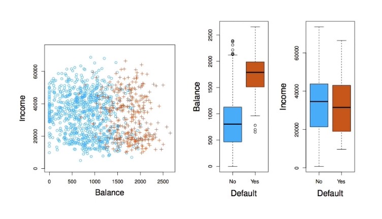
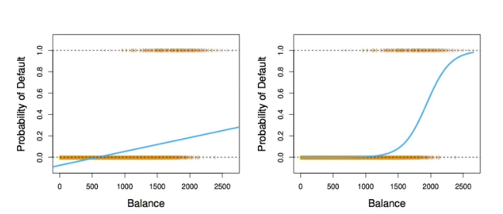

# Section 1 - Introduction to Classification
## Classification
* Qualitative variables take values on an unordered set $\mathcal{C},$ such as
$$\begin{aligned}
\text{eye color}&\in\{\text{brown, blue, green}\}\\
\text{email}&\in\{\text{spam, ham}\}.
\end{aligned}$$
* Given a feature vector $X$ and a qualitative response $Y$ taking values in the set $\mathcal{C},$ the classification task is to build a function $C(X)$ that takes as input the feature vector $X$ and predicts its value for $Y;$ i.e. $C(X)\in\mathcal{C}.$
* Often we are more interested in estimating the _probabilities_ that $X$ belongs to each category in $\mathcal{C}.$
For example, it is more valuable to have an estimate of the probability that an insurance claim is fradulent, than a classification fradulent or not.
## Example: Credit Card Default

## Can we use Linear Regression?
Supoose for the $\text{Default}$ classification task that we code
$$Y=\begin{cases}
0\quad\text{if No}\\
1\quad\text{if Yes}.
\end{cases}$$
Can we simply perform a linear regression of $Y$ on $X$ and classify as $\text{Yes}$ if $\hat{Y}>0.5?$
* In this case of a binary outcome, linear regression does a good job as a classifier, and is equivalent to _linear discriminant analysis_ which we discuss later.
* Since in the population $E(Y|X=x)=\text{Pr}(Y=1|X=x),$ we might think that regression is perfect for this task.
* However, _linear_ regression might produce probabilities less than zero or bigger than one. _Logistic regression_ is more appropiate.
## Linear versus Logistic Regression

The orange marks indicate the response $Y,$ either $0$ or $1.$ Linear regression does not estimate $\text{Pr}(Y=1|X)$ well. Logistic regression seems well suited to the task.
## Linear Regression continued
Now suppose we have a response variable with three possible values. A patient presents at the emergency room, and we must classify them according to their symptoms.
$$Y=\begin{cases}
1\quad\text{if stroke}\\
2\quad\text{if drug overdose}\\
3\quad\text{if epileptic seizure}.
\end{cases}$$
This coding suggests an ordering, and in fact implies that the difference between $\text{stroke}$ and $\text{drug overdose}$ is the same as between $\text{drug overdose}$ and $\text{epileptic seizure}.$
Linear regression is not appropiate here.
_Multiclass Logistic Regression_ or _Discriminant Analysis_ are more appropiate.