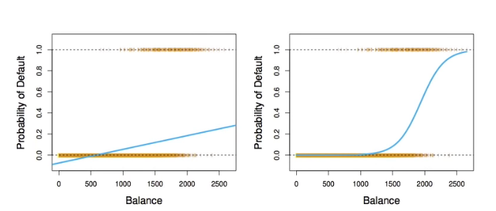
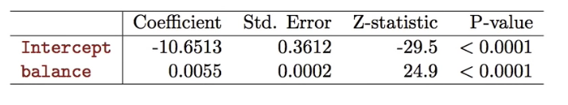
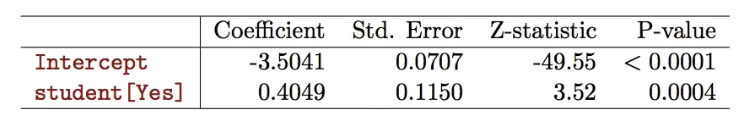

# Section 2 - Logistic Regression and Maximum Likelihood
## Logistic Regression
Let's write $p(X)=\text{Pr}(Y=1|X)$ for short and consider using $\text{balance}$ to predict $\text{default}.$ Logistic regression uses the form
$$p(X)=\frac{e^{\beta_0+\beta_1X}}{1+e^{\beta_0+\beta_1X}}.$$
($e\approx2.71828$ is a mathematical constant [Euler's number.])
It is easy to see that no matter what values $\beta_0,\beta_1$ or $X$ take, $p(X)$ will have values between $0$ and $1.$
A bit of rearrangement gives
$$\log\left(\frac{p(X)}{1-p(X)}\right)=\beta_0+\beta_1X.$$
This monotone transformation is called the _log odds_ or _logit_ transformation of $p(X).$
## Linear versus Logistic Regression

Logistic regression ensures that our estimate for $p(X)$ lies between $0$ and $1.$
## Maximum Likelihood
We use maximum likelihood to estimate the parameters
$$l(\beta_0,\beta)=\prod_{i:y_i=1}p(x_i)\prod_{i:y_i=0}(1-p(x_i)).$$
This _likelihood_ gives the probability of the observed zeros and ones in the data. We pick $\beta_0$ and $\beta_1$ to maximize the likelihood of the observed data.
Most statistical packages can fit linear logistic regression models by maximum likelihood. In `R` we use the `glm` function.

## Making Predictions
What is our estimated probability of $\text{default}$ for someone with a balance of $\$1000?$
$$p(X)=\frac{e^{\hat{\beta}_0+\hat{\beta}_1X}}{1+e^{\hat{\beta}_0+\hat{\beta}_1X}}=\frac{e^{-10.6513+0.0055\times1000}}{1+e^{-10.6513+0.0055\times1000}}=0.006$$
With a balance of $\$2000?$
$$p(X)=\frac{e^{\hat{\beta}_0+\hat{\beta}_1X}}{1+e^{\hat{\beta}_0+\hat{\beta}_1X}}=\frac{e^{-10.6513+0.0055\times2000}}{1+e^{-10.6513+0.0055\times2000}}=0.586$$
Let's do it again, using $\text{student}$ as the predictor.

$$\begin{aligned}
\widehat{\text{Pr}}(\text{default}=\text{Yes}|\text{student}=\text{Yes})&==\frac{e^{-3.5041+0.4049\times1}}{1+e^{-3.5041+0.4049\times1}}=0.0431,\\
\widehat{\text{Pr}}(\text{default}=\text{Yes}|\text{student}=\text{No})&==\frac{e^{-3.5041+0.4049\times0}}{1+e^{-3.5041+0.4049\times0}}=0.0292.
\end{aligned}$$