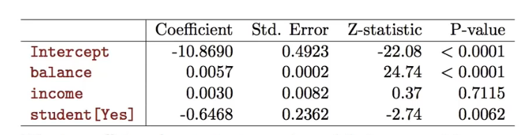
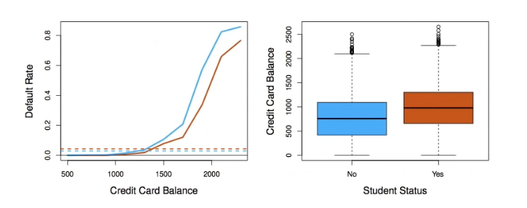
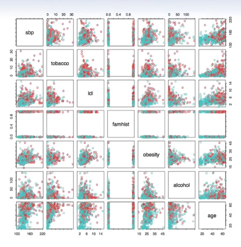
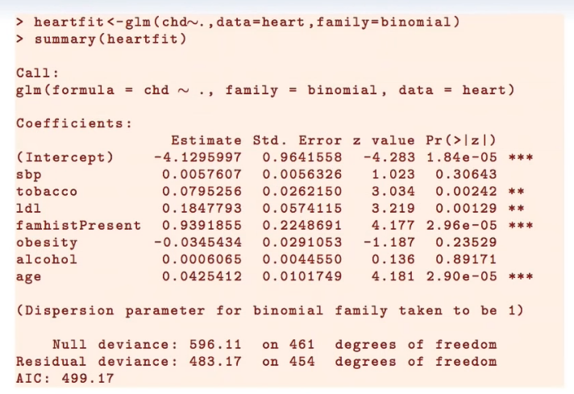

# Section 3 - Multivariate Logistic Regression and Confounding
## Logistic regression with several variables
$$\begin{aligned}
\log\left(\frac{p(X)}{1-p(X)}\right)&=\beta_0+\beta_1X_1+\dots+\beta_pX_p\\
p(X)&=\frac{e^{\beta_0+\beta_1X_1+\dots+\beta_pX_p}}{1+e^{\beta_0+\beta_1X_1+\dots+\beta_pX_p}}
\end{aligned}$$

Why is coefficient for $\text{student}$ negative, while it was positive before?
## Confounding

* Students tend to have higher balances than non-students, so their marginal default rate is higher than for non-students.
* But for each level of balance, students default less than non-students.
* Multiple logistic regression can tease this out.
## Example: South African Heart Disease
* 160 cases of MI (myocardial infarction) and 302 controls (all male in range 15-64), from Western Cape, South Africa in early 80s.
* Overall pervalence very high in this region: 5.1%
* Measurements on seven predictors (risk factors), shown in scatterplot matrix.
* Goal is to identify relative strengths and directions of risk factors.
* This was part of an intervention study aimed at educating the public of healthier diets.

Scatterplot matrix of the _South-African Heart Disease_ data. The response is color coded - The cases (MI) are red, the controls turquoise. $\text{famhist}$ is a binary variable, with 1 indicating family history of MI.

