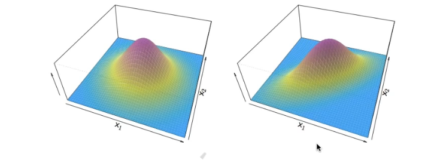
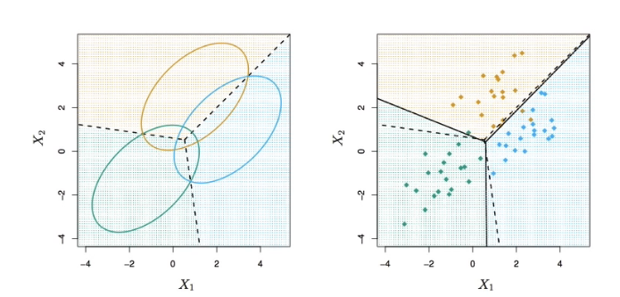
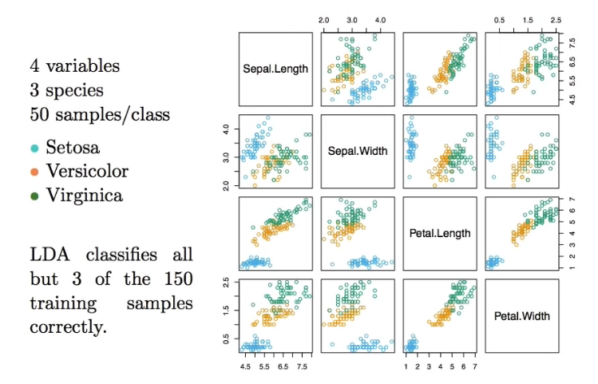
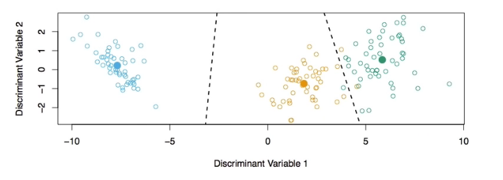
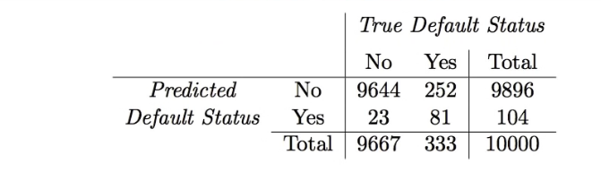
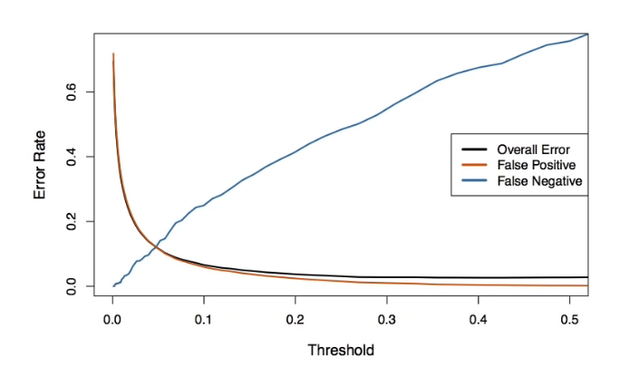
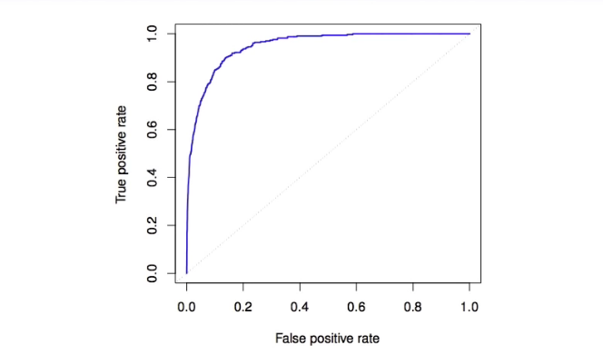

# Section 7 - Multivariate Linear Discriminant Analysis and ROC Curves
## Linear Discriminant Analysis when $p>1$

Density:
$$f(x)=\frac{1}{(2\pi)^{p/2}|\mathbf{\Sigma}|^{1/2}}e^{-\frac{1}{2}(x-\mu)^T\mathbf{\Sigma}^{-1}(x-\mu)}$$
Discriminant function:
$$\delta_k(x)=x^T\mathbf{\Sigma}^{-1}\mu_k-\frac{1}{2}\mu_k^T\mathbf{\Sigma}^{-1}\mu_k+\log\pi_k$$
Despite its complex form,
$$\delta_k(x)=c_k0+c_{k1}x+c_{k2}x_2+\dots+c_{kp}x_p$$
is a linear function.
## Illustration: $p=2$ and $K=3$ classes

Here $\pi_1=\pi_2=\pi_3=1/3.$
The dashed lines are known as the _Bayes decision boundaries._
Were they known, they would yield the fewest misclassification errors, among all possible classifiers.
## Fisher's Iris Data

## Fisher's Discriminant Plot

When there are $K$ classes, linear discriminant analysis can be viewed exactly in a $K-1$ dimensional plot.
Why? Because it essentially classifies to the closest centroid, and they span a $K-1$ dimensional plane.
Even when $K>3,$ we can find the "best" $2$-dimensional plane for visualizing the discriminant rule.
## From $\delta_k(x)$ to probabilities
Once we have estimated $\hat{\delta}_k(x),$ we can turn these into estimates for class probabilities:
$$\widehat{\text{Pr}}(Y=k|X=x)=\frac{e^{\hat{\delta}_k(x)}}{\sum_{l=1}^Ke^{\hat{\delta}_l(x)}}.$$
So classifying to the largest $\hat{\delta}_k(x)$ amounts to classifying to the class for which $\widehat{\text{Pr}}(Y=k|X=x)$ is largest.
When $K=2,$ we classify to class $2$ if $\widehat{\text{Pr}}(Y=2|X=x)\geq 0.5,$ else to class $1.$
## LDA on Credit Data

$(23+252)/10000$ errors - a $2.75\%$ misclassification rate!
Some caveats:
* This is _training_ error, and we may be overfitting. Not a big concern here sinse $n=10000$ and $p=4.$
* If we classified to the prior - always to class $\text{No}$ in this case - we would make $333/10000$ errors, or only $3.33\%.$
* Of the true $\text{No}$'s, we make $23/9667=0.2\%$ errors; of the true $\text{Yes}$'s, we make $252/333=75.7\%$ errors!
## Types of errors
__False positive rate:__ The fraction of negative examples that are classified as positive - $0.2\%$ in example.
__False negative rate:__ The fraction of positive examples that are classified as negative - $75.7\%$ in example.
We produced this table by classifying to class $\text{Yes}$ if
$$\widehat{\text{Pr}}(\text{Default}=\text{Yes}|\text{Balance, Student})\geq0.5$$
We can change the two error rates by changing the threshold from $0.5$ to somer other value in $[0,1]:$
$$\widehat{\text{Pr}}(\text{Default}=\text{Yes}|\text{Balance, Student})\geq\textit{threshold},$$
and vary _threshold._
## Varying the _threshold_

In order to reduce the false negative rate, we may want to reduce the threshold to $0.1$ or less.
## ROC curve

The _ROC plot_ displays both simultaneously.
Sometimes we use the _AUC_ or _area under the curve_ to summarize the overall performance. Higher _AUC_ is good.