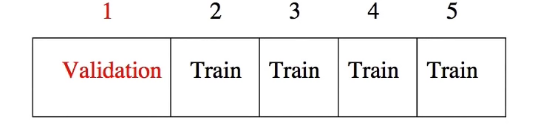
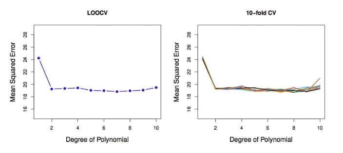
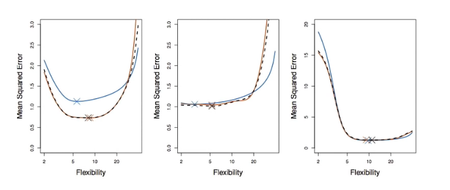

# Section 2 - $K$-fold Cross-Validation
## $K$-fold-Cross-validation
* _Widely used approach_ for estimating test error.
* Estimates can be used to select best model, and to give an idea of the test error of the final chosen model.
* Idea is to randomly divide the data into $K$ equal-sized parts. We leave out part $k,$ fit the model to the other $K-1$ parts (combined), and then obtain predictions for the left-out $k$th part.
* This is done in turn for each part $k=1,2,\dots,K,$ and then the results are combined.
## $K$-fold Cross-validation in detail
Divide data into $K$ rougly equal-sized parts ($K=5$ here)

## The details
* Let the $K$ parts be $C_1,C_2,\dots,C_K,$ where $C_k$ denotes the indices of the observation in part $k.$ There are $n_k$ observations in part $k:$ if $n$ is a multiple of $K,$ then $n_k=n/K.$
* Compute
$$\text{CV}_{(K)}=\sum_{k=1}^K{\frac{n_k}{n}\text{MSE}_k}$$
where $\text{MSE}_k=\sum_{i\in C_k}{(y_i-\hat{y}_i)^2}/n_k,$ and $\hat{y}_i$ is the fit for observation $i,$ obtained from the data with part $k$ removed.
* Setting $K=n$ yields $n$-fold or _leace-one out cross-valudation_ (LOOCV).
## A nice special case!
* With least-squares linear or polynomial regression, an amazing shortcut makes the cost of LOOCV the same as that of a single model fit! The following formula holds:
$$\text{CV}_{(n)}=\frac{1}{n}\sum_{i=1}^n{\left(\frac{y_i-\hat{y}_i}{1-h_i}\right)^2},$$
where $\hat{y}_i$ is the $i$th fitted value from the original least squares fit, and $h_i$ is the leverage (diagonal of the "hat" matrix; see book for details.) This is like the ordinary MSE, except the $i$th residual is divided by $1-h_i.$
* LOOCV sometimes useful, but typically doesn't _shake up_ the data enough. The estimates from each fold are highly correlated and hence their average can have high variance.
* a better choice is $K=5$ or $10.$
## Auto data revisited

## True and estimated test MSE for the simulated data

## Other issues with Cross-validation
* Since each training set is only $(K-1)/K$ as big as the original training set, the estimates of prediction error will typically be biased upward. _Why?_
* This bias is minimized when $K=n$ (LOOCV), but this estimate has high variance, as noted earlier.
* $K=5$ or $10$ provides a good compromise for this bias-variance tradeoff.
## Cross-Validation for Classification Problems
* We divide the data into $K$ rougly equal-sized parts $C_1,C_2,\dots,C_K.$ $C_k$ denotes the indices of the observations in part $k.$ There are $n_k$ observations in part $k:$ if $n$ is a multiple of $K,$ then $n_k=n/K.$
* Compute
$$\text{CV}_{(K)}=\sum_{k=1}^K{\frac{n_k}{n}\text{Err}_k}$$
where $\text{Err}_k=\sum_{i\in C_k}{I(y_i\ne\hat{y}_i)}/n_k.$
* The estimated standard deviation of $\text{CV}_K$ is
$$\widehat{\text{SE}}(\text{CV}_K)=\sqrt{\sum_{k=1}^K{(\text{Err}_k-\overline{\text{Err}_k})^2}/(K-1)}$$
* This is a useful estimate, but strictly speaking, not quite valid. _Why not?_