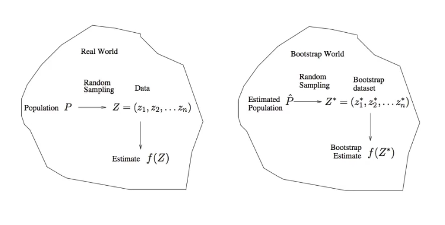

# Section 4 - More on the Bootstrap
## A general picture for the bootstrap

## The bootstrap in general
* In more complex data situations, figuring out the appropiate way to generate bootstrap samples can require some thought.
* For example, if the data is a time series, we can't simply sample the observations with replacement (_why not?_) 
* We can create blocks of consecutive observations, and sample those with replacements. Then we paste together sampled blocks to obtain a bootstrap dataset.
## Other uses of the bootstrap
* Primarily used to obtain standard errors of an esimtate.
* Also provides approximate confidence intervals for a population parameter. For example, looking at the histogram in the previous Section, the $5\%$ and $95\%$ quantiles of the $1000$ values is $(.43,.72).$
* This represents an approximate $90\%$ confidence interval for the true $\alpha.$ _How do we interpret this confidence interval?_
* The above interval is called a _Bootstrap Percentile_ confidence interval. It is the simplest method (among many approaches) for obtaining a confidence interval from the bootstrap.
## Can the bootstrap estimate prediction error?
* In cross-validation, each of the $K$ validation folds is distinct from the other $K-1$ folds used for training: _there is no overlap._ This is crucial for its success.
* To estimate prediction error using the bootstrap, we could think about using each bootstrap dataset as our training sample, and the original sample as our validation sample.
* But each bootstrap sample has significant overlap with the original data. About two-thirds of the original data points appear in each bootstrap sample. _Can you prove this?_
* This will cause the bootstrap to seriously underestimate the true prediction error. _Why?_
* The other way around - with original sample $=$ training sample, bootstrap dataset $=$ validation sample - is worse!
## Removing the overlap
* Can partly fix this problem by only using predictions for those observations that did not (by chance) occur in the current bootstrap sample.
* But the method gets complicated, and in the end, cross-validation provides a simpler, more attractive approach for estimating prediction error.