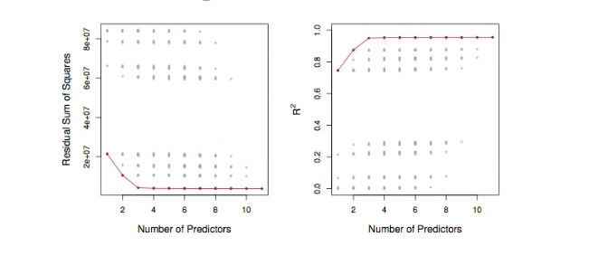

# Section 1 - Linear Model Selection and Best Subset Selection
## Linear Model Selection and Regularization
* Recall the linear model
$$Y=\beta_0+\beta_1X_1+\dots+\beta_pX_p+\epsilon.$$
* In the lectures that follow, we consider some approaches for extending the linear model framework. In the lectures covering Chapter 7 of the text, we generalize the linear model in order to accomodate _non-linear,_ but still _additive,_ relationships.
* In the lectures covering Chapter $8$ we consider even more general _non-linear_ models.
## In praise of linear models!
* Despite its simplicity, the linear model has distinct advantages in terms of its _interpretability_ and often shows good _predictive performance._
* Hence we discuss in this lecture some ways in which the simple linear model can be improved, by replacing ordinary least squares fitting with some alternative fitting procedures.
## Why consider alternatives to least squares?
* _Prediction Accuracy:_ especially when $p>n,$ to control the variance.
* _Model Interpretability:_ By removing irrelevant features - that is, by setting the corresponding coefficient estimates to zero - we can obtain a model that is more easily interpreted. We will present some approaches for automatically performing _feature selection._
## Three classes of methods
* _Subset Selection._ We identify a subset of the $p$ predictors that we believe to be related to the response. We then fit a model using least squares on the reduced set of variables.
* _Shrinkage._ We fit a model involving all $p$ predictors, but the estimated coefficients are shrunken towards zero relative to the least squares estimates. This shrinkage (also known as _regularization_) has the effect of reducing variance and can also perform variable selection.
* _Dimension Reduction._ We project the $p$ predictors into a $M$-dimensional subspace where $M<p.$ This is achieved by computing $M$ different _linear combinations,_ or _projections,_ of the variables. Then these $M$ projections are used as predictors to fit a linear regression model by least squares.
## Subset Selection
_Best subset and stepwise model selection procedures_
### Best Subset Selection
1. Let $\mathcal{M}_0$ denote the _null model,_ which contains no predictors. This model simply predicts the sample mean for each observation.
2. For $k=1,2,\dots,p:$
    (a) Fit all $\binom{p}{k}$ models that contain exactly $k$ predictors.
    (b) Pich the best among these $\binom{p}{k}$ models, and call it $\mathcal{M}_k.$ Here _best_ is defined as having the ssmallest RSS, or equivalently largest $R^2.$
3. Select a single best model from among $\mathcal{M}_0,\dots,\mathcal{M}_p$ using cross-validated prediction error, $C_p$ (AIC), BIC, or adjusted $R^2.$
## Example - Credit data set

_For each possible model containing a subset of the ten predictors in the $\text{Credit}$ data set, the RSS and $R^2$ are displayed. The red frontier tracks the __best__ model for a given number of predictors, according to RSS and $R^2.$ Though the data set contains only ten predictors, the $x$-axis ranges from $1$ to $11,$ since one of the variables is categorical and takes on three values, leading to the creation of two dummy variables_