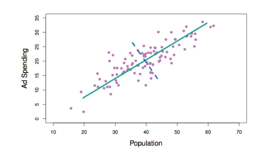
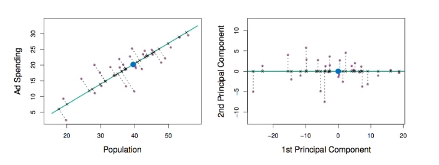
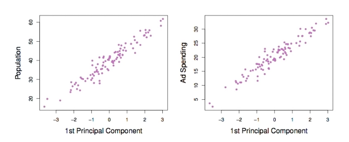
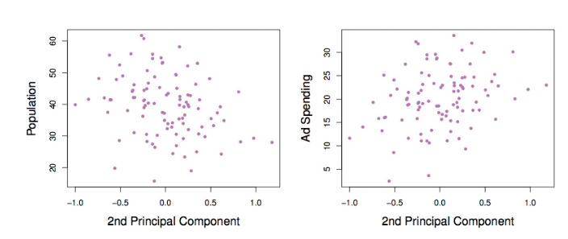
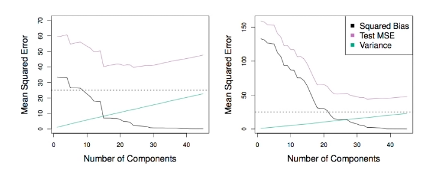
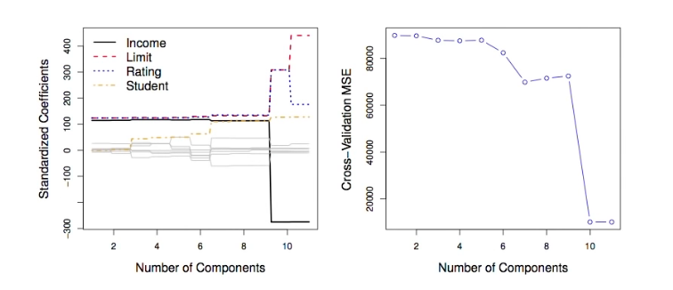

# Section 10 - Principal Components Regression and Partial Least Squares
## Principal Components Regression
* Here we apply components analysis (PCA) (discussed in Chapter $10$ of the text) to define the linear combinations of the predictors, for use in our regression.
* The first principal component is that (normalized) linear combination of the variables with the largest variance.
* The second principal component has largest variance, subject to being uncorrelated with the first.
* And so on.
* Hence with many correlated original variables, we replace them with a small set of principal components that capture their joint variation.
## Pictures of PCA

_A subset of the advertising data._
__Left:__ _The first principal component, chosen to minimize the sum of the squared perpendicular distances to each point, is shown in green. These distances are represented using the black dashed line segments._
__Right:__ _The left-hand panel has been rotated so that the first principal component lies on the $x$-axis._

_Plots of the first principal component scores, $z_{i1},$ versus $\text{TV}$ and $\text{radio}.$ The relationships are strong._

_Plots of the second principal component scores, $z_{i1},$ versus $\text{TV}$ and $\text{radio}.$ The relationships are weak._

## Application to Principal Components Regression

_PCR was applied to two simulated data sets. The black, green, and purple lines correspond to squared bias, variance, and test mean squared error, respectively._
__Left:__ _Simulated data from slide $32.$_
__Right:__ _Simulated data from slide $39.$_
## Choosing the number of directions $M$

__Left:__ _PCR standardized coefficent estimates on the $\text{Credit}$ data set for different values of $M.$
__Right:__ _The $10$-fold cross validation MSE obtained using PCR, as a function of M._
## Partial Least Squares
* PCR identifies linear combinations, or _directions_, that best represent the predictors $X_1,\dots,X_p.$
* These directions are identified in an _unsupervised_ way, since the response $Y$ is not used to help determine the principal component directions.
* That is, the response does not _supervise_ the identification of the principal components.
* Consequently, PCR suffers from a potentially serious drawback: there is no guarantee that the directions that best explain the predictors will also be the best directions to use for predicting the response.
* Like PCR, PLS is a dimension reduction method, which first identifies a new set of features $Z_1,\dots,Z_M$ that are linear combinations of the original features, and then fits a linear model via OLS using these $M$ new features.
* But unlike PCR, PLS identifies these new features in a supervised way - that is, makes use of the response $Y$ in order to identify new features that not only approximate the old features well, but also that _are related to  the response._
* Roughly speaking, the PLS approach attempts to find directions that help explain both the response and the predictors.
## Details of Partial Least Squares
* After standardizing the $p$ predictors, PLS computes the first direction $Z_1$ by setting $\phi_{1j}$ in $(1)$ equal to the coefficient from the simple linear regression of $Y$ onto $X_j.$
* One can show that this coefficient is proportional to the correlation between $Y$ and $X.$
* Hence, in computing $Z_1=\sum_{j=1}^p{\phi_{1j}X_j},$ PLS places the highest weight on the variables that are most strongly related to the response.
* Subsequent directions are found by taking residuals and then repeating the above prescription.
## Summary
* Model selection methods are an esssential tool for data analysis, espcecially for big datasets involving many predictors.
* Research into methods that give _sparsity,_ such as the _lasso_ is an especially hot area.
* Later, we will return to sparsity in more detail, and will describe related approaches such as the _elastic net._