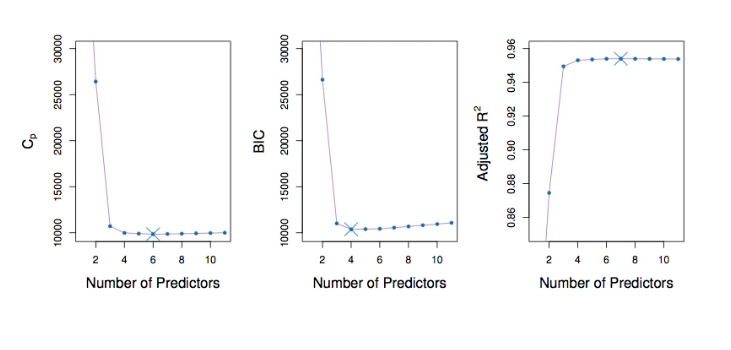

# Section 4 - Estimating Test Error Using Mallow’s Cp, AIC, BIC, Adjusted R-squared
## Estimating test error: two approaches
* We can indirectly estimate test error by making an _adjustment_ to the training error to account for the bias due to overfitting.
* We can _directly_ estimate test error, using either a validation set approach or a cross-validation approach, as discussed in previous lectures.
* We illustrate both approaches next.
## $C_p,$ AIC, BIC, and Adjusted $R^2$
* These techniques adjust the training error for the model size, and can be used to select among a set of models with different numbers of variables.
* The next figure displays $C_p,$ BIC, and adjusted $R^2$ for the best model of each size produced by best subset selection on the $\text{Credit}$ data set.
## Credit data example

## Now for some details
* _Mallow's $C_p:$_
$$C_p=\frac{1}{n}\left(\text{RSS}+2d\hat{\sigma}^2\right),$$
where $d$ is the total # of parameters used and $\hat{\sigma}^2$ is an estimate of the variance of the error $\epsilon$ associated with each response measurement.
* The _AIC_ criterion is defined for a large class of models fit by maximum likelihood:
$$\text{AIC}=-2\log L+2\cdot d$$
where $L$ is the maximized value of the likelihood function for the estimated model.
* In the case of linear model with Gaussian errors, maximum likelihood and least squares are the same thing, and $C_p$ and AIC are equivalent. _Prove this._
## Details on BIC
$$\text{BIC}=\frac{1}{n}\left(\text{RSS}+\log(n)d\hat{\sigma}^2\right).$$
* Like $C_p,$ the BIC will tend to take on a small value for a model with a low test error, and so generally we select the model that has the lowest BIC value.
* Notice that BIC replaces the $2d\hat{\sigma}^2$ used by $C_p$ with a $\log(n)d\hat{\sigma}^2$ term, where $n$ is the number of observations.
* Since $\log n>2$ for any $n>7,$ the BIC statistic generally places a heavier penalty on models with many variables, and hence results in the selection of smaller models than $C_p.$ See Figure above.
## Adjusted $R^2$
* For a least square model with d variables, the adjusted $R^2$ statistic is calculated as
$$\text{Adjusted }R^2=1-\frac{\text{RSS}/(n-d-1)}{\text{TSS}/(n-1)}.$$
where TSS is the total sum of squares.
* Unlike $C_p,$ AIC, and BIC, for which a _small_ value indicates a model with a low test error, a _large_ value of adjusted $R^2$ indicates a model with a small test error.
* Maximizing the adjusted $R^2$ is equivalent to minimizing $\frac{\text{RSS}}{n-d-1}.$ While RSS always decreases as the number of variables in the model increases, $\text{RSS}{n-d-1}$ may increase or decrease, due to the presence of $d$ in the denominator.
* Unlike the $R^2$ statistic, the adjusted $R^2$ statistic _pays a price_ for the inclusion of unnecessary variables in the model. See Figure above.