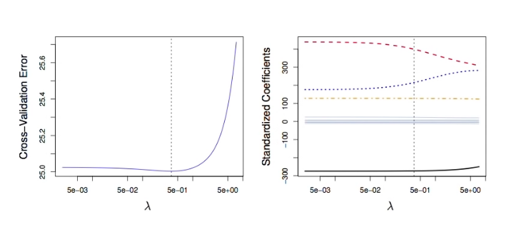
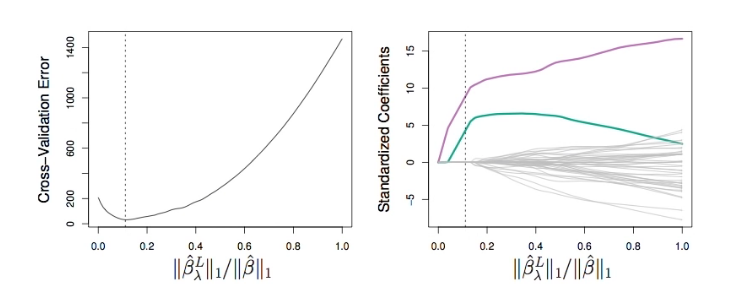

# Section 8 - Tuning Parameter Selection for Ridge Regression and Lasso
## Select the Tuning Parameter for Ridge Regression and Lasso
* As for subset selection, for ridge regression and lasso we require a method to determine which of the models under consideration is best.
* That is, we require a method selecting a value for the tuning parameter $\lambda$ or equivalently, the value of the constraint $s.$
* _Cross-validation_ provides a simple way to tackle this problem. We choose a grid of $\lambda$ values, and compute the cross-validation error rate for each value of $\lambda.$
* We then select the tuning parameter value for which the cross-validation error is smallest.
* Finally, the model is re-fit using all of the available observations and the selected value of the tuning parameter.
## Credit data example

__Left:__ _Cross-validation errors that result from applying ridge regression to the $\text{Credit}$ data set with various values of $\lambda.$_
__Right:__ _The coefficient estimates as a function of $\lambda.$ The vertical dashed lines indicates the value of $\lambda$ selected by cross-validation._
## Simulated data example

__Left:__ _Ten-fold cross-validation MSE for the lasso, applied to the sparse simulated data set from Section $7.$_
__Right:__ _The corresponding lasso coefficient estimates are displayed. The vertical dashed lines indicate the lasso fit for which the cross-validation error is smallest._