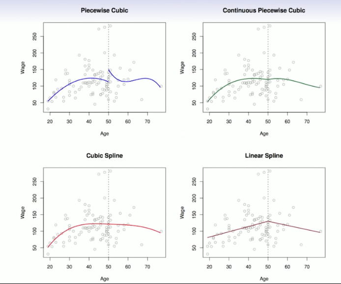
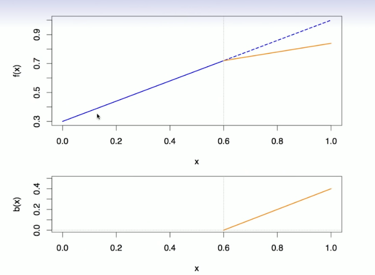
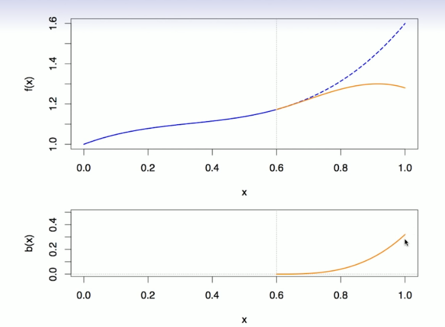
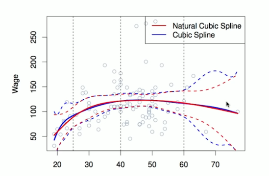
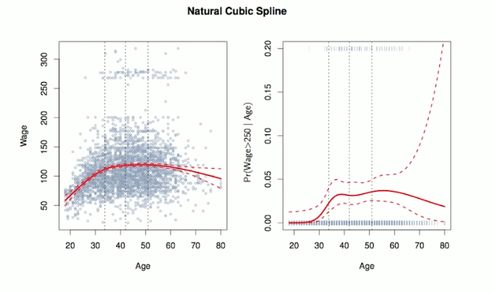
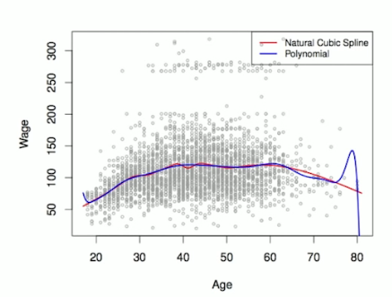

# Section 2 - Piecewise Polynomials and Splines
## Piecewise Polynomials
* Instead of a single polynomial in $X$ over its whole domain, we can rather use different polynomials in regions defined by knots. E.g. (see figure)
$$y_i=\begin{cases}
\beta_{01}+\beta_{11}x_i+\beta_{21}x_i^2+\beta_{31}x_i^3+\epsilon&\quad\text{if }x_i<c;\\
\beta_{02}+\beta_{12}x_i+\beta_{22}x_i^2+\beta_{32}x_i^3+\epsilon&\quad\text{if }x_i\geq c.\\
\end{cases}$$
* Better to add constraints to the polynomials, e.g. continuity.
* _Splines_ have the "maximum" amount of continuity.


## Linear Splines
_A linear splines with knots $\xi_k, k=1,\dots,K$ is a piecewise linear polynomial continious at each knot._

We can represent this model as
$$y_i=\beta_0+\beta_1b_1(x_i)+\beta_2b_2(x_i)+\dots+\beta_{K+3}b_{K+3}(x_i)+\epsilon_i,$$
where the $b_k$ are _basis functions._
$$\begin{aligned}
b_1(x_i)&=x_i\\
b_{k+1}(x_i)&=(x_i-\xi_k)_+,\quad k=1,\dots,K
\end{aligned}$$
Here the $()_+$ means _positive part_; i.e.
$$(x_i-\xi_k)_+=\begin{cases}
x_i-\xi_k&\quad\text{if }x_i>\xi_k\\
0&\quad\text{otherwise}\end{cases}$$

## Cubic Splines
_A cubic spline with knots at $\xi_k,k=1,\dots,K$ is a piecewise cubic polynomial with continious derivatives up to order $2$ at each knot._

Again we can represent this model with truncated power basis functions
$$y_i=\beta_0+\beta_1b_1(x_i)+\beta_2b_2(x_i)+\dots+\beta_{K+3}b_{K+3}(x_i)+\epsilon_i,$$
$$\begin{aligned}
b_1(x_i)&=x_i\\
b_2(x_i)&=x_i^2\\
b_3(x_i)&=x_i^3\\
b_{k+3}(x_i)&=(x_i-\xi_k)^3_+,\quad k=1,\dots,K
\end{aligned}$$
where
$$(x_i-\xi_k)^3_+=\begin{cases}
(x_i-\xi_k)^3&\quad\text{if }x_i>\xi_k\\
0&\quad\text{otherwise}\end{cases}$$

## Natural Cubic Splines
A natural cubic spline extrapolates linearly beyond the bondary knots. This adds $4=2\times 2$ extra constraints, and allows us to put more internal knots for the same degrees of freedom as a regular cubic spline.



Fitting splines in R is easy: `bs(x, ...)` for any degree splines and `ns(x, ...)` for natural cubic splines, in package `splines`.


## Knot placement
* One strategy is to decide $K,$ the number of knots, and then place them at appropiate quantiles of the observed $X.$
* A cubic spline with $K$ knots has $K+4$ parameters or degrees of freedom.
* A natural spline with $K$ knots has $K$ degrees of freedom.

Comparison of a degree-14 polynomial and a natural cubic spline, each with 15df.



```{r}
ns(age, df=14)
poly(age, deg=14)
```