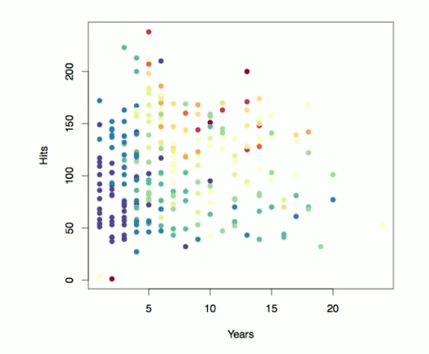
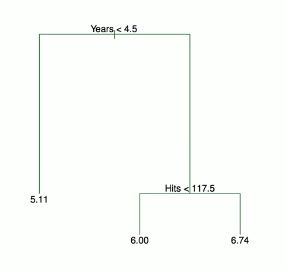
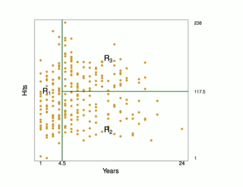

# Section 1 - Decision Trees
## Tree-baed Methods
* Here we describe _tree-based_ methods for regression and classification.
* These involve _stratifying_ or _segmenting_ the predictor space into a number of simple regions.
* Since the set of splitting rules used to segment the predictor space can be summarized in a tree, these types of approaches are known as _decision-tree_ methods.
## Pros and Cons
* Tree-based methods are simple and useful for interpretation.
* Howeber they typically are not competitive withthe best supervised learning approaches in terms of prediction accuracy.
* Hence we also discuss _bagging, random forests,_ and _boosting_. These methods grow multiple trees which are then combined to yield a single consensus prediction.
* Combining a large number of trees can often result in dramatic improvements in prediction accuracy at the expense of some loss interpretation.
## The Basics of Decision Trees
* Decision trees can be applied to both regression and classification problems.
* We first consider regression problems, and then move on to classification.
## Baseball salary data: how would you stratify it?
Salary is color-coded from low (blue, green) to high (yellow, red)

## Decision tree for these data

## Details of previous figure
* For the Hitters data, a regression tree for predicting the $\log$ salary of a baseball player, based on the number of years that he has played in the major leagues and the number of hits that he made in the previous year.
* At a given internal node, the label (of the form $X_j<t_k)$ indicats the left-hand branch emanating from that split, and the right-hand branch corresponds to $X_j\geq t_k.$ For instance, the split at the top of tree results in two large branches. The left-hand branch corresponds to $\text{Years}<4.5,$ and the right-hand branch corresponds to $\text{Years}\geq4.5.$
* The tree has two internal nodes and three terminal nodes, or leaves. The number in each leaf is the mean of the response for the observations that fall there.
## Results
* Overall, the tree satisfies or segments the players into three regions or predictor space: $R_1=\{X|\text{Years}<4.5\},R_2=\{X|\text{Years}\geq4.5,\text{ Hits}<117.5\},$ and $R_3=\{X|\text{Years}\geq4.5,\text{ Hits}\geq117.5\}.$

## Terminology for Trees
* In keeping with the _tree_ analogy, the regions $R_1,R_2,$ and $R_3$ are known as _terminal nodes._
* Decision trees are typically drawn _upside down_, in the sense that the leaves are at the bottom of the tree.
* The points along the tree where the predictor space is split are referred to as _internal nodes._
* In the hitters tree, the two internal nodes are indicated by the text $\text{Years}<4.5$ and $\text{Hits}<117.5.$
## Interpretation of Results
* $\text{Years}$ is the most important factor in determining $\text{Salary},$ and players with less experience earn lower salaries than more experienced players.
* Given that a player is less experienced, the number of $\text{Hits}$ that he made in the previous play little role in his $\text{Salary}.$
* But among players who have been in the majo leagues for five or more years, the number of $\text{Hits}$ made in the previous year does affect $\text{Salary},$ and players who made more $\text{Hits}$ last year tend to have higher salaries.
* Surely an over-simplification, but compared to a regression model, it is easy to display, interpret and explain.
## Details of the tree-building process
1. We divide the predictor space - that is, the set of possible values for $X_1,X_2,\dots,X_p$ - into $J$ distinct and non-overlapping regions, $R_1,R_2,\dots,R_J.$
2. For every observation that falls into the region $R_j,$ we make the same prediction, which is simply the mean of the response values for the training observation in $R_j.$
## More details of the tree-building process
* In theory, the regions could have any shape. However, we choose to divide the predictor space into high-dimensional rectangles, or _boxes,_ for simplicity and for ease of interpretation of the resulting predictive model.
* The goal is to find boxes $R_1,\dots,R_J$ that minimize the RSS, given by
$$\sum_{j=1}^J{\sum_{i\in R_j}{(y_i-\hat{y}_{R_j})^2}},$$
where $\hat{y}_{R_j}$ is the mean response for the training observations within the $j$th box.
* Unfortunately, it is computationally infeasible to consider every possible partition of the feature space into $J$ boxes.
* For this reason, we take a _top-down_, _greedy_ approach that is known as recursive binary splitting.
* The approach is _top-down_ because it begins at the top of the tree and then successively splits the predictor space; each split is indicated via two new branches further down on the tree.
* It is _greedy_ because at each step of the tree-building process, the _best_ split is made at that particular step, rather than looking ahead and picking a split that will lead to a better tree in some future step.
* We first select the predictor $X_j$ and the cutpoint $s$ such that splitting the predictor space into the regions $\{X|X_j<s\}$ and $\{X|X_j>s\}$ leads to the greatest possible reduction in RSS.
* Next, we repeat the process, looking for the best predictor and best cutpoint in order to split the data further so as to minimize the RSS within each of the resulting regions.
* However, this time, instead of splitting the entire predictor space, we split one of the two previously identified regions. We now have three regions.
* Again, we look to split one of thes three regions further, so as to minimize the RSS. The process continues until a stopping criterion is reached; for instance, we may continue until no region contains more than five observations.