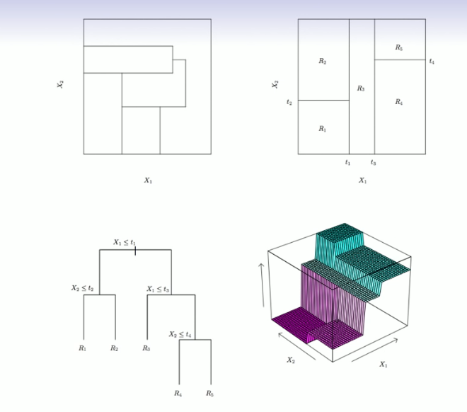
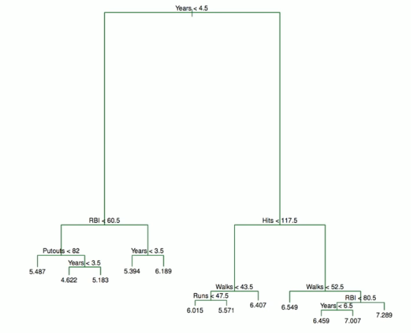
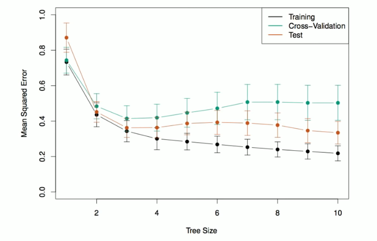

# Section 2 - Pruning a Decision Tree
## Predictions
* We predict the response for a given test observation using the mean of the training observations in the region to which that test observation belongs.
* A five-region example of this approach is shown below.

## Details of the previous figure
_Top Left:_ A partition of two-dimensional feature space that could not result from recursive binary splitting.

_Top Right:_ The output of recursive binary splitting on a two-dimensional example.

_Bottom Left:_ A tree corresponding to the partition in the top right panel.

_Bottom Right:_ A perspective plot of the prediction surface corresponding to that tree.
## Pruning a tree
* The process described above may produce good predictions on the training set, but is likely to _overfit_ the data, leading to poor test set performance. _Why?_
* A smaller tree with fewer splits (that is, fewer regions $R_1,\dots,R_J$) might lead to lower variance and better interpretation at the cost of a little bias.
* One possible alternative to the process described above is to grow the tree only so long as the decrease in the RSS due to each split exceeds some (high) threshold.
* This strategy will result in smaller trees, but is too _short-sighted:_ a seemingly worthless split early on in the tree might be followed by a very good split - that is, a split that leads to a large reduction in RSS later on.
* A better strategy is to grow a very large tree $T_0,$ and then _prune_ it back in order to obtain a _subtree._
* _Cost complexity pruning_ - also known as _weakest link pruning_ - is used to do this.
* We consider a sequence of trees indexed by a nonnegative tuning parameter $\alpha.$ For each value of $\alpha$ there corresponds a subtree $T\subset T_0$ such that
$$\sum_{m=1}^{|T|}{\sum_{i:x_i\in R_m}{(y_i-\hat{y}_{R_m})^2}}+\alpha|T|$$
is as small as possible. Here $|T|$ indicates the number of terminal nodes of the tree $T,$ $R_m$ is the rectangle (i.e. the subset of predictor space) corresponding to the $m$th terminal node, and $\hat{y}_{R_m}$ is the mean of the training observations in $R_m.$
## Choosing the best subtree
* The tuning parameter $\alpha$ controls a trade-off between the subtree's complexity and its fit to the training data.
* We select an optimal value $\hat{\alpha}$ using cross-validation.
* We then return to the full data set and obtain the subtree corresponding to $\hat{\alpha}.$
## Summary: tree algorithm
1. Use recursive binary splitting to grow a large tree on the training data, stopping only when each terminal node has fewer than some minimum number of observations.
2. Apply cost complexity pruning to the large tree in order to obtain a sequence of best subtrees, as a function of $\alpha.$
3. Use $K$-fold cross-validation to choose $\alpha.$ For each $k=1,\dots,K:$
   3.1 Repeat Steps $1$ and $2$ on the $\frac{K-1}{K}$th fraction of the training data, excluding the $k$th fold.
   3.2 Evaluate the mean squared prediction error on the data in the left-out $k$th fold, as a function of $\alpha.$
Average the results, and pick $\alpha$ to minimize the average error.
4. Return the subtree from Step $2$ that corresponds to the chosen value of $\alpha.$
## Baseball example continued
* First, we randomly divided the data set in helf, yielding $132$ observations in the training set and $131$ observations in the test set.
* We then build a large regression tree on the training data and varied $\alpha$ in order to create subtrees with different number of terminal nodes.
* Finally, we performed six-fold cross-validation in order to estimate the cross-validated MSE of the trees as a function of $\alpha.$

