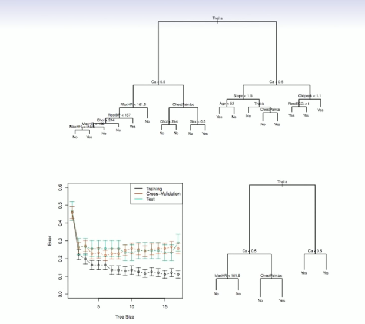
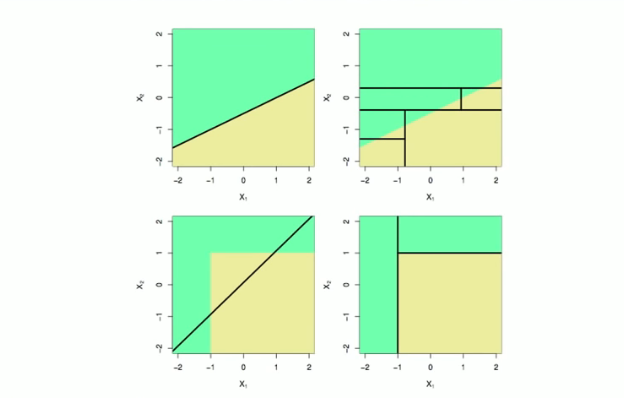

# Section 3 - Classification Trees and Comparison with Linear Models
## Classification Trees
* Very similar to a regression tree, except that it is used to predict a qualitative rather than a quantitative response.
* For a classification tree, we predict that each observation belongs to the _most commonly occurring class_ of training observations in the region to which it belongs.
## Details of classification trees
* Just as in the regression setting, we use recursive binary splitting to grow a classification tree.
* In the classification setting, RSS cannot be used as a criterion for making the binary splits.
* A natural alternative to RSS is the _classification error rate._ This is simply the fraction of the trarining observations in the region that dod not belong to the most common class:
$$E=1-\max_k(\hat{p}_{mk}).$$
Here $\hat{p}_{mk}$ represents the proportion of training observations in the $m$th region that are from the $k$th class.
* However classification error is not sufficiently sensitive for tree-growing, and in practise two other measures are preferable.
## Gini index and Deviance
* The _Gini index_ is defined by
$$G=\sum_{k=1}^K{\hat{p}_{mk}(1-\hat{p}_{mk})},$$
a measure of total variance across the $K$ classes. The Gini index takes on small value if all of the $\hat{p}_{mk}$'s are close to zero or one.
* For this reason the Gini index is referred to as a measurement of node _purity_ - a small value indicates that a node contains predominantly observations from a single class.
* An alternative to the Gini index is _cross-entropy,_ given by
$$D=-\sum_{k=1}^K{\hat{p}_{mk}\log\hat{p}_{mk}}.$$
* It turns out that the Gini index and the cross-entropy are very similar numerically.
## Example: heart data
* These data contain a binary outcome $\text{HD}$ for $303$ patients who presented with chest pain.
* An outcome value of $\text{Yes}$ indicates the presence of heart disease based on an angigraphic test, while $\text{No}$ means no heart disease.
* There are $13$ predictors including $\text{Age, Sex, Chol}$ (a cholesterol measurement), and other heart and lung function measurements.
* Cross-validation yield a tree with six terminal nodes. See next figure.

## Tree Versus Linear Models

Top Row: True linear bondary; Bottom row: true non-linear bondary.
Left column: linear model; Right column: tree-based model
## Advantages and Disadvantages of Trees
* Trees are very easy to explain to people. In fact, they are even easier to explain than linear regression!
* Some people believe that decision trees more closely mirrror human decision-making than do the regression and classification approaches seen in previous chapters.
* Trees can be displayed graphically, and are easily interpreted even by a non-expert (especially if they are small).
* Trees can easily handle qualitative predictors without the need to create dummy variables.
* Unfortunately, trees generally do not have the same level of predictive accuracy as some of the other regression and classification approaches seen in this book.
However, by aggregating many decision trees, the predictive performance of trees can be substantially improved. We introduce these concepts next.