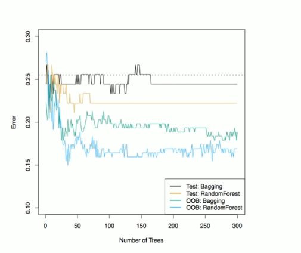
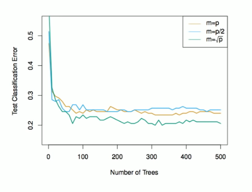

# Section 4 - Bootstrap Aggregation (Bagging) and Random Forests
## Bagging
* _Bootstrap aggregation_, or _bagging_, is a general-purpose procedure for reducing the variance of a statistical learning method; we introduce it here because it is particularly useful and frequently used in the context of decision trees.
* Recall that given a set of $n$ independent observations $Z_1,\dots,Z_n,$ each with variance $\sigma^2,$ the variance of the mean $\bar{Z}$ of the observations is given by $\sigma^2/n.$
* In other words, _averaging a set of observations reduces variance_. Of course, this is not practical because we generally do not have access to multiple training sets.
* Instead we can boostrap, by taking repeated samples from the (single) training data set.
* In this approach, we generate $B$ different bootstrapped training data sets. We then train our method on the $b$th bootstrapped training set in order to get $\hat{f}^{*b}(x),$ the prediction at a point $x.$ We then average all the predictions to obtain
$$\hat{f}_{\text{bag}}(x)=\frac{1}{B}\sum_{b=1}^B{\hat{f}^{*b}(x)}.$$
This is called _bagging._
## Bagging classification trees
* The above prescription applied to regression trees.
* For classification trees: for each test observation, we record the class predicted by each of the $B$ trees, and take a _majority vote_: the overall prediction is the most commonly occurring class among the $B$ predictions.
## Bagging the heart data

## Details of previous figure
Bagging and random forest results for the Heart data.
* The test error (black and orange) is shown as a function of $B,$ the number of bootstrapped training sets used.
* Random forests were applied with $m=\sqrt{p}.$
* The dashed line indicates the test error resulting from a single classification tree.
* The green and blue traces show the OOB error, which in this case is considerably lower.
## Out-of-Bag Error Estimation
* It turns out that there is a very straightforward way to estimate the test error of a bagged model.
* Recall that the key to bagging is that trees are repeatedly fit to bootstrapped subsets of the observations. One can show that on average, each bagged tree makes use of around two-thirds of the observations.
* The remaining one-third of the observations not used to fit a given bagged tree are referred to as the _out-of-bag_ (OOB) observations.
* We can predict the response for the $i$th observation using each of the trees in which that observation was OOB. This will yield around $B/3$ predictions for the $i$th observation, which we average.
* This estimate is essentially the LOO cross-validation error for bagging, if $B$ is large.
## Random Forests
* _Random forests_ provide an improvement over bagged trees by way of a small tweak that _decorrelates_ the trees. This reduced the variance when we average the trees.
* As in bagging, we build a number of decision trees on bootstrapped training samples.
* But when building these decision trees, each time a split on a tree is considered, _a random selection of $m$ predictors_ is chosen as split candidates from the full set of $p$ predictors. The split is allowed to use only one of those $m$ predictors.
* A fresh selection of $m$ predictors is taken at each split, and typically we choose $m\approx\sqrt{p}$ - that is, the number of predictors considered at each split is approximately equal to the square root of the total number of predictors ($4$ out of the $13$ for the Heart data).
## Example: gene expression data
* We applied random forest to a high-dimensional biological data set consisting og expression measurements of $4,718$ genes measured on tissue samples from $349$ patients.
* There are around $20,000$ genes in humans, and individual genes have different levels of activity, or expression, in particular cells, tissues, and biological conditions.
* Each of the patient samples has a qualitative label with $15$ different levels: either normal or one of $14$ different types of cancer.
* We use random forests to predict cancer type based on the $500$ genes that have the largest variance in the training set.
* We randomly divided the observations into a training and a test set, and applied raodm forests to the training set for three different values of the number of splitting variables $m.$
## Results: gene expression data

## Details of previous figure
* Results from random forests for the fifteen-class gene expression data set with $p=500$ predictors.
* The test error is displayed as a function of the number of trees. Each colored line corresponds to a different value of $m,$ the number of predictors available for splitting at each interior tree node.
* Random forests $(m<p)$ lead to a slight improvement over bagging $(m=p).$ A single classification tree has an error rate of $45.7\%.$
