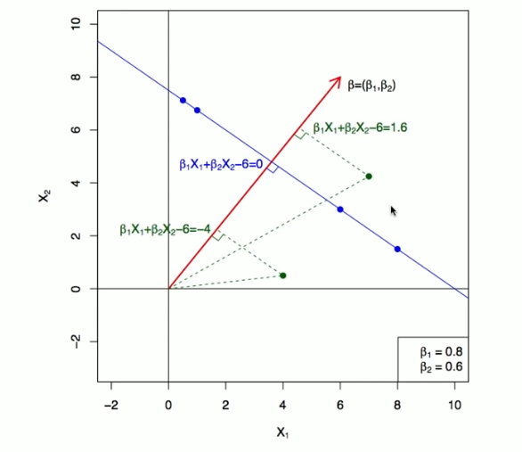
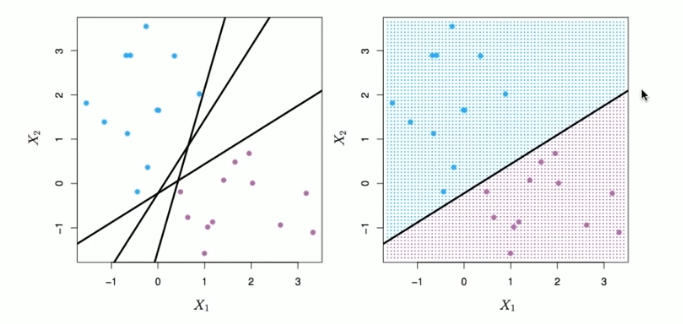
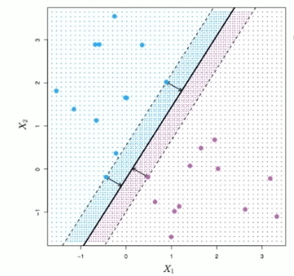

# Section 1 - Maximal Margin Classifier
## Support Vector Machines
Here we approach the two-class classification problem in a direct way:
$$\textit{We try to find a plane that separates the classes in feature space.}$$
If we cannot, we get creative in two ways:
* We soften what we mean by "separates", and
* We enrich and enlarge the feature space so that separation is possible.
## What is a Hyperplane
* A hyperplane in $p$ dimensions is a flat affine subspace of dimension $p-1.$
* In general the equation for a hyperplane has the form
$$\beta_0+\beta_1X_1+\beta_2X_2+\dots+\beta_pX_p=0$$
* In $p=2$ dimensions a hyperplane is a line.
* If $\beta_0=0,$ the hyperplane goes through the origin, otherwise not.
* The vector $\beta=(\beta_1,\beta_2,\dots,\beta_p)$ is called the normal vector - it points in a direction orthogonal to the surface of a hyperplane.
## Hyperplane in $2$ Dimensions

## Separating Hyperplanes

* If $f(X)=\beta_0+\beta_1X_1+\dots+\beta_pX_p,$ then $f(X)>0$ for points on one side of the hyperplane, and $f(X)<0$ for points on the other.
* If we code the colored points as $Y_i=+1$ for blue, say, and $Y_i=-1$ for mauve, then if $Y_i\cdot f(X_i)>0$ for all $i, f(X)=0$ defines a _separating hyperplane._
## Maximal Margin Classifier
Among all separating hyperplanes, find the one that makes the biggest gap or magin between the two classes.

Constrained optimization problem
$$\max_{\beta_0,\beta_1,\dots,\beta_p}{M}\\\text{subject to }\sum_{j=1}^p{\beta_j^2}=1,\\y_i(\beta_0+\beta_1x_{i1}+\dots+\beta_px_{ip})\geq M\\\text{for all }i=1,\dots,N.$$
This can be rephrased as a convex quadratic program, and solved efficiently. The function `svm()` in package `e1071` solves this problem efficiently.