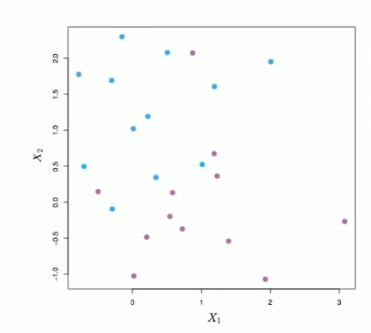
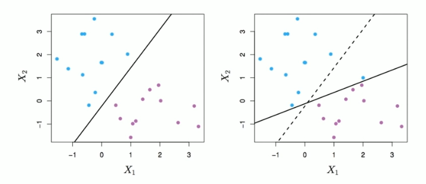
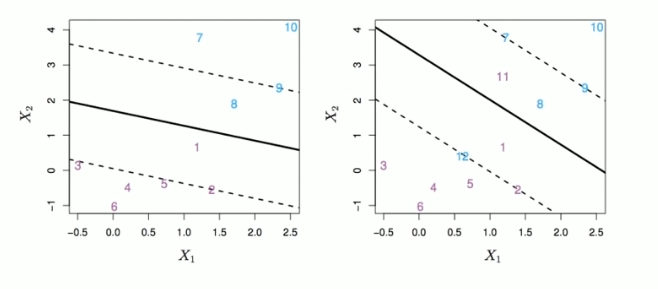
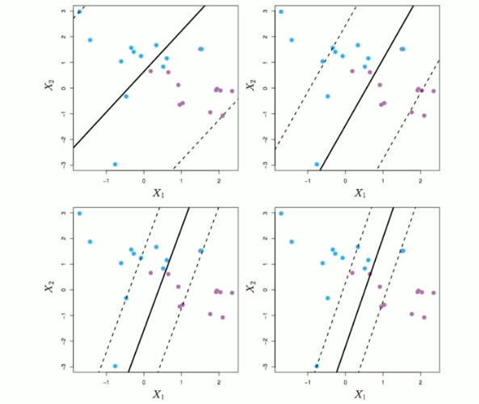
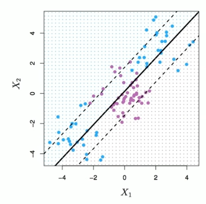

# Section 2 - Support Vector Classifier
## Non-separable Data

The data above are not separable by a linear boundary.

This is often the case, unless $N<p.$
## Noisy Data

Sometimes the data are separable, but noisy. This can lead to a poor solution for the maximal-margin classifier.

The _support vector classifier_ maximimes a _soft_ margin.
## Support Vector Classifier

$$\max_{\beta_0,\beta_1,\dots,\beta_p,\epsilon_1,\dots,\epsilon_n}{M}\text{ subject to }\sum_{j=1}^p{\beta_j^2}=1,\\y_i(\beta_0+\beta_1x_{i1}+\beta_2x_{i2}+\dots+\beta_px_{ip}\geq M(1-\epsilon_i),\\\epsilon_i\geq0,\sum_{i=1}^n{\epsilon_i}\leq C,$$
## $C$ is a regularization parameter

## Linear boundary can fail

Sometime a linear boundary simply won't work, no matter what value of $C.$

The example above is such a case.

What to do?