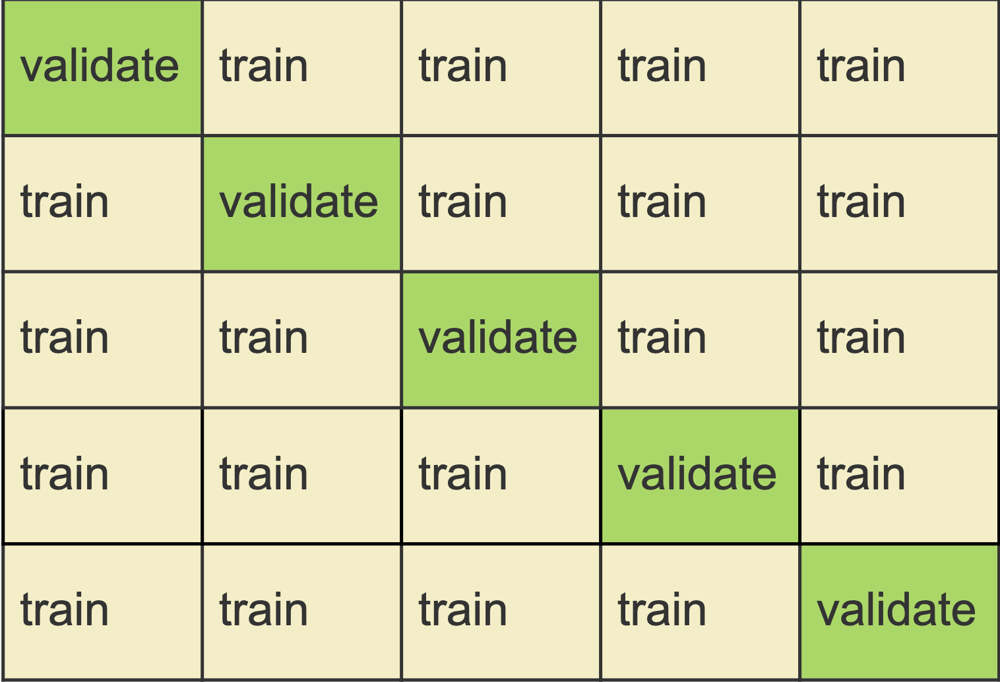

# Recommended exercises on cross-validation

## Problem 1: Explain how $k$-fold cross-validation is implemented 

a)  See Figure 1

{#id .class width=50% height=50%}


b) In run 1 fold 1 is kept aside and folds 2 - 5 are used to train the method. The error is calculated on fold 1 ($\text{MSE}_1$).
We do this for the remaining 4 runs. The cross-validation error is given by

$$
CV_5 = \frac{1}{n} \sum_{j=1}^5 n_j\cdot \text{MSE}_j \ ,
$$
where $n_j$ is the size of the $j^\text{th}$ fold.

For a regression problem $\text{MSE}_j = \frac{1}{n_j}\sum_{i \in V_j} (y_i - \hat y_i)^2$ for all $i$ in the validation set $V_j$.
For a binary classification problem the error might be the average of correctly classified observations.


c) Find the optimal number of neighbors $k$ in KNN or the optimal polynomial degree in polynomial regression.

d) For a classification problem we can use CV to choose between QDA or LDA.

## Problem 2: Advantages and disadvantages of $k$-fold Cross-Validation

a) The validation set approach:

D:  The $k$-fold cross validation is computationally more expensive, and has more bias. 

A: The advantage is that it has less variance


b) In LOOCV there is no randomness in the splits. 

A: $k$-fold-CV is computationally less expensive, as we run the model $k$ times where $k \ll n$

A: $k$-fold-CV has less variance, because in LOOCV we are averaging from $n$ fitted models that are trained on nearly the same data, therefore we have positively correlated data.

D: $k$-fold-CV has more bias, as in LOOCV we use a larger data set to fit the model, which gives a less biased version of the test error.


c) We know that if $k=n=$ LOOCV the estimator of test error will have small bias but high variance and it is computationally expensive.

If $k$ is too small (for example 2), the estimator will have larger bias but lower variance.

Experimental research (simulations) has found that $k = 5$ or $k=10$ to be good choice.

## Problem 3: Selection bias and the "wrong way to do CV".

The task here is to devise an algorithm to "prove" that the wrong way is wrong and that the right way is right. 

a) What are the steps of such an algorithm? Write down a suggestion. Hint: How do you generate data for predictors and class labels, how do you do the classification task, where is the CV in the correct way and wrong way inserted into your algorithm? Can you make a schematic drawing of the right and the wrong way? Hint: [ISL book slides, page 20+21](https://lagunita.stanford.edu/c4x/HumanitiesScience/StatLearning/asset/cv_boot.pdf) - but you can do better?
  
  
  
  b) We are now doing a simulation to illustrate the selection bias problem in CV, when it is applied the wrong way. Here is what we are (conceptually) going to do:
  
  Generate data

* Simulate high dimensional data ($p=5000$ predictors) from independent or correlated normal variables, but with few samples ($n=50$).

* Randomly assign class labels (here only 2). This means that the "truth"" is that the misclassification rate can not get very small. What is the expected misclassification rate (for this random set)?

Classification task:

* We choose a few ($d=25$) of the predictors (how? we just select those with the highest correlation to the outcome).
* Perform a classification rule (here: logistic empirical Bayes) on these predictors.
* Then we run CV ($k=5$) on either only the $d$ (=wrong way), or on all $c+d$ (=right way) predictors. 
* Report misclassification errors for both situations.

One possible version of this is presented in the R-code below. Go through the code and explain what is done in each step, then run the code and observe if the results are in agreement with what you expected. Make changes to the R-code if you want to test out different strategies.

We start by generating data for $n=50$ observations
```{r,eval=TRUE, warning=FALSE}
library(boot)
# GENERATE DATA; use a seed for reproducibility
set.seed(4268)
n=50 #number of observations
p=5000 #number of predictors
d=25 #top correlated predictors chosen
#generating predictor data
xs=matrix(rnorm(n*p,0,4),ncol=p,nrow=n) #simple way to to uncorrelated predictors
dim(xs) # n times p
# generate class labels independent of predictors - so if all classifies as class 1 we expect 50% errors in general
ys=c(rep(0,n/2),rep(1,n/2)) #now really 50% of each
table(ys)
```

**WRONG CV**: Select the 25 most correlated predictors outside the CV.
```{r, eval=TRUE, warning=FALSE}
corrs=apply(xs,2,cor,y=ys)
hist(corrs)
selected=order(corrs^2,decreasing = TRUE)[1:d] #top d correlated selected
data=data.frame(ys,xs[,selected])
```

Then run CV around the fitting of the classifier - use logistic regression and built in `cv.glm()` function
```{r, eval=TRUE, warning=FALSE}
logfit=glm(ys~.,family="binomial",data=data)
cost <- function(r, pi = 0) mean(abs(r-pi) > 0.5)
kfold=10
cvres=cv.glm(data=data,cost=cost,glmfit=logfit,K=kfold)
cvres$delta
```
Observe a zero misclassification rate!


**CORRECT CV**: Do not pre-select predictors outside the CV, but as part of the CV. We need to code this ourselves:
```{r, eval=TRUE, warning=FALSE}
reorder=sample(1:n,replace=FALSE)
validclass=NULL
for (i in 1:kfold)
{
  neach=n/kfold
  trainids=setdiff(1:n,(((i-1)*neach+1):(i*neach)))
  traindata=data.frame(xs[reorder[trainids],],ys[reorder[trainids]])
  validdata=data.frame(xs[reorder[-trainids],],ys[reorder[-trainids]])
  colnames(traindata)=colnames(validdata)=c(paste("X",1:p),"y")
  foldcorrs= apply(traindata[,1:p],2,cor,y=traindata[,p+1]) 
  selected=order(foldcorrs^2,decreasing = TRUE)[1:d] #top d correlated selected
  data=traindata[,c(selected,p+1)]
  trainlogfit=glm(y~.,family="binomial",data=data)
  pred=plogis(predict.glm(trainlogfit,newdata=validdata[,selected]))
  validclass=c(validclass,ifelse(pred > 0.5, 1, 0))
}
table(ys[reorder],validclass)
1-sum(diag(table(ys[reorder],validclass)))/n
```

## Problem 5: Estimate standard deviation and confidence intervals with bootstrapping

We repeat the following for $b = 1,\cdots,B$:

* Draw with replacement a bootstrap sample
* Fit the model 
* Store $\hat{\beta_b}$

Calculate $\hat{SD}(\hat{\beta}) =\sum_{b=1}^B \sqrt{\frac{1}{B-1} \sum_{b=1}^B (\hat{\beta_b} - \frac{1}{B}\sum_{b=1}^B \hat{\beta_b})}.$

For the $95\%$ CI, we can calculate the 0.025 and 0.975 quantiles of the sample $\hat{\beta_b},$ $b=1,\cdots,B.$

## Problem 6: Implement problem 5


```{r,}
library(carData)
boot.fn = function(data, index){
  return(coef(lm(wages~., data = SLID, subset = index)))
}
beta_hat = c()
B = 1000
for(i in 1:B){
  beta_hat[i] = boot.fn(SLID, sample(nrow(SLID), nrow(SLID), replace = T))["age"]
}
```

We can for example look at the histogram of the samples of $\hat\beta$ to get an idea of the distribution:
```{r,fig.width=5, fig.height=4}
library(ggplot2)
data = data.frame(beta_hat = beta_hat, norm_den = dnorm(beta_hat, mean(beta_hat), sd(beta_hat)))
ggplot(data)+
  geom_histogram(aes(x = beta_hat, y = ..density..),  fill = "grey80", color = "black") +
  geom_line(aes(x = beta_hat, y = norm_den), color = "red")+
  theme_minimal()
```

The $95\%$ CI for $\hat{\beta}_{age}$ can now be derived by either using the 2.5\% and 97.5\% quantiles of the samples, or by using the $\hat\beta \pm 1.96\cdot \text{SD}(\hat\beta)$ idea:

```{r}
sd(beta_hat)
quantile(beta_hat, c(0.025, 0.975))
c(mean(beta_hat) - 1.96*sd(beta_hat), mean(beta_hat) + 1.96*sd(beta_hat))
```

We can compare these results to what we would obtain directly from fitting the model and calcualating the confidence interval
```{r}
SLID.lm = lm(wages ~ ., data = SLID)
confint(SLID.lm )
```
As expected, the 95\% CI for `age` is essentially the same as the one we obtained from bootstrapping.


If you prefer to use the built in function `boot()`

```{r}
library(boot)
bo = boot(SLID, boot.fn, 1000)
bo
```